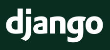
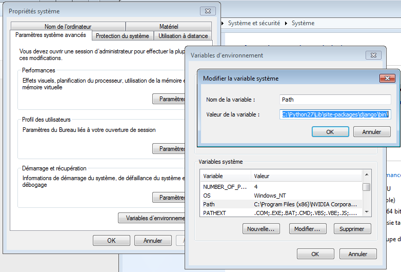

Créez vos applications web avec Django
======================================

Si vous lisez ceci, c'est que vous avez décidé de vous lancer dans l'apprentissage de Django. Avant de commencer, des présentations s'imposent : Django est un framework web écrit en Python, qui se veut complet tout en facilitant la création d'applications web riches.

Avant de commencer à écrire du code, nous allons tout d'abord voir dans ce chapitre ce qu'est un framework en général, et plus particulièrement ce qu'est Django. Dans un second temps, nous verrons comment l'installer sur votre machine, pour pouvoir commencer à travailler ! Est-il utile de vous rappeler encore ici qu'il est nécessaire d'avoir les bases en Python pour pouvoir commencer ce cours ?

Qu'est-ce qu'un framework ?
---------------------------
Un framework est un ensemble d'outils qui simplifie le travail d'un développeur. Traduit littéralement de l'anglais, un framework est un « cadre de travail ». Il apporte les bases communes à la majorité des programmes ou des sites web. Celles-ci étant souvent identiques (le fonctionnement d'un espace membres est commun à une très grande majorité de sites web de nos jours), un développeur peut les réutiliser simplement et se concentrer sur les particularités de son projet.

Il s'agit donc d'un ensemble de bibliothèques coordonnées, qui permettent à un développeur d'éviter de réécrire plusieurs fois une même fonctionnalité, et donc d'éviter de réinventer constamment la roue. Inutile de dire que le gain en énergie et en temps est considérable !

### Quels sont les avantages d'un framework ?

Un framework instaure en quelque sorte sa « ligne de conduite ». Tous les développeurs Django codent de façon assez homogène (leurs codes ont le même fonctionnement, les mêmes principes). De ce fait, lorsqu'un développeur rejoint un projet utilisant un framework qu'il connaît déjà, il comprendra très vite ce projet et pourra se mettre rapidement au travail.

Le fait que chaque framework possède une structure commune pour tous ses projets a une conséquence tout aussi intéressante : en utilisant un framework, votre code sera le plus souvent déjà organisé, propre et facilement réutilisable par autrui.

Voici d'ailleurs un grand défi des frameworks : bien que ceux-ci doivent instaurer une structure commune, ils doivent aussi être souples et modulables, afin de pouvoir être utilisés pour une grande variété de projets, du plus banal au plus exotique. Autrement, leur intérêt serait grandement limité !

### Quels sont les désavantages d'un framework ?

Honnêtement, il n'existe pas vraiment de désavantages à utiliser un framework. Il faut bien évidemment prendre du temps à apprendre à en manier un, mais ce temps d'apprentissage est largement récupéré par la suite, vu la vitesse de développement qui peut parfois être décuplée. Nous pourrions éventuellement dire que certains frameworks sont parfois un peu trop lourds, mais il incombe à son utilisateur de choisir le bon framework, adapté à ses besoins.


Qu'est-ce que Django ?
----------------------

Django est donc un framework Python _destiné au web_. Ce n'est pas le seul dans sa catégorie, nous pouvons compter d'autres frameworks Python du même genre comme [web2py](http://www.web2py.com/), [TurboGears](http://www.turbogears.org/), [Tornado](http://www.tornadoweb.org/en/stable/) ou encore [Flask](http://flask.pocoo.org/). Il a cependant le mérite d'être le plus exhaustif, d'automatiser un bon nombre de choses et de disposer d'une très grande communauté.



Django est né en 2003 dans une agence de presse qui devait développer des sites web complets dans des laps de temps très courts (d'où l'idée du framework). En 2005, l'agence de presse [Lawrence Journal-World](http://www2.ljworld.com/) décide de publier Django au grand public, le jugeant assez mature pour être réutilisé n'importe où. Trois ans plus tard, la fondation Django Software est créée par les fondateurs du framework afin de pouvoir maintenir celui-ci et la communauté très active qui l'entoure.

Aujourd'hui, Django est devenu très populaire et est utilisé par des sociétés du monde entier, telles qu'[Instagram](http://instagr.am/), [Pinterest](http://pinterest.com/), et même la [NASA](http://www.nasa.gov/) !


### Pourquoi ce succès ?

Si Django est devenu très populaire, c'est notamment grâce à sa philosophie, qui a su séduire de nombreux développeurs et chefs de projets. En effet, le framework prône le principe du « _Don't repeat yourself_ », c'est-à-dire en français « Ne vous répétez pas », et permet le développement rapide de meilleures et plus performantes applications web, tout en conservant un code élégant.

Django a pu appliquer sa philosophie de plusieurs manières. Par exemple, l'administration d'un site sera automatiquement générée, et celle-ci est très facilement adaptable. L'interaction avec une base de données se fait via un ensemble d'outils spécialisés et très pratiques. Il est donc inutile de perdre son temps à écrire directement des requêtes destinées à la base de données, car Django le fait automatiquement. De plus, d'autres bibliothèques complètes et bien pensées sont disponibles, comme un espace membres, ou une bibliothèque permettant la traduction de votre application web en plusieurs langues.


### Une communauté à votre service

Évidemment, Django dispose des avantages de tous les frameworks en général. Il est soutenu par une communauté active et expérimentée, qui publie régulièrement de nouvelles versions du framework avec de nouvelles fonctionnalités, des corrections de bugs, etc.

Encore un point, et non des moindres, la communauté autour de Django a rédigé au fil des années une documentation très complète sur [docs.djangoproject.com](http://docs.djangoproject.com/). Bien que celle-ci soit en anglais, elle reste très accessible pour des francophones et [une traduction française est disponible](https://docs.djangoproject.com/fr/stable/). Nous ne pouvons que vous conseiller de la lire en parallèle de ce cours si vous voulez approfondir un certain sujet ou si certaines zones d'ombre persistent.

Enfin, pour gagner encore plus de temps, les utilisateurs de Django ont généralement l'esprit _open source_ et fournissent une liste de _snippets_, des portions de code réutilisables par n'importe qui. Le site [djangosnippets.org](http://djangosnippets.org/) est dédié à ces _snippets_. Si vous devez vous attaquer à une grosse application ou à une portion de code particulièrement difficile, n'hésitez pas à aller chercher dans ces _snippets_, vous y trouverez souvent votre bonheur !  
Dans le même esprit, de nombreuses applications, prêtes à être utilisées, sont disponible via [Django Packages](https://www.djangopackages.com/) notamment.


Téléchargement et installation
------------------------------

Maintenant que nous avons vu les avantages qu'apporte Django, il est temps de passer à son installation. Tout d'abord, assurez-vous que vous disposez bien d'une **version de Python supérieure ou égale à la 3.4**. Il est possible d'utiliser Django avec Python 2.7 également, mais **nous vous recommandons fortement d'utiliser Python 3**. 

Il est également plus prudent de supprimer toutes les anciennes installations de Django, si vous en avez déjà. Il peut y avoir des conflits entre les versions, notamment lors de la gestion des projets. Il est essentiel de **n'avoir que Django 1.7 sur votre machine**, à part si vous avez déjà des applications en production sur des versions antérieures. Dans ce cas, il est conseillé soit de porter toutes vos applications pour Django 1.7, soit d'exécuter vos deux projets avec deux versions de Django bien indépendantes, à l'aide du [module venv](https://docs.python.org/3.4/library/venv.html), disponible depuis Python 3.3.

### Linux et Mac OS

Sous Linux et Mac OS, la méthode la plus simple et universelle consiste à installer Django depuis les répertoires de Pypi.

<div class="info">Pypi est l'index des paquets Python de référence. Il contient les paquets de dizaines de milliers de projets Python, prêt à être utilisé pour vos propres projets. Grâce à pip, il est possible d'installer ces paquets en une seule commande mais aussi gérer les dépendances de vos projets facilement.</div>

Si vous n'avez jamais utilisé `pip`, il vous faut d'abord que vous l'installiez. Utilisez votre gestionnaire de paquets préféré et installez le paquet `python3-pip`. Par exemple, sous Debian et Ubuntu :
```
apt-get install python3-pip
```

Ensuite, vous n'avez plus qu'à installer le paquet Django, via pip :
```
pip install Django==1.7
``` 

Nous spécifions ici que nous souhaitons la version 1.7 de Django et il va donc **chercher la dernière version de la branche 1.7**. L'index Pypi conserve toutes les versions de Django, et il est donc possible d'installer d'anciennes versions si vous le souhaitez.

### Windows

Contrairement aux environnements UNIX, l'installation de Django sous Windows requiert quelques manipulations. Téléchargez [l'archive de Django](https://www.djangoproject.com/download/) et extrayez-la. Avant de continuer, nous allons devoir modifier quelques variables d'environnement, afin de permettre l'installation du framework. Pour cela (sous Windows 7) :

1. Rendez-vous dans les informations générales du système (via le raccourci <kbd>Windows</kbd> + <kbd>Pause</kbd>) ;
2. Cliquez sur `Paramètres système avancés`, dans le menu de gauche ;
3. Une fois la fenêtre ouverte, cliquez sur `Variables d'environnement` ;
4. Cherchez la variable système (deuxième liste) Path et ajoutez ceci en fin de ligne (faites attention à votre version de Python) : `;C:\Python27\;C:\Python27\Lib\site-packages\django\bin\`. Respectez bien le point-virgule permettant de séparer le répertoire de ceux déjà présents, comme indiqué à la figure suivante.



Validez, puis quittez. Nous pouvons désormais installer Django via la console Windows (<kbd>Windows</kbd> + <kbd>R</kbd> puis la commande `cmd`) :

    cd C:\Users\<nom_utilisateur>\Downloads\django1.7  # À adapter à votre répertoire de téléchargement 
    python setup.py install

Les fichiers sont ensuite copiés dans votre dossier d'installation Python (ici `C:\Python27`).


### Vérification de l'installation

Dès que vous avez terminé l'installation de Django, lancez une nouvelle console, puis lancez l'interpréteur Python (via la commande python) et tapez les deux lignes suivantes :

    >>> import django
    >>> django.get_version()
    1.7  # <- Résultat attendu

Si vous obtenez également 1.7 comme réponse, félicitations, **vous avez correctement installé Django** !

<div class="info">Il se peut que vous obteniez un numéro de version légèrement différent (du type 1.7.1). En réalité, Django est régulièrement mis à jour de façon mineure, afin de résoudre des failles de sécurité ou des bugs. Tenez-vous au courant de ces mises à jour, et appliquez-les dès que possible.   
Avec pip, vous pouvez faire un `pip install Django --upgrade` pour passer à la dernière version automatiquement.</div>

Dans la suite de ce cours, nous utiliserons SQLite, qui est simple et déjà inclus dans les bibliothèques de base de Python. Si vous souhaitez utiliser un autre système de gestion de base de données, n'oubliez pas d'installer les outils nécessaires (dépendances, packages, etc.).


En résumé
---------

- Un framework (cadre de travail en français) est un ensemble d'outils qui simplifie le travail d'un développeur.
- Un framework est destiné à des développeurs, et non à des novices. Un framework nécessite un temps d'apprentissage avant de pouvoir être pleinement utilisé.
- Django est un framework web pour le langage Python très populaire, très utilisé par les entreprises dans le monde : Mozilla, Instagram ou encore la NASA l'ont adopté !
- Ce cours traite de la version 1.7, sortie en septembre 2014. Nous ne garantissons pas que les exemples donnés soient compatibles avec des versions antérieures et postérieures.