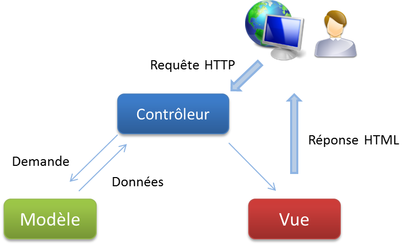
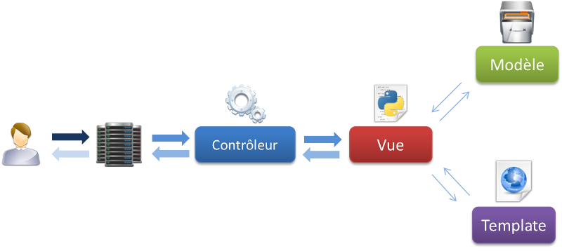
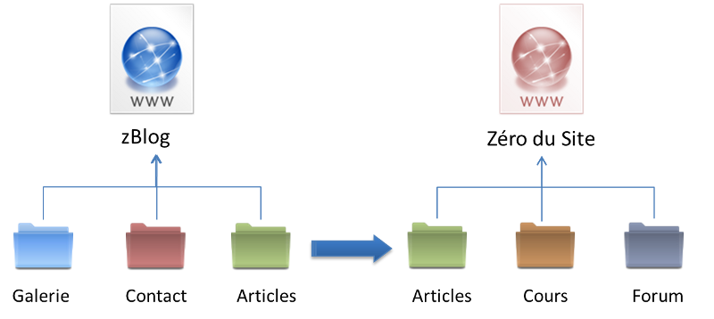

Le fonctionnement de Django 
===========================

Attaquons-nous au vif du sujet ! Dans ce chapitre, théorique mais fondamental, nous allons voir comment sont construits la plupart des frameworks grâce au modèle MVC, nous aborderons ensuite les spécificités du fonctionnement de Django et comment les éléments d'une application classique Django s'articulent autour du modèle MVT, que nous introduirons également. En dernier lieu, nous expliquerons le système de projets et d'applications, propre à Django, qui permet une séparation nette, propre et précise du code.

Au terme de ce chapitre, vous aurez une vue globale sur le fonctionnement de Django, ce qui vous sera grandement utile lorsque vous commencerez à créer vos premières applications.

Un peu de théorie : l'architecture MVC 
--------------------------------------
Lorsque nous parlons de frameworks qui fournissent une interface graphique à l'utilisateur (soit une page web, comme ici avec Django, soit l'interface d'une application graphique classique, comme celle de votre traitement de texte par exemple), nous parlons souvent de l'architecture **MVC**. Il s'agit d'un modèle distinguant plusieurs rôles précis d'une application, qui doivent être accomplis. Comme son nom l'indique, l'architecture (ou « patron ») **M**odèle-**V**ue-**C**ontrôleur est composé de trois entités distinctes, chacune ayant son propre rôle à remplir.

### Modèle

Tout d'abord, le modèle _représente une information_ enregistrée quelque part, le plus souvent dans une base de données. Il permet d'accéder à l'information, de la modifier, d'en ajouter une nouvelle, de vérifier que celle-ci correspond bien aux critères (on parle d'intégrité de l'information), de la mettre à jour, etc. Il s'agit d'une interface supplémentaire entre votre code et la base de données, mais qui simplifie grandement les choses, comme nous le verrons par la suite.

### Vue

La vue, comme son nom l'indique, est la _visualisation de l'information_. C'est la seule chose que l'utilisateur peut voir. Non seulement elle sert à présenter une donnée, mais elle permet aussi de _recueillir une éventuelle action de l'utilisateur_ (un clic sur un lien, ou la soumission d'un formulaire par exemple). Typiquement, un exemple de vue est une page web, ni plus, ni moins.

### Contrôleur 

Enfin, le contrôleur _prend en charge tous les événements de l'utilisateur_ (accès à une page, soumission d'un formulaire, etc.). Il se charge, en fonction de la requête de l'utilisateur, de récupérer les données voulues dans les modèles. Après un éventuel traitement sur ces données, il transmet ces données à la vue, afin qu'elle s'occupe de les afficher. Lors de l'appel d'une page, c'est le contrôleur qui est chargé en premier, afin de savoir ce qu'il est nécessaire d'afficher.

La spécificité de Django : le modèle MVT 
----------------------------------------

L'architecture utilisée par Django **diffère légèrement de l'architecture MVC** classique. En effet, la « magie » de Django réside dans le fait qu'il _gère lui-même la partie contrôleur_ (gestion des requêtes du client, des droits sur les actions…). Ainsi, nous parlons plutôt de framework utilisant l'architecture **MVT** : **M**odèle-**V**ue-**T**emplate.

Cette architecture reprend les définitions de modèle et de vue que nous avons vues, et en introduit une nouvelle : le **template** (voir figure suivante). Un template est un fichier HTML, aussi appelé en français « gabarit ». Il sera récupéré par la vue et envoyé au visiteur ; cependant, avant d'être envoyé, il sera analysé et exécuté par le framework, comme s'il s'agissait d'un fichier avec du code. Django fournit un moteur de templates très utile qui permet, dans le code HTML, d'afficher des variables, d'utiliser des structures conditionnelles (`if`/`else`) ou encore des boucles (`for`), etc.

Concrètement, lorsque l'internaute appelle une page de votre site réalisé avec Django, le framework se charge, via les règles de routage URL définies, d'exécuter la vue correspondante. Cette dernière récupère les données des modèles et génère un rendu HTML à partir du template et de ces données. Une fois la page générée, l'appel fait chemin arrière, et le serveur renvoie le résultat au navigateur de l'internaute.

On distingue les quatre parties qu'un développeur doit gérer :

- Le **routage des requêtes**, en fonction de l'URL ;
- La **représentation des données** dans l'application, avec leur gestion (ajout, édition, suppression…), c'est-à-dire les modèles ;
- L'**affichage de ces données** et de toute autre information au format HTML, c'est-à-dire les templates ;
- Enfin le lien entre les deux derniers points : **la vue** qui récupère les données et génère le template selon celles-ci.

On en revient donc au modèle **MVT**. Le développeur se doit de fournir le modèle, la vue et le template. Une fois cela fait, il suffit juste d'assigner la vue à une URL précise, et la page est accessible.

Si le template est un fichier HTML classique, un modèle en revanche sera écrit sous la forme d'une classe où chaque attribut de celle-ci correspondra à un champ dans la base de données. Django se chargera ensuite de créer la table correspondante dans la base de données, et de faire la liaison entre la base de données et les objets de votre classe. Non seulement il n'y a plus besoin d'écrire de requêtes pour interagir avec la base de données, mais en plus le framework propose la représentation de chaque entrée de la table sous forme d'une instance de la classe qui a été écrite. Il suffit donc d'accéder aux attributs de la classe pour accéder aux éléments dans la table et pouvoir les modifier, ce qui est très pratique !

Enfin, une vue est une simple fonction, qui prend comme paramètres des informations sur la requête (s'il s'agit d'une requête GET ou POST par exemple), et les paramètres qui ont été donnés dans l'URL. Par exemple, si l'identifiant ou le nom d'un article du blog a été donné dans l'URL `crepes-bretonnes.com/blog/faire-de-bonnes-crepes`, la vue récupérera `faire-de-bonnes-crepes` comme titre et cherchera dans la base de données l'article correspondant à afficher. Suite à quoi la vue générera le template avec le bon article et le renverra à l'utilisateur.

Projets et applications
-----------------------
En plus de l'architecture MVT, Django introduit le développement d'un site **sous forme de projet**. Chaque site web conçu avec Django est considéré comme un projet, **composé de plusieurs applications**. Une application consiste en un dossier contenant plusieurs fichiers de code, chacun étant relatif à une tâche du modèle MVT que nous avons vu. En effet, chaque bloc du site web est isolé dans un dossier avec ses vues, ses modèles et ses schémas d'URL.

Lors de la conception de votre site, vous allez devoir penser aux applications que vous souhaitez développer. Voici quelques exemples d'applications :

- Un module d'actualités ;
- Un forum ;
- Un système de contact ;
- Une galerie de photos ;
- Un système de dons.

Ce principe de séparation du projet en plusieurs applications possède deux avantages principaux :

1. Le code est beaucoup **plus structuré**. Les modèles et templates d'une application ne seront que rarement ou jamais utilisés dans une autre, nous gardons donc une séparation nette entre les différentes applications, ce qui évite de s'emmêler les pinceaux !

2. Une application correctement conçue pourra **être réutilisée** dans d'autres projets très simplement, par un simple copier/coller, comme le montre la figure suivante.

Ici, le développement du système d'articles sera fait une fois uniquement. Pour le second site, une légère retouche des templates suffira. Ce système permet de voir le site web comme des boîtes que nous agençons ensemble, accélérant considérablement le développement pour les projets qui suivent.

Si vous souhaitez ajouter un blog sur votre projet, vous pouvez même télécharger une application déjà existante (via `pip` par exemple), comme [Django Blog Zinnia](http://django-blog-zinnia.com/), et personnaliser les templates en les surchargeant. Nous verrons ce principe plus loin.  
Il existe des milliers d'applications _open source_ que vous pouvez télécharger et intégrer à vos projets. N'hésitez pas à faire un tour sur [Django Packages](https://www.djangopackages.com/) pour trouver votre bonheur.

En résumé
---------

- Django respecte l'architecture MVT, directement inspirée du très populaire modèle MVC ;
- Django gère de façon autonome la réception des requêtes et l'envoi des réponses au client (partie contrôleur) ;
- Un projet est divisé en plusieurs applications, ayant chacune un ensemble de vues, de modèles et de schémas d'URL ;
- Si elles sont bien conçues, ces applications sont réutilisables dans d'autres projets, puisque chaque application est indépendante.