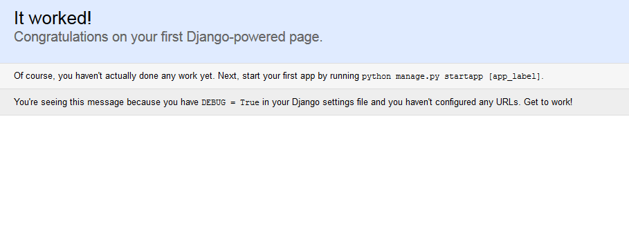

Gestion d'un projet 
===================

Django propose un outil en ligne de commandes très utile qui permet énormément de choses :

- Création de projets et applications ;
- Création des tables dans la base de données selon les modèles de l'application ;
- Lancement du serveur web de développement ;
- Etc.

Nous verrons dans ce chapitre comment utiliser cet outil, la structure d'un projet Django classique, comment créer ses projets et applications, et leur configuration.

Créons notre premier projet 
---------------------------

L'outil de gestion fourni avec Django se nomme `django-admin.py` et il n'est accessible qu'en ligne de commandes. Pour ce faire, munissez-vous d'une console MS-DOS sous Windows, ou d'un terminal sous Linux et Mac OS X.

Attention ! La console système n'est pas l'interpréteur Python ! Dans la console système, vous pouvez exécuter des commandes système comme l'ajout de dossier, de fichier, tandis que dans l'interpréteur Python vous écrivez du code Python.

Sous Windows, allez dans le menu `Démarrer > Exécuter` et tapez dans l'invite de commande `cmd`. Une console s'ouvre, déplacez-vous dans le dossier dans lequel vous souhaitez créer votre projet grâce à la commande cd, suivie d'un chemin. Exemple :

    cd C:\Mes Documents\Utilisateur\

Sous Mac OS X et Linux, lancez tout simplement l'application Terminal (elle peut parfois également être nommée Console sous Linux), et déplacez-vous dans le dossier dans lequel vous souhaitez créer votre projet, également à l'aide de la commande `cd`.
Exemple :

    cd /home/utilisateur/Projets/

Tout au long du tutoriel, nous utiliserons un blog sur les bonnes crêpes bretonnes comme exemple. Ainsi, appelons notre projet `crepes_bretonnes` (seuls les caractères alphanumériques et underscores sont autorisés pour le nom du projet) et créons-le grâce à la commande suivante :

    django-admin.py startproject crepes_bretonnes

Un nouveau dossier nommé `crepes_bretonnes` est apparu et possède la structure suivante :

	crepes_bretonnes/
	        manage.py
	        crepes_bretonnes/
	                __init__.py
	                settings.py
	                urls.py
	                wsgi.py

Il s'agit de votre projet.

Dans le dossier principal `crepes_bretonnes`, nous retrouvons deux éléments : un fichier `manage.py` et un autre sous-dossier nommé également `crepes_bretonnes`.

Le sous-dossier contient quatre fichiers Python, à savoir `settings.py`, `urls.py`, `wsgi.py` et `__init__.py`. Ne touchez surtout pas à ces deux derniers fichiers, ils n'ont pas pour but d'être modifiés ! Les deux autres fichiers ont des noms plutôt éloquents : `settings.py` contiendra la **configuration de votre projet**, tandis que `urls.py` rassemblera toutes **les URL de votre site web** et la liste des fonctions à appeler pour chaque URL. Nous reviendrons sur ces deux fichiers plus tard.

Ensuite, à la racine du projet, le fichier `manage.py` est en quelque sorte un raccourci local de la commande `django-admin.py` qui prend en charge la configuration de votre projet. Vous pouvez désormais oublier la commande `django-admin.py`, elle ne sert en réalité qu'à créer des projets, tout le reste se fait via `manage.py`. Bien évidemment, n'éditez pas ce fichier non plus.

Votre projet étant créé, pour vous assurer que tout a été correctement effectué jusqu'à maintenant, vous pouvez lancer le serveur de développement via la commande `python manage.py runserver` :

    $ python manage.py runserver
    Performing system checks...
    
    System check identified no issues (0 silenced).
    April 21, 2014 - 13:37:00
    Django version 1.7, using settings 'crepes_bretonnes.settings'
    Starting development server at http://127.0.0.1:8000/
    Quit the server with CONTROL-C.

Cette console vous donnera des informations, des logs (quelle page a été accédée et par qui) et les exceptions de Python lancées en cas d'erreur lors du développement. Par défaut, l'accès au site de développement se fait via l'adresse  [http://localhost:8000]().  
Vous devriez obtenir une page semblable à la figure suivante dans votre navigateur :

Si ce n'est pas le cas, assurez-vous d'avoir bien respecté toutes les étapes précédentes !

Au passage, `manage.py` propose bien d'autres sous-commandes, autres que `runserver`. Une petite liste est fournie avec la sous-commande `help` :

    python manage.py help

Toutes **ces commandes sont expliquées dans une annexe**, donc nous vous invitons à la survoler de temps en temps, au fur et à mesure que vous avancez dans ce cours, et nous reviendrons sur certaines d'entre elles dans certains chapitres. Il s'agit là d'un outil très puissant qu'il ne faut surtout pas sous-estimer. Le développeur Django y a recours quasiment en permanence, d'où l'intérêt de savoir le manier correctement.

Configurez votre projet
-----------------------

Avant de commencer à écrire des applications Django, configurons le projet que nous venons de créer. Ouvrez le fichier `settings.py` dont nous avons parlé tout à l'heure. Il s'agit d'un simple fichier Python avec une liste de variables que vous pouvez modifier à votre guise. 

Pour commencer, nous avons tout en haut la variable `BASE_DIR`, définie automatiquement selon le chemin du fichier courant (qui est `settings.py` pour rappel) :

    import os
    BASE_DIR = os.path.dirname(os.path.dirname(__file__))

La fonction `dirname` est appelée deux fois, afin de remonter d'un dossier et ainsi avoir le chemin vers la racine du projet. La variable `BASE_DIR` peut être ainsi utilisée pour référencer des chemins vers des fichiers au sein du projet (ressources CSS, Javascript, fichiers de test, base de données SQLite...)

Ensuite, nous allons expliquer les variables les plus importantes. Tout d'abord nous avons les variables de debug :

    # SECURITY WARNING: don't run with debug turned on in production!
    DEBUG = True
    TEMPLATE_DEBUG = DEBUG

Ces deux variables permettent d'indiquer si votre site web est en mode « debug » ou pas. Le mode de débogage affiche des informations pour déboguer vos applications en cas d'erreur. Ces informations affichées peuvent contenir des données sensibles de votre fichier de configuration. Ne mettez donc jamais `DEBUG = True` en production, comme le commentaire le précise ! 

Nous avons ensuite la variable `ALLOWED_HOSTS` que nous allons laisser de côté pour le moment. Elle permet de renseigner les noms de domaine et IP par lesquels le projet peut être vu lorsque le mode `DEBUG` est désactivé. Nous allons également laisser de côte plusieurs variables, que l'on aura l'occasion de recroiser par la suite.  

Un peu plus bas, la configuration de la base de données se fait dans le dictionnaire `DATABASES`, **déjà rempli pour gérer une base de données SQLite** (notez l'utilisation de `BASE_DIR` par ailleurs).   
Nous conseillons pour le développement local de garder cette configuration. L'avantage de SQLite comme gestionnaire de base de données pour le développement est simple : il ne s'agit que d'un simple fichier. Il n'y a donc **pas besoin d'installer un service à part** ; Python et Django se chargent de tout. Si vous n'avez aucune idée de ce qu'est réellement une base de données SQLite, n'ayez aucune crainte, le prochain chapitre vous expliquera en détail en quoi elles consistent et comment elles fonctionnent.

Si vous souhaitez utilisez une base de données MySQL par exemple, plus de champs sont nécéssaires, voici une configuration d'exemple : 

	DATABASES = {
	    'default': {
	        'ENGINE': 'django.db.backends.mysql',  # Backends disponibles : 'postgresql_psycopg2', 'mysql', 'sqlite3' or 'oracle'.
	        'NAME': 'crepes_bretonnes',  # Nom de la base de données
	        'USER': '<user>',            # Utilisateur
	        'PASSWORD': '<pswd>',        # Mot de passe si nécessaire
	        'HOST': '127.0.0.1',         # Utile si votre base de données est sur une autre machine
	        'PORT': '',                  # ... et si elle utilise un autre port que celui par défaut
	    }
	}

Juste après la base de données, nous avons quelques variables pour définir la langue et le fuseau horaire de votre projet : 

    # Langage utilisé au sein de Django, pour afficher les messages 
    # d'information et d'erreurs notamment
	LANGUAGE_CODE = 'fr-FR'
    # Fuseau horaire, pour l'enregistrement et l'affichage des dates
    # Laissez UTC dans le cas de l'Europe de l'Ouest, c'est notre fuseau ;)
	TIME_ZONE = 'UTC'

Il y a ensuite les variables `USE_I18N`, `USE_L10N` et `USE_TZ` qui sont toutes à `True`. Elles permettent entre autres d'activer l'internationalisation et ainsi avoir l'interface en français, la répresentation des jours au format `dd/mm/YYYY` et d'autres détails. 
    
Voilà ! Les variables les plus importantes ont été expliquées. Pour que ce ne soit pas indigeste, nous n'avons pas tout traité, **il en reste en effet beaucoup d'autres**. De nombreuses variables ne sont pas présentes dans ce fichier par défaut et ont une valeur déjà définie par le framework.   
Nous reviendrons sur certains paramètres plus tard. En attendant, si une variable vous intrigue, n'hésitez pas à lire le commentaire (bien qu'en anglais) à côté de la déclaration et à vous référer à [la documentation en ligne](https://docs.djangoproject.com/en/stable/ref/settings/).

Créons notre première application 
---------------------------------

Comme nous l'avons expliqué précédemment, un projet se compose de plusieurs applications, chacune ayant un but bien précis (système d'actualités, galerie photos…). Pour créer une application dans un projet, le fonctionnement est similaire à la création d'un projet : il suffit d'utiliser la commande `manage.py` avec `startapp`, à l'intérieur de votre projet. Pour notre site sur les crêpes bretonnes, créons un blog pour publier nos nouvelles recettes :

    python manage.py startapp blog

Comme avec `startproject`, `startapp` crée un dossier avec plusieurs fichiers et un sous-dossier à l'intérieur. La structure de notre projet ressemble à ceci :

	crepes_bretonnes/
	        blog/
	                __init__.py
                    admin.py
                    migrations/
                        __init__.py
	                models.py
	                tests.py
	                views.py
            crepes_bretonnes/
	                __init__.py
	                settings.py
	                urls.py
	                wsgi.py
            db.sqlite3
            manage.py
            

Si vous avez suivi, certains noms de fichiers sont relativement évidents. Nous allons les voir un à un dans les prochains chapitres : 

- `admin.py` va permettre de définir ce que vous souhaitez afficher et pouvoir modifier dans l'administration de l'application ; 
- `models.py` contiendra vos modèles ;
- `tests.py` permet la création de tests unitaires (un chapitre y est consacré dans la quatrième partie de ce cours) ;
- `views.py` contiendra toutes les vues de votre application.

Le dossier `migrations` nous servira plus tard, quand nous parlerons des modèles. Il permet de retracer l'évolution de vos modèles dans le temps et d'appliquer les modifications à votre base de données. Nous verrons ça plus en détails également, laissons-le de côté pour le moment.

À partir de maintenant, nous ne parlerons plus des fichiers __init__.py, qui ne sont là que pour indiquer que notre dossier est un module Python. C'est une spécificité de Python qui ne concerne pas directement Django.

Dernière petite chose, il faut ajouter cette application au projet. Pour que Django considère le sous-dossier `blog` comme une application, il faut donc l'ajouter dans la configuration. 

Retournez dans le fichier `settings.py`, et cherchez la variable `INSTALLED_APPS`, que l'on a ignoré plus tôt. Tout en conservant les autres applications installées, ajoutez une chaîne de caractères avec le nom de votre application.   
Votre variable devrait ressembler à quelque chose comme ceci :

	INSTALLED_APPS = (
	    'django.contrib.admin',
	    'django.contrib.auth',
	    'django.contrib.contenttypes',
	    'django.contrib.sessions',
	    'django.contrib.messages',
	    'django.contrib.staticfiles',
		'blog',
	)

Nous sommes désormais prêts pour attaquer le développement de notre application de blog !

En résumé
---------

- L'administration de projet s'effectue via la script `manage.py`. Tout particulièrement, la création d'un projet se fait via la commande `django-admin.py startproject mon_projet`.
- À la création du projet, Django déploie un ensemble de fichiers, facilitant à la fois la structuration du projet et sa configuration.
- Pour tester notre projet, il est possible de lancer un serveur de test, via la commande `python manage.py runserver`, dans le dossier de notre projet. Ce serveur de test ne doit pas être utilisé en production.
- Il est nécessaire de modifier le `settings.py`, afin de configurer le projet selon nos besoins. Ce fichier ne doit pas être partagé avec les autres membres ou la production, puisqu'il peut contenir des données dépendant de votre installation, comme la connexion à la base de données et la `SECRET_KEY`.