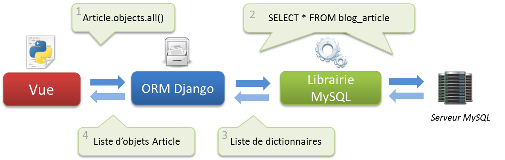

Les bases de données et Django
==============================

Pour que vous puissiez enregistrer les données de vos visiteurs, l'utilisation d'une base de données s'impose. Nous allons dans ce chapitre expliquer le fonctionnement d'une base de données, le principe des requêtes SQL et l'interface que Django propose entre les vues et les données enregistrées. À la fin de ce chapitre, vous aurez assez de connaissances théoriques pour comprendre par la suite le fonctionnement des modèles.

Une base de données, c'est quoi ? 
---------------------------------

Imaginez que vous souhaitiez classer sur papier la liste des films que vous possédez à la maison. Un film a plusieurs caractéristiques : le titre, le résumé, le réalisateur, les acteurs principaux, le genre, l'année de sortie, une appréciation, etc. Il est important que votre méthode de classement permette de différencier très proprement ces caractéristiques. De même, vous devez être sûrs que les caractéristiques que vous écrivez sont correctes et homogènes. Si vous écrivez la date de sortie une fois en utilisant des chiffres, puis une autre fois en utilisant des lettres, vous perdez en lisibilité et risquez de compliquer les choses.

Il existe plusieurs méthodes de classement pour trier nos films, mais la plus simple et la plus efficace (et à laquelle vous avez sûrement dû penser) est tout simplement un tableau ! Pour classer nos films, les colonnes du tableau renseignent les différentes caractéristiques qu'un film peut avoir, tandis que les lignes représentent toutes les caractéristiques d'un même film. Par exemple :

	| Titre              | Réalisateur        | Année | Note (sur 20) |
	| -------------------| -------------------| ------| --------------|
	| Pulp Fiction       | Quentin Tarantino  | 1994  | 19            |
	| Django Unchained   | Quentin Tarantino  | 2012  | 20            |
	| Holy Grail         | Monty Python       | 1975  | 19            |
	| Fight Club         | David Fincher      | 1999  | 20            |
	| Life of Brian      | Monty Python       | 1979  | 17            |

Le classement par tableau est très pratique et simple à comprendre. Les bases de données s'appuient sur cette méthode de tri pour enregistrer et classer les informations que vous spécifierez.

Une base de données peut contenir plusieurs tableaux, chacun servant à enregistrer un certain type d'élément. Par exemple, dans votre base, vous pourriez avoir un tableau qui recensera vos utilisateurs, un autre pour les articles, encore un autre pour les commentaires, etc.

En anglais, « tableau » est traduit par « table ». Cependant, beaucoup de ressources francophones utilisent pourtant le mot anglais « table » pour désigner un tableau, à cause de la prépondérance de l'anglais dans l'informatique. À partir de maintenant, nous utiliserons également le mot « table » pour désigner un tableau dans une base de données.

Nous avons évoqué un autre point important de ces bases de données, avec l'exemple de la date de sortie. Il faut en effet que toutes les données dans une colonne soient homogènes. Autrement dit, elles doivent avoir un même type de données : entier, chaîne de caractères, texte, booléen, date… Si vous enregistrez un texte dans la colonne `Note`, votre code vous renverra une erreur. Dès lors, chaque fois que vous irez chercher des données dans une table, vous serez sûrs du type des variables que vous obtiendrez.

Le langage SQL et les gestionnaires de base de données 
------------------------------------------------------
Il existe plusieurs programmes qui s'occupent de gérer des bases de données. Nous les appelons, tout naturellement, des gestionnaires de bases de données (ou « SGBD » pour « *systèmes de gestion de bases de données* »). Ces derniers s'occupent de tout : création de nouvelles tables, ajout de nouvelles entrées dans une table, mise à jour des données, renvoi des entrées déjà enregistrées, etc. Il y a énormément de SGBD, chacun avec des caractéristiques particulières. Néanmoins, ils se divisent en deux grandes catégories : les bases de données SQL et les bases de données non-SQL. Nous allons nous intéresser à la première catégorie (celle que Django utilise).

Les gestionnaires de bases de données SQL sont les plus populaires et les plus utilisés pour le moment. Ceux-ci reprennent l'utilisation du classement par tableau tel que nous l'avons vu. L'acronyme « SQL » signifie « *Structured Query Language* », ou en français « langage de requêtes structurées ». En effet, lorsque vous souhaitez demander au SGBD toutes les entrées d'une table, vous devez communiquer avec le serveur (le programme qui sert les données) dans un langage qu'il comprend. Ainsi, si pour commander un café vous devez parler en français, pour demander les données au gestionnaire vous devez parler en SQL.

Voici un simple exemple de requête SQL qui renvoie toutes les entrées de la table films dont le réalisateur doit être Quentin Tarantino et qui sont triées par date de sortie :	

    SELECT titre, annee_sortie, note FROM films 
    WHERE realisateur="Quentin Tarantino" ORDER BY annee_sortie;

On a déjà vu plus simple, mais voilà comment communiquent un serveur SQL et un client. Il existe bien d'autres commandes (une pour chaque type de requête : sélection, mise à jour, suppression…) et chaque commande possède ses paramètres.

Heureusement, tous les SGBD SQL parlent à peu près le même SQL, c'est-à-dire qu'une requête utilisée avec un gestionnaire fonctionnera également avec un autre. Néanmoins, ce point est assez théorique, car même si les requêtes assez basiques marchent à peu près partout, les requêtes plus pointues et avancées commencent à diverger selon le SGBD, et si un jour vous devez changer de gestionnaire, nul doute que vous devrez réécrire certaines requêtes. Django a une solution pour ce genre de situations, nous verrons cela par la suite.

Voici quelques gestionnaires SQL bien connus (dont vous avez sûrement déjà dû voir le nom quelque part) :

- **MySQL** : gratuit, probablement le plus connu et le plus utilisé à travers le monde ;
- **PostgreSQL** : gratuit, moins connu que MySQL, mais possède quelques fonctionnalités de plus que ce dernier ;
- **Oracle Database** : généralement utilisé dans de grandes entreprises, une version gratuite existe, mais est très limitée ;
- **Microsoft SQL Server** : payant, développé par Microsoft ;
- **SQLite** : très léger, gratuit, et très simple à installer (en réalité, il n'y a rien à installer avec Django).

Lors de la configuration de votre projet Django dans le chapitre précédent, nous vous avons conseillé d'utiliser SQLite. Pourquoi ? Car contrairement aux autres SGBD qui ont besoin d'un serveur lancé en permanence pour traiter les données, une base de données SQLite consiste en un simple fichier. C'est la bibliothèque Python (nommée `sqlite3`) qui se chargera de modifier et renvoyer les données de la base. C'est très utile en développement, car il n'y a rien à installer, mais en production mieux vaut utiliser un SGBD plus performant comme MySQL ou PostgreSQL.

La magie des ORM
----------------

Apprendre le langage SQL et écrire ses propres requêtes est quelque chose d'assez difficile et contraignant lorsque nous débutons. Cela prend beaucoup de temps et est assez rébarbatif. Heureusement, Django propose un système pour bénéficier des avantages d'une base de données SQL sans devoir écrire ne serait-ce qu'une seule requête SQL !

Ce type de système s'appelle ORM pour « *object-relationnal mapping* ». Derrière ce nom un peu barbare se cache un fonctionnement simple et très utile. Lorsque vous créez un modèle dans votre application Django, le framework va automatiquement créer une table adaptée dans la base de données qui permettra d'enregistrer les données relatives au modèle.

Sans entrer dans les détails (nous verrons cela après), voici un modèle simple qui reviendra par la suite :

    class Article(models.Model):
       titre = models.CharField(max_length=100)
       auteur = models.CharField(max_length=42)
       contenu = models.TextField(null=True)
       date = models.DateTimeField(auto_now_add=True, auto_now=False, 
                                   verbose_name="Date de parution")

À partir de ce modèle, Django va créer une table `blog_article` (« blog » étant le nom de l'application dans laquelle le modèle est ajouté) dont les champs seront `titre`, `auteur`, `contenu` et `date`. Chaque champ a son propre type (tel que défini dans le modèle), et ses propres paramètres. Tout cela se fait, encore une fois, sans écrire la moindre requête SQL.

La manipulation de données est tout aussi simple bien évidemment. Le code suivant…

    Article(titre="Bonjour", auteur="Maxime", contenu="Salut").save()

… créera une nouvelle entrée dans la base de données. Notez la relation qui se crée : chaque instance du modèle Article qui se crée correspond à une entrée dans la table SQL. **Toute manipulation des données** dans la base **se fait depuis des objets Python**, ce qui est bien plus intuitif et simple.

De la même façon, il est possible d'obtenir toutes les entrées de la table. Ainsi le code suivant…

    Article.objects.all()

… renverra des instances d'Article, une pour chaque entrée dans la table, comme le schématise la figure suivante :

Pour conclure, l'ORM est un système très flexible, utilisé dans la plupart des frameworks web aujourd'hui. Django l'insère parfaitement bien dans l'architecture MVT que nous avons décrite précédemment. L'avantage majeur est bien évidemment une meilleure compréhension du code pour les non habitués au SQL. Cependant, cela nous donne également la possibilité de migrer d'un système de base de données à un autre sans toucher à notre code.

Le principe des clés étrangères 
-------------------------------

Pour terminer ce chapitre, nous allons aborder une dernière notion théorique relative aux bases de données SQL, il s'agit des clés étrangères (ou *Foreign Keys* en anglais).

Reprenons notre exemple de tout à l'heure : nous avons une table qui recense plusieurs films. Imaginons maintenant que nous souhaitions ajouter des données supplémentaires, qui ne concernent pas les films mais les réalisateurs. Nous voudrions par exemple ajouter le pays d'origine et la date de naissance des réalisateurs. Étant donné que certains réalisateurs reviennent plusieurs fois, il serait redondant d'ajouter les caractéristiques des réalisateurs dans les caractéristiques des films. La bonne solution ? Créer une nouvelle table qui recensera les réalisateurs et *ajouter un lien* entre les films et les réalisateurs.

Lorsque Django crée une nouvelle table depuis un modèle, il va ajouter un autre champ qui n'est pas dans les attributs de la classe. Il s'agit d'un champ tout simple nommé `ID` (pour « identifiant », synonyme ici de « clé »), qui contiendra un certain nombre unique à l'entrée, et qui va croissant au fil des entrées. Ainsi, le premier réalisateur ajouté aura l'identifiant 1, le deuxième l'identifiant 2, etc.

	| ID | Nom               | Date de naissance |
	| ---| ------------------| ------------------|
	| 1  | Quentin Tarantino | 1963              |
	| 2  | David Fincher     | 1962              |
	| 3  | Monty Python      | 1969              |

Jusqu'ici, rien de spécial à part la nouvelle colonne `ID` introduite précédemment. En revanche, dans la table recensant les films, une colonne a été modifiée :

	| Titre              | Réalisateur | Année | Note (sur 20) |
	| -------------------| ------------| ------| --------------|
	| Pulp Fiction       | 1           | 1994  | 19            |
	| Django Unchained   | 1           | 2012  | 20            |
	| Holy Grail         | 3           | 1975  | 19            |
    | Fight Club         | 2           | 1999  | 20            |
    | Life of Brian      | 3           | 1979  | 17            |

Désormais, les noms des réalisateurs sont **remplacés par des nombres**. Ceux-ci correspondent aux **identifiants** de la table des réalisateurs. Si nous souhaitons obtenir le réalisateur du film Fight Club, il faut aller regarder dans la table `réalisateurs` et sélectionner l'entrée ayant l'identifiant 2. Nous pouvons dès lors regarder le nom du réalisateur : nous obtenons bien à nouveau David Fincher, et les données supplémentaires (date de naissance et pays d'origine) sont également accessibles.

Cette méthode de clé étrangère (car la clé vient d'une autre table) permet de créer simplement des liens entre des entrées dans différents tableaux. L'ORM de Django gère parfaitement cette méthode. Vous n'aurez probablement jamais besoin de l'identifiant pour gérer des liaisons, Django s'en occupera et renverra directement l'objet de l'entrée associée.

En résumé
---------

- Une base de données permet de stocker vos données de façon organisée et de les récupérer en envoyant des requêtes à votre système de gestion de base de données ;
- De manière générale, nous communiquons la plupart du temps avec les bases de données via le langage SQL ;
- Il existe plusieurs systèmes de gestion de bases de données, ayant chacun ses particularités ;
- Pour faire face à ces différences, Django intègre une couche d'abstraction, afin de communiquer de façon uniforme et plus intuitive avec tous les systèmes : il s'agit de l'ORM que nous avons présenté brièvement ;
- Une ligne dans une table peut être liée à une autre ligne d'une autre table via le principe de clés étrangères : nous gardons l'identifiant de la ligne de la seconde table dans une colonne de la ligne de la première table.