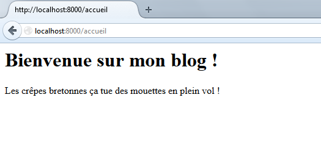
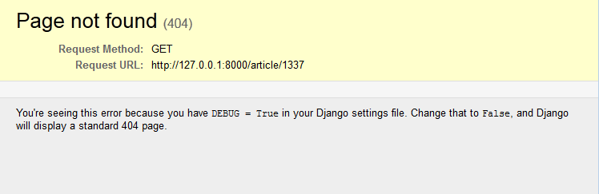

Votre première page grâce aux vues
==================================

Dans ce chapitre, nous allons créer notre première page web avec Django. Pour ce faire, nous verrons comment créer une vue dans une application et la rendre accessible depuis une URL. Une fois cela fait, nous verrons comment organiser proprement nos URL afin de rendre le code plus propre et structuré. Nous aborderons ensuite deux cas spécifiques des URL, à savoir la gestion de paramètres et de variables dans celles-ci, et les redirections, messages d'erreur, etc.

Cette partie est fondamentale pour aborder la suite et comprendre le fonctionnement du framework en général. Autrement dit, nous ne pouvons que vous conseiller de bien vous accrocher tout du long !

Hello World !
-------------

Commençons enfin notre blog sur les bonnes crêpes bretonnes. En effet, au chapitre précédent, nous avons créé une application « blog » dans notre projet, il est désormais temps de se mettre au travail !

Pour rappel, comme vu dans la théorie, *chaque vue se doit d'être associée au minimum à une URL*. Avec Django, une vue est représentée par une fonction définie dans le fichier `views.py`, prenant en paramètre une requête HTTP et renvoyant une réponse HTTP. Cette fonction va généralement récupérer des données dans les modèles (ce que nous verrons plus tard) et appeler le bon template pour générer le rendu HTML adéquat. Par exemple, nous pourrions donner la liste des 10 derniers articles de notre blog au moteur de templates, qui se chargera de les insérer dans une page HTML finale, qui sera renvoyée à l'utilisateur.

Pour débuter, nous allons réaliser quelque chose de relativement simple : une page qui affichera « Bienvenue sur mon blog ! ».

### La gestion des vues

Chaque application possède *son propre* fichier `views.py`, regroupant l'ensemble des fonctions que nous avons introduites précédemment. Comme tout bon blog, le nôtre possèdera plusieurs vues qui rempliront diverses tâches, comme l'affichage d'un article par exemple.

Commençons à travailler dans `blog/views.py`. Par défaut, Django a généré gentiment ce fichier :

    from django.shortcuts import render

    # Create your views here.

Si vous utilisez encore Python 2, pour éviter tout problème par la suite, indiquons à l'interpréteur Python que le fichier sera en UTF-8, afin de prendre en charge les accents. En effet, Django gère totalement l'UTF-8 et il serait bien dommage de ne pas l'utiliser. Insérez ceci comme première ligne de code du fichier, avant l'import :

    #-*- coding: utf-8 -*-

Cela vaut pour tous les fichiers Python que nous utiliserons à l'avenir. Spécifiez toujours un encodage UTF-8 au début de ceux-ci ! Ceci ne concerne que Python 2 et est totalement facultatif pour Python 3

Désormais, nous pouvons créer une fonction qui remplira le rôle de la vue. Bien que nous n'ayons vu pour le moment ni les modèles, ni les templates, il est tout de même possible d'écrire une vue, mais celle-ci restera basique. En effet, il est possible d'écrire du code HTML directement dans la vue et de le renvoyer au client. On va pour le moment laisser de côté la méthode `render` déjà importé et utiliser `HttpResponse`, pour comprendre la base :

	from django.http import HttpResponse
	from django.shortcuts import render

	def home(request):
        """ Exemple de page HTML, non valide pour que l'exemple soit concis """
	    text = """<h1>Bienvenue sur mon blog !</h1>
	              
Les crêpes bretonnes ça tue des mouettes en plein vol !
"""
	    return HttpResponse(text)

Si vous utilisez Python 2, vous pourriez avoir besoin de préfixer les chaines contenant des accents avec `u` : `text = u"""..."""` pour forcer la chaine en Unicode.

Ce code se divise en trois parties :

- Nous importons la classe `HttpResponse` du module `django.http`. Cette classe permet de retourner une réponse (texte brut, JSON ou HTML comme ici) depuis une chaîne de caractères. `HttpResponse` est spécifique à Django et permet d'encapsuler votre réponse dans un objet plus générique, que le framework peut traiter plus aisément.
- Une fonction `home`, avec comme argument une instance de `HttpRequest`. Nous avons nommé ici (et c'est par convention partout le cas) sobrement cet argument `request`. Celui-ci contient des informations sur la méthode de la requête (GET, POST), les données des formulaires, la session du client, etc. Nous y reviendrons plus tard.
- Finalement, la fonction déclare une chaîne de caractères nommée `text` et crée une nouvelle instance de `HttpResponse` à partir de cette chaîne, que la fonction renvoie ensuite au framework.

Toutes les fonctions prendront comme premier argument un objet du type `HttpRequest`. Toutes les vues doivent forcément retourner une instance de `HttpResponse`, sans quoi Django générera une erreur.

Par la suite, _ne renvoyez jamais du code HTML directement depuis la vue_ comme nous le faisons ici. Passez toujours par des templates, ce que nous introduirons au chapitre suivant, utilisable avec la méthode `render` que nous avons laissé de côté pour le moment.
Il s'agit de respecter l'architecture du framework dont nous avons parlé dans la partie précédente afin de bénéficier de ses avantages (la structuration du code notamment). Nous n'avons utilisé cette méthode que dans un _but pédagogique_ et afin de montrer les choses une par une.

Routage d'URL : comment j'accède à ma vue ?
-------------------------------------------
Nous avons désormais une vue opérationnelle, il n'y a plus qu'à l'appeler depuis une URL. Mais comment ? En effet, nous n'avons pas encore défini vers quelle URL pointait cette fonction. Pour ce faire, il faut modifier le fichier `urls.py` de votre projet (ici `crepes_bretonnes/urls.py`). Par défaut, ce fichier est minimaliste et contient des exemples basiques :

	from django.conf.urls import patterns, include, url
	from django.contrib import admin

	urlpatterns = patterns('',
	    # Examples:
	    # url(r'^$', 'crepes_bretonnes.views.home', name='home'),
	    # url(r'^blog/', include('blog.urls')),

	    url(r'^admin/', include(admin.site.urls)),
	)

Quand un utilisateur appelle une page de votre site, la requête est directement prise en charge par le contrôleur de Django qui va chercher à quelle vue correspond cette URL. En fonction de l'ordre de définition dans le fichier précédent, la première vue qui correspond à l'URL demandée sera appelée, et elle retournera donc la réponse HTML au contrôleur (qui, lui, la retournera à l'utilisateur). Si aucune URL ne correspond à un schéma que vous avez défini, alors Django renverra une page d'erreur 404. Le schéma d'exécution est celui de la figure suivante.

")

Occupons-nous du tuple `urlpatterns`, qui permet de définir les associations entre URL et vues. Une association de routage basique se définit par un sous-tuple composé des éléments suivants :

- Le pattern de l'URL : une URL peut être composée d'arguments qui permettent par la suite de retrouver des informations dans les modèles par exemple. Exemple : un titre d'article, le numéro d'un commentaire, etc. ;
- Le chemin Python vers la vue correspondante.

Par exemple, en reprenant la vue définie tout à l'heure, si nous souhaitons que celle-ci soit accessible depuis l'URL `http://www.crepes-bretonnes.com/accueil`, il suffit de rajouter cette règle dans votre urlpatterns (avant ou après celui `admin/` déjà présent, cela a peu d'importance) :

	urlpatterns = patterns('',
	    url(r'^accueil$', 'blog.views.home'),
	)

Mettre `r'^$'` comme URL équivaut à spécifier la racine du site web. Autrement dit, si nous avions utilisé cette URL à la place de `r'^accueil$'`, la vue serait accessible depuis `http://www.crepes-bretonnes.com/`.

Qu'est-ce que c'est, tous ces caractères bizarres dans l'URL ?

Pour bien comprendre cette nouvelle ligne, il faut voir rapidement ce qu'est une expression régulière (ou « regex »). Elles sont utilisées ici pour créer des URL plus souples, on le verra quand on prendra en compte des arguments. Il est généralement conseillé de maîtriser au moins les bases des regex pour pouvoir écrire des URL correctes. Dans ce cas-ci :

- `^` indique le début de la chaîne (autrement dit, il ne peut rien y avoir avant `/accueil`) ;
- `?` indique que le caractère précédent peut être absent ;
- `$` est le contraire de `^`, il indique la fin de la chaîne.

Bien évidemment, toute expression régulière compatible avec le module `re` de Python sera compatible ici aussi.

Concernant le lien vers la vue, il s'agit du même type de lien utilisé lors d'une importation de module. Ici :

- `blog` indique le module qui forme l'application « blog » ;
- `views` indique le fichier concerné du module ;
- `home` est le nom de la fonction dans le fichier `views.py`.

Grâce à cette règle, Django saura que lorsqu'un client demande la page `http://www.crepes-bretonnes.com/accueil`, il devra appeler la vue `blog.views.home`.

Enregistrez les modifications, lancez le serveur de développement Django et laissez-le tourner (pour rappel : `python manage.py runserver`), et rendez-vous sur `http://localhost:8000/accueil`. Vous devriez obtenir quelque chose comme la figure suivante.

Si c'est le cas, félicitations, vous venez de créer votre première vue !

Organiser proprement vos URL
----------------------------

Dans la partie précédente, nous avions parlé de deux avantages importants de Django : la réutilisation d'applications et la structuration du code. Sauf qu'évidemment, un problème se pose avec l'utilisation des URL que nous avons faites : si nous avons plusieurs applications, toutes les URL de celles-ci iraient dans` urls.py` du projet, ce qui compliquerait nettement la réutilisation d'une application et ne structure en rien votre code.

En effet, il faudrait sans cesse recopier toutes les URL d'une application en l'incluant dans un projet, et une application complexe peut avoir des dizaines d'URL, ce qui ne facilite pas la tâche du développeur. Sans parler de la problématique qui survient lorsqu'il faut retrouver la bonne vue parmi la centaine de vues déjà écrites. C'est pour cela qu'il est généralement bien vu de créer dans chaque application un fichier également nommé `urls.py` et d'inclure ce dernier par la suite dans le fichier `urls.py` du projet.

### Comment procède-t-on ?

Tout d'abord, il faut créer un fichier `urls.py` dans le dossier de votre application, ici `blog`. Ensuite, il suffit d'y réécrire l'URL que nous avons déjà écrite précédemment (ne pas oublier l'importation des modules nécessaires !) :

	from django.conf.urls import patterns, url

	urlpatterns = patterns('',
	    url(r'^accueil$', 'blog.views.home'),
	)

Et c'est tout pour `blog/urls.py` !

Maintenant, retournons à `crepes_bretonnes/urls.py`. Nous pouvons y enlever la règle réécrite dans `blog/urls.py`. Il ne devrait donc plus rester grand-chose. L'importation des règles de `blogs/urls.py` est tout aussi simple, il suffit d'utiliser la fonction `include` de `django.conf.urls` et d'ajouter ce sous-tuple à urlpatterns :

    url(r'^blog/', include('blog.urls')),

Ici, on a défini le préfixe d'URL `^blog/`. Cette portion va précéder toutes les URL incluses. Autrement dit, nous avions une URL `/accueil` qui envoyait vers la vue `blog.views.home`, désormais celle-ci sera accessible depuis `/blog/accueil`. Et cela vaut pour toutes les futures URL importées. Cependant, rien ne vous empêche de laisser cette chaîne de caractères vide (ainsi `/accueil` restera `/accueil`), mais il s'agit d'une bonne solution pour structurer vos URL et éviter les conflits entre applications.

Nous avons scindé nos URL dans un fichier `urls.py` pour chaque application. Cependant, nous allons bientôt ajouter d'autres URL plus complexes dans notre `blog/urls.py`. Toutes ces URL seront routées vers des vues de `blog.views`. Au final, la variable `urlpatterns` de notre `blog/urls.py` risque de devenir longue :

	urlpatterns = patterns('',
	    url(r'^accueil$', 'blog.views.home'),
	    url(r'^truc$', 'blog.views.truc'),
	    url(r'^chose$', 'blog.views.chose'),
	    url(r'^machin$', 'blog.views.machin'),
	    url(r'^foo$', 'blog.views.foo'),
	    url(r'^bar$', 'blog.views.bar'),
	)

Maintenant, imaginez que votre application « blog » change de nom, vous allez devoir réécrire tous les chemins vers vos vues ! Pour éviter de devoir modifier toutes les règles une à une, il est possible de spécifier un module par défaut qui contient toutes les vues. Pour ce faire, il faut utiliser le premier élément de notre tuple qui est resté une chaîne de caractères vide jusqu'à maintenant :

	urlpatterns = patterns('blog.views',
	    url(r'^accueil$', 'home'),
	    url(r'^truc$', 'truc'),
	    url(r'^chose$', 'chose'),
	    url(r'^machin$', 'machin'),
	    url(r'^foo$', 'foo'),
	    url(r'^bar$', 'bar'),
	)

Tout est beaucoup plus simple et facilement éditable. Le module par défaut ici est `blog.views`, car toutes les vues viennent de ce fichier-là ; cela est désormais possible, car nous avons scindé notre `urls.py` principal en plusieurs `urls.py` propres à chaque application.

Finalement, notre `blog/urls.py` ressemble à ceci pour le moment :

	from django.conf.urls import patterns, url

	urlpatterns = patterns('blog.views',
	    url(r'^accueil$', 'home'),
	)

Ne négligez pas cette solution, utilisez-la dès maintenant ! Il s'agit d'une excellente méthode pour structurer votre code, parmi tant d'autres que Django offre. Pensez aux éventuels développeurs qui pourraient maintenir votre projet après vous et qui n'ont pas envie de se retrouver avec une structure proche de l'anarchie.

Passer des arguments à vos vues
-------------------------------

Nous avons vu comment lier des URL à des vues et comment les organiser. Cependant, un besoin va bientôt se faire sentir : pouvoir passer des paramètres dans nos adresses directement. Si vous observez les adresses du site Instagram (qui est basé sur Django), le lien vers une photo est construit ainsi : `http://instagr.am/p/*******` où `*******` est une suite de caractères alphanumériques. Cette suite représente en réalité l'identifiant de la photo sur le site et permet à la vue de récupérer les informations en relation avec cette photo.

Pour passer des arguments dans une URL, il suffit de capturer ces arguments directement depuis les expressions régulières. Par exemple, si nous souhaitons sur notre blog pouvoir accéder à un certain article via l'adresse `/blog/article/**` où `**` sera l'identifiant de l'article (un nombre unique), il suffit de fournir le routage suivant dans votre `urls.py` :

	urlpatterns = patterns('blog.views',
	    url(r'^accueil$', 'home'),  # Accueil du blog
	    url(r'^article/(\d+)$', 'view_article'),  # Vue d'un article
	    url(r'^articles/(\d{4})/(\d{2})$', 'list_articles'),  # Vue des articles d'un mois précis
	)

Lorsque l'URL `/blog/article/42` est demandée, Django regarde le routage et exécute la fonction `view_article`, en passant en paramètre `42`. Autrement dit, Django appelle la vue de cette manière : `view_article(request, 42)`. Voici un exemple d'implémentation :

	def view_article(request, id_article):
	    """ Vue qui affiche un article selon son identifiant (ou ID, ici un numéro)
	        Son ID est le second paramètre de la fonction (pour rappel, le premier
	        paramètre est TOUJOURS la requête de l'utilisateur) """

	    text = "Vous avez demandé l'article #{0} !".format(id_article)
	    return HttpResponse(text)

Il faut cependant faire attention à l'ordre des paramètres dans l'URL afin qu'il corresponde à l'ordre des paramètres de la fonction. En effet, lorsque nous souhaitons obtenir la liste des articles d'un mois précis, selon la troisième règle que nous avons écrite, il faudrait accéder à l'URL suivante pour le mois de juin 2012 : `/blog/articles/2014/09`.

Cependant, si nous souhaitons changer l'ordre des paramètres de l'URL pour afficher le mois, et ensuite l'année, celle-ci deviendrait `/blog/articles/09/2014`. Il faudra donc modifier l'ordre des paramètres dans la déclaration de la fonction en conséquence.

Pour éviter cette lourdeur et un bon nombre d'erreurs, il est possible d'associer une variable de l'URL à un paramètre de la vue. Voici la démarche :

	urlpatterns = patterns('blog.views',
	    url(r'^home$', 'home'),  # Accueil du blog
	    url(r'^article/(?P<id_article>\d+)$', 'view_article'),  # Vue d'un article
	    url(r'^articles/(?P<year>\d{4})/(?P<month>\d{2})$', 'list_articles'),  # Vue des articles d'un mois précis
	)

Et la vue correspondante :

	def list_articles(request, month, year):
	    """ Liste des articles d'un mois précis. """

	    text = "Vous avez demandé les articles de {0} {1}.".format(month, year)
	    return HttpResponse(text)

Dans cet exemple, mois et année (`month` et `year`) ne sont pas dans le même ordre entre le `urls.py` et le `views.py`, mais Django s'en occupe et règle l'ordre des arguments en fonction des noms qui ont été donnés dans le `urls.py`. En réalité, le framework va exécuter la fonction de cette manière :

	list_articles(request, year=2014, month=9)

Il faut juste s'assurer que les noms de variables donnés dans le fichier `urls.py` coïncident avec les noms donnés dans la déclaration de la vue, sans quoi Python retournera une erreur.

Pour terminer, sachez qu'il est toujours possible de passer des paramètres GET. Par exemple : `http://www.crepes-bretonnes.com/blog/article/1337?ref=twitter`. Django tentera de trouver le pattern correspondant en ne prenant en compte que ce qui est avant les paramètres GET, c'est-à-dire `/blog/article/1337`. Les paramètres passés par la méthode GET sont bien évidemment récupérables, via le dictionnaire `request.GET` dans la vue. Ici, `request.GET['ref']` retournerait `'twitter'`.

Des réponses spéciales
----------------------
Jusqu'ici, nous avons vu comment renvoyer une page HTML standard. Cependant, il se peut que nous souhaitions renvoyer autre chose que du HTML : une erreur 404 (page introuvable), une redirection vers une autre page, etc.

### Simuler une page non trouvée

Parfois, une URL correspond bien à un pattern mais ne peut tout de même pas être considérée comme une page existante. Par exemple, lorsque vous souhaitez afficher un article avec un identifiant introuvable, il est impossible de renvoyer une page, même si Django a correctement identifié l'URL et utilisé la bonne vue. Dans ce cas-là, nous pouvons le faire savoir à l'utilisateur via une page d'erreur 404, qui correspond au code d'erreur indiquant qu'une page n'a pas été trouvée. Pour ce faire, il faut utiliser une exception du framework : `Http404`. Cette exception, du module `django.http`, arrête le traitement de la vue, et renvoie l'utilisateur vers une page d'erreur.

Voici un rapide exemple d'une vue compatible avec une des règles de routage que nous avons décrites dans le sous-chapitre précédent :

	from django.http import HttpResponse, Http404

	def view_article(request, id_article):
        # Si l'ID est supérieur à 100, nous considérons que l'article n'existe pas
	    if int(id_article) > 100:
	        raise Http404

	    return HttpResponse('<h1>Mon article ici</h1>')

Si à l'appel de la page l'argument `id_article` est supérieur à 100, la page retournée sera une erreur 404 de Django, visible à la figure suivante. Il est bien entendu possible de personnaliser par la suite cette vue, avec un template, afin d'avoir une page d'erreur qui soit en accord avec le design de votre site, mais cela ne fonctionne uniquement qu'avec `DEBUG = False` dans le `settings.py` (en production donc). Si vous êtes en mode de développement, vous aurez toujours une erreur similaire à la figure suivante.

### Rediriger l'utilisateur

Le second cas que nous allons aborder concerne les redirections. Il arrive que vous souhaitiez rediriger votre utilisateur vers une autre page lorsqu'une action vient de se dérouler, ou en cas d'erreur rencontrée. Par exemple, lorsqu'un utilisateur se connecte, il est souvent redirigé soit vers l'accueil, soit vers sa page d'origine. Une redirection est réalisable avec Django via la méthode `redirect` qui renvoie un objet `HttpResponseRedirect` (classe héritant de `HttpResponse`), qui redirigera l'utilisateur vers une autre URL. La méthode `redirect` peut prendre en paramètres plusieurs types d'arguments, dont notamment une URL brute (chaîne de caractères) ou le nom d'une vue.

Si par exemple vous voulez que votre vue, après une certaine opération, redirige vos visiteurs vers le site de Django, il faudrait procéder ainsi :

	from django.shortcuts import redirect

	def list_articles(request, year, month):
	    # Il veut des articles ? Soyons fourbe et redirigeons le vers djangoproject.com
	    return redirect("https://www.djangoproject.com")

N'oubliez pas qu'une URL valide pour accéder à cette vue serait `/blog/articles/2014/09`.

Cependant, si vous souhaitez rediriger votre visiteur vers une autre page de votre site web, il est plus intéressant de privilégier l'autre méthode, qui permet de garder indépendante la configuration des URL et des vues. Nous devons donc passer en argument le nom de la vue vers laquelle nous voulons rediriger l'utilisateur, avec éventuellement des arguments destinés à celle-ci.

	from django.http import HttpResponse, Http404
	from django.shortcuts import redirect

	def view_article(request, id_article):
	    if int(id_article) > 100:
	        raise Http404

	    return redirect(view_redirection)

	def view_redirection(request):
	    return HttpResponse(u"Vous avez été redirigé sur cette page.")

	# Ne pas oublier dans le fichier blogs/urls.py :
	url(r'^redirection/$', 'view_redirection'),

Ici, si l'utilisateur accède à l'URL `/blog/article/101`, il aura toujours une page 404. Par contre, s'il choisit un ID inférieur à 100, alors il sera redirigé vers la seconde vue, qui affiche un simple message.

Il est également possible de préciser si la redirection est temporaire ou définitive en ajoutant le paramètre `permanent=True`. L'utilisateur ne verra aucune différence, mais ce sont des détails que les moteurs de recherche prennent en compte lors du référencement de votre site web.

Si nous souhaitions rediriger un visiteur vers la vue `view_article` définie précédemment par un ID d'article spécifique, il suffirait simplement d'ajouter un argument comme ceci :

	return redirect('blog.views.view_article', id_article=42)

Pourquoi est-ce que nous utilisons une chaîne de caractères pour désigner la vue maintenant, au lieu de la fonction elle-même ?

En fait, il est possible d'indiquer une vue de trois manières différentes :

1. En passant directement la fonction Python, comme nous l'avons vu au début avec `redirect(view_redirection)` ;
2. En donnant le chemin vers la fonction, dans une chaîne de caractères (ce qui évite de l'importer si elle se situe dans un autre fichier) ;
3. En indiquant le nom de la vue tel qu'indiqué dans un `urls.py` (voir l'exemple suivant).

En réalité, la fonction redirect va construire l'URL vers la vue selon le routage indiqué dans urls.py. Ici, il va générer l'URL `/blog/article/42` tout seul et rediriger l'utilisateur vers cette URL. Ainsi, si par la suite vous souhaitez modifier vos URL, vous n'aurez qu'à le faire dans les fichiers `urls.py`, tout le reste se mettra à jour automatiquement. Il s'agit d'une fonctionnalité vraiment pratique, il ne faut donc *jamais* écrire d'URL en dur, sauf quand cette méthode est inutilisable (vers des sites tiers par exemple).

Sachez qu'au lieu d'écrire à chaque fois tout le chemin d'une vue ou de l'importer, il est possible de lui assigner un nom plus court et plus facile à utiliser dans urls.py. Par exemple :

	url(r'^article/(?P<id_article>\d+)$', 'view_article', name="afficher_article"),

Notez le paramètre `name="afficher_article"` qui permet d'indiquer le nom de la vue. Avec ce routage, en plus de pouvoir passer directement la fonction ou le chemin vers celle-ci en argument, nous pouvons faire beaucoup plus court et procéder comme ceci :

	return redirect('afficher_article', id_article=42)

Pour terminer, sachez qu'il existe également une fonction qui permet de générer simplement l'URL et s'utilise de la même façon que `redirect` ; il s'agit de `reverse` (`django.core.urlresolvers.reverse`). Cette fonction ne retournera pas un objet `HttpResponseRedirect`, mais simplement une chaîne de caractères contenant l'URL vers la vue selon les éventuels arguments donnés. Une variante de cette fonction sera utilisée dans les templates peu après pour générer des liens HTML vers les autres pages du site.

En résumé
---------

- Le minimum requis pour obtenir une page web avec Django est une vue, associée à une URL.
- Une vue est une fonction placée dans le fichier `views.py` d'une application. Cette fonction doit toujours renvoyer un objet `HttpResponse`.
- Pour être accessible, une vue doit être liée à une ou plusieurs URL dans les fichiers `urls.py` du projet.
- Les URL sont désignées par des expressions régulières, permettant la gestion d'arguments qui peuvent être passés à la vue pour rendre l'affichage différent selon l'URL visitée.
- Il est conseillé de diviser le `urls.py` du projet en plusieurs fichiers, en créant un fichier `urls.py` par application.
- Il existe des réponses plus spéciales permettant d'envoyer au navigateur du client les codes d'erreur 404 (page non trouvée) et 403 (accès refusé), ou encore d'effectuer des redirections.