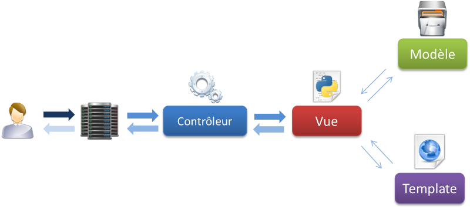
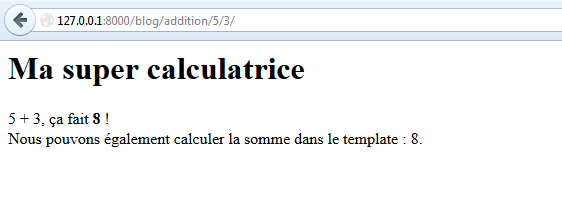
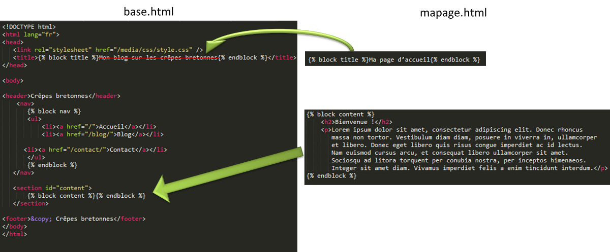

Les templates
============= 

Nous avons vu comment créer une vue et renvoyer du code HTML à l'utilisateur. Cependant, la méthode que nous avons utilisée n'est pas très pratique, le code HTML était en effet intégré à la vue elle-même ! Le code Python et le code HTML deviennent plus difficiles à éditer et à maintenir pour plusieurs raisons :

- Les indentations HTML et Python se confondent ;
- La coloration syntaxique de votre éditeur favori ne fonctionnera généralement pas pour le code HTML, celui-ci n'étant qu'une simple chaîne de caractères ;
- Si vous avez un designer dans votre projet, celui-ci risque de casser votre code Python en voulant éditer le code HTML ;
- Etc.

C'est à cause de ces raisons que tous les frameworks web actuels utilisent un moteur de templates. Les templates sont écrits dans un mini-langage de programmation propre à Django et qui possède des expressions et des structures de contrôle basiques (`if`/`else`, boucle `for`, etc.) que nous appelons des tags. Le moteur transforme les tags qu'il rencontre dans le fichier par le rendu HTML correspondant. Grâce à ceux-ci, il est possible d'effectuer plusieurs actions algorithmiques : afficher une variable, réaliser des conditions ou des boucles, faire des opérations sur des chaînes de caractères, etc.

Lier templates et vue
---------------------
Avant d'aborder le cœur même du fonctionnement des templates, retournons brièvement vers les vues. Dans la première partie, nous avons vu que nos vues étaient liées à des templates (et des modèles), comme le montre la figure suivante.

C'est la vue qui se charge de transmettre l'information de la requête au template, puis de retourner le HTML généré au client. Dans le chapitre précédent, nous avons utilisé la méthode `HttpResponse(text)` pour renvoyer le HTML au navigateur. Cette méthode prend comme paramètre une chaîne de caractères et la renvoie sous la forme d'une réponse HTTP. La question ici est la suivante : comment faire pour appeler notre template, et générer la réponse à partir de celui-ci ? La fonction `render` a été conçue pour résoudre ce problème.

La fonction `render` est en réalité une méthode de `django.shortcut` qui nous simplifie la vie : elle génère un objet `HttpResponse` après avoir traité notre template. Pour les puristes qui veulent savoir comment cela fonctionne en interne, n'hésitez pas à aller fouiller dans [la documentation officielle](https://docs.djangoproject.com/en/1.7/ref/templates/api/#using-the-template-system).

Nous allons commencer par quelques exemples avec deux vues. La première renvoie juste la date actuelle à l'utilisateur, alors que la seconde va effectuer l'addition de deux entiers.

	from datetime import datetime
	from django.shortcuts import render
	
	def date_actuelle(request):
	    return render(request, 'blog/date.html', {'date': datetime.now()})

    def addition(request, nombre1, nombre2):	
        total = int(nombre1) + int(nombre2)
    
        # retourne nombre1, nombre2 et la somme des deux
        return render(request, 'blog/addition.html', locals())

----------

	url(r'^date$', 'date_actuelle'),
    url(r'^addition/(?P<nombre1>\d+)/(?P<nombre2>\d+)/$', 'addition'),

Comme vous pouvez le voir, la fonction `render` prend en argument trois paramètres :

- La requête initiale, qui a permis de construire la réponse (`request` dans notre cas) ;
- Le chemin vers le template adéquat dans une application ou un des dossiers de templates donnés dans `settings.py` ;
- Un dictionnaire reprenant les variables qui seront accessibles dans le template.

Avant d'écrire notre template, il faut d'abord se demander où est-ce que l'on va l'enregistrer. Par défaut, Django va chercher les templates aux endroits suivants :

1. Dans la liste des dossiers fournis dans la variable de configuration `TEMPLATES_DIR`.
2. S'il ne l'a pas trouvé, dans le dossier `templates` de l'application en cours

Nous n'avons pas parlé de `TEMPLATES_DIR` lors de la configuration de notre projet, car cette variable n'est pas présente par défaut dans le fichier `settings.py`. En réalité, il vous est possible de définir une liste de dossiers où Django ira chercher les templates en priorité. Classiquement, cette liste est composée d'un dossier `templates` à la racine de votre projet : 

    TEMPLATE_DIRS = (
        os.path.join(BASE_DIR, 'templates'),
    )

Nous vous conseillons de créer un dossier `templates` à la racine du projet. Vous pourrez y déposer des templates plutôt propres à votre projet (erreurs 404, squelette de votre design, pages statiques...).

Pour nos applications, nous allons utiliser la deuxième catégorie : le dossier `templates` de l'application actuelle. En effet, il est préférable de conserver les templates propre à une application dans son dossier, afin de permettre la réusabilité de l'application. Si vous souhaitez partager votre application, tout marchera sans devoir déplacer les templates en fonction de l'installation.

Enfin, pour éviter les conflits, l'usage est de créer un dossier du nom de l'application au sein du dossier `templates`. On obtient alors la hiérarchie suivante : 

    crepes_bretonnes/
            blog/
                __init__.py
                admin.py
                migrations/
                    __init__.py
                models.py
                templates/
                    blog/
                        addition.html
                        date.html
                tests.py
                views.py
            crepes_bretonnes/
                __init__.py
                settings.py
                urls.py
                wsgi.py
            templates/
            db.sqlite3
            manage.py

L'avantage de cette structure est que les personnes qui utiliseraient votre application pourrait surcharger votre template en écrivant un nouveau dans leur propre dossier `templates/` global !

Maintenant que nous avons notre structure, créeons nos fichiers templates. Occupons-nous d'abord de `date.html`, le plus simple. Créez ce nouveau fichier dans `blog/templates/blog` :

    <h1>Bienvenue sur mon blog</h1>
    
La date actuelle est : {{ date }}

Nous retrouvons `date`, comme passé dans `render()` ! Si vous accédez à cette page (après lui avoir assigné une URL), le `{{ date }}` est bel et bien remplacé par la date actuelle !  
Dans ce fichier, nous avons accès qu'à cette variable, puisque c'est la seule que nous avons passé au template via la fonction `render`.

Si vous obtenez l'exception `TemplateDoesNotExist`, spécifiant que `blog/date.html` n'existe pas, vérifiez que l'application `blog` est bien dans `INSTALLED_APPS`, dans le fichier `settings.py`. Django ne va chercher les templates que dans les applications installées !

On peut rapidement observer le second exemple avec le template `addition.html` :

    <h1>Ma super calculatrice</h1>
    
{{ nombre1 }} + {{ nombre2 }}, ça fait <strong>{{ total }}</strong> ! 
    Nous pouvons également calculer la somme dans le template : {{ nombre1|add:nombre2 }}.

Nous expliquerons bientôt les structures présentes dans ce template, ne vous inquiétez pas. Cependant, en allant sur `http://127.0.0.1:8000/blog/addition/5/3`, vous obtiendrez le résultat de l'addition 5 + 3.

Encore une fois, un piège peut se glisser ici. Du fait des accents, faites attention à ce que votre fichier de templates soit encodé en **UTF8**, sinon vous pouvez obtenir l'erreur suivante :

    UnicodeDecodeError at /blog/addition/5/3/

    'utf8' codec can't decode byte 0xe7 in position 73: invalid continuation byte

Ceci est dû à la présence d'accent dans le template, cher à notre langue française.

La seule différence dans la vue réside dans le deuxième argument donné à `render`. Au lieu de lui passer un dictionnaire directement, nous faisons appel à la fonction `locals()` qui va retourner un dictionnaire contenant toutes les variables locales de la fonction depuis laquelle `locals()` a été appelée. Les clés seront les noms de variables (par exemple `total`), et les valeurs du dictionnaire seront tout simplement… les valeurs des variables de la fonction ! Ainsi, si `nombre1` valait 42, la valeur `nombre1` du dictionnaire vaudra elle aussi 42. Le dictionnaire pour notre seconde vue est semblable à ceci :

    {'total': 8, 'nombre1': 5, 'nombre2': 3, 'request': <WSGIRequest ...>}

Affichons nos variables à l'utilisateur 
---------------------------------------

### Affichage d'une variable

Comme nous l'avons déjà expliqué, la vue transmet au template les données destinées à l'utilisateur. Ces données correspondent à des variables classiques de la vue. Nous pouvons les afficher dans le template grâce à l'expression `{{ }}` qui prend à l'intérieur des accolades un argument (on pourrait assimiler cette expression à une fonction), le nom de la variable à afficher. Le nom des variables est également limité aux caractères alphanumériques et aux underscores.

    Bonjour {{ pseudo }}, nous sommes le {{ date }}.

Ici, nous considérons que la vue a transmis deux variables au template : `pseudo` et `date`. Ceux-ci seront affichés par le moteur de template. Si pseudo vaut « Jean » et date « 28 décembre », le moteur de templates affichera « _Bonjour Jean, nous sommes le 28 décembre._ ».

Si jamais la variable n'est pas une chaîne de caractères, le moteur de templates utilisera la méthode `__str__` de l'objet pour l'afficher. Par exemple, les listes seront affichés sous la forme `['element 1', 'element 2'...]`, comme si vous demandiez son affichage dans une console Python. Il est possible d'accéder aux attributs d'un objet comme en Python, en les juxtaposant avec un point. Plus tard, nos articles de blog seront représentés par des objets, avec des attributs `titre`, `contenu`, etc. Pour y accéder, la syntaxe sera la suivante :

    {# Nous supposons que notre vue a fourni un objet nommé article contenant les attributs titre, auteur et contenu #}
    <h2>{{ article.titre }}</h2>
    
<em>Article publié par {{ article.auteur }}</em>

    
    
{{ article.contenu }}

Si jamais une variable n'existe pas, ou n'a pas été envoyée au template, la valeur qui sera affichée à sa place est celle définie par `TEMPLATE_STRING_IF_INVALID` dans votre `settings.py`, qui est une chaîne vide par défaut.

### Les filtres

Les filtres permettent de modifier l'affichage en fonction d'une variable, sans passer par la vue. Prenons un exemple concret : sur la page d'accueil des sites d'actualités, le texte des dernières nouvelles est généralement tronqué, seul le début est affiché. Pour réaliser la même chose avec Django, nous pouvons utiliser un filtre qui limite l'affichage aux 80 premiers mots de notre article :

    {{ texte|truncatewords:80 }}

Ici, le filtre `truncatewords` (qui prend comme paramètre un nombre, séparé par un deux-points) est appliqué à la variable `texte`. À l'affichage, cette dernière sera tronquée et l'utilisateur ne verra que les 80 premiers mots de celle-ci.

Ces filtres ont pour but d'effectuer des opérations de façon claire, afin d'alléger les vues, et ne marchent que lorsqu'une variable est affichée (avec la structure `{{ }}` donc). Il est par exemple possible d'accorder correctement les phrases de votre site avec le filtre `pluralize` :

    Vous avez {{ nb_messages }} message{{ nb_messages|pluralize }}.

Dans ce cas, un « s » sera ajouté si le le nombre de messages est supérieur à 1. Il est possible de passer des arguments au filtre afin de coller au mieux à notre chère langue française :

    Il y a {{ nb_chevaux }} chev{{ nb_chevaux|pluralize:"al,aux" }} dans l'écurie.

Ici, nous aurons « cheval » si `nb_chevaux` est égal à 1 et « chevaux » pour le reste.

Et un dernier pour la route : imaginons que vous souhaitiez afficher le pseudo du membre connecté, ou le cas échéant « visiteur ». Il est possible de le faire en quelques caractères, sans avoir recours à une condition !

    Bienvenue {{ pseudo|default:"visiteur" }}

En bref, il existe des dizaines de filtres par défaut : safe, length, etc. Tous les filtres sont répertoriés et expliqués dans [la documentation officielle de Django](https://docs.djangoproject.com/en/1.7/ref/templates/builtins/#built-in-filter-reference), n'hésitez pas à y jeter un coup d'œil pour découvrir d'éventuels filtres qui pourraient vous être utiles.

Manipulons nos données avec les tags 
------------------------------------

Abordons maintenant le second type d'opération implémentable dans un template : les tags. C'est grâce à ceux-ci que les conditions, boucles, etc. sont disponibles.

### Les conditions : ``

Tout comme en Python, il est possible d'exécuter des conditions dans votre template selon la valeur des variables passées au template :

    Bonjour
    
       Madame
    
       Monsieur
     !

Ici, en fonction du contenu de la variable sexe, l'utilisateur ne verra pas le même texte à l'écran. Ce template est similaire au code HTML généré par la vue suivante :

    def tpl(request, sexe):
        html = "Bonjour "
        if sexe == "Femme":
            html += "Madame"
        else:
            html += "Monsieur"
        html += " !"
        return HttpResponse(html)

La séparation entre vue et template simplifie grandement les choses, et permet une plus grande lisibilité que lorsque le code HTML est écrit directement dans la vue !

Il est également possible d'utiliser les structures `if`, `elif`, `else` de la même façon :
    
    
        Bienvenue Monsieur, passez un excellent moment dans nos locaux.
    
        Vas-y, tu peux passer.
    
        Tu ne peux pas rentrer petit, tu es trop jeune !
    

### Les boucles : ``

Tout comme les conditions, le moteur de templates de Django permet l'utilisation de la boucle for, similaire à celle de Python. Admettons que nous possédions dans notre vue un tableau de couleurs définies en Python :

    couleurs = ['rouge', 'orange', 'jaune', 'vert', 'bleu', 'indigo', 'violet']

Nous décidons dès lors d'afficher cette liste dans notre template grâce à la syntaxe `` suivante :

Les couleurs de l'arc-en-ciel sont :

    <ul>
    
        <li>{{ couleur }}</li>
    
    </ul>

Avec ce template, le moteur va itérer la liste (cela fonctionne avec n'importe quel autre type itérable), remplacer la variable couleur par l'élément actuel de l'itération et générer le code compris entre  et  pour chaque élément de la liste. Comme résultat, nous obtenons le code HTML suivant :

Les couleurs de l'arc-en-ciel sont :

    <ul>
        <li>rouge</li>
        <li>orange</li>
        <li>jaune</li>
        <li>vert</li>
        <li>bleu</li>
        <li>indigo</li>
        <li>violet</li>
    </ul>

Il est aussi possible de parcourir un dictionnaire, en passant par la directive `` :

    couleurs = {'FF0000':'rouge', 
                'ED7F10':'orange', 
                'FFFF00':'jaune', 
                '00FF00':'vert', 
                '0000FF':'bleu', 
                '4B0082':'indigo', 
                '660099':'violet'}

Les couleurs de l'arc-en-ciel sont :

    <ul>
    
        <li style="color:#{{ code }}">{{ nom }}</li>
    
    </ul>

Résultat :

    <ul>
        <li style="color:#ED7F10">orange</li>
        <li style="color:#4B0082">indigo</li>
        <li style="color:#0000FF">bleu</li>
        <li style="color:#FFFF00">jaune</li>
        <li style="color:#660099">violet</li>
        <li style="color:#FF0000">rouge</li>
        <li style="color:#00FF00">vert</li>
    </ul>

Vous pouvez aussi réaliser n'importe quelle opération classique avec la variable générée par la boucle `for` (ici `couleur`, `code` ou) : une condition, utiliser une autre boucle, l'afficher, etc.

Rappelez-vous que la manipulation de données doit être faite au maximum dans les vues. Ces tags doivent juste servir à l'affichage !

Enfin, il existe une troisième directive qui peut être associée au ``, il s'agit de ``. Elle permet d'afficher un message par défaut si la liste parcourue est vide. Par exemple :

    <h3>Commentaires de l'article</h3>
    
        
{{ commentaire }}

    
        
Pas de commentaires pour le moment.

    

Ici, s'il y a au moins un élément dans `commentaires`, alors une suite de paragraphes sera affichée, contenant chacun un élément de la liste. Sinon, le paragraphe « *Pas de commentaires pour le moment.* » sera renvoyé à l'utilisateur.

### Le tag ``

Sur la quasi-totalité des sites web, *une page est toujours composée de la même façon* : un haut de page, un menu et un pied de page. Si vous copiez-collez le code de vos menus dans tous vos templates et qu'un jour vous souhaitez modifier un élément de votre menu, il vous faudra modifier tous vos templates !  
Heureusement, le tag `` nous permet d'éviter cette épineuse situation. En effet, il est possible de déclarer des blocs, qui seront définis dans un autre template, et réutilisables dans le template actuel. Dès lors, nous pouvons créer un fichier, appelé usuellement `base.html`, qui va définir la structure globale de la page, autrement dit son squelette. Par exemple:

    <!DOCTYPE html>
    <html lang="fr">
    <head>
       <link rel="stylesheet" href="/media/css/style.css" />
       <title>Mon blog sur les crêpes bretonnes</title>
    </head>
    <body>
    <header>Crêpes bretonnes</header>
        <nav>
           
           <ul>
                <li><a href="/">Accueil</a></li>
                <li><a href="/blog/">Blog</a></li>
                <li><a href="/contact/">Contact</a></li>
           </ul>
           
       </nav>
       <section id="content">
           
       </section>
    <footer>© Crêpes bretonnes</footer>
    </body>
    </html>

Ce template est composé de plusieurs éléments `` :

- Dans la balise `<title>` : `Mon blog sur les crêpes bretonnes` ;
- Dans la balise `<nav>`, qui définit un menu ;
- Dans le corps de la page, qui recevra le contenu.

Tous ces blocs *pourront être redéfinis* ou inclus tels quels dans *un autre template*. Voyons d'ailleurs comment redéfinir et inclure ces blocs.   
Tout d'abord ce fichier `base.html`, nous allons l'enregistrer dans le dossier `templates/` du projet et non dans l'application. Souvenez-vous : tout ce qui est relatif au projet va dans un des dossiers de la liste `TEMPLATE_DIRS`. Pour ce cours c'est `templates/`. Maintenant, nous allons appelez ce fichier dans chacun des templates de notre blog.

Pour ce faire, nous utilisons le tag `` (pour ceux qui ont déjà fait de la programmation objet, cela doit vous dire quelque chose ; cette méthode peut aussi être assimilée à `include` en PHP). Nous parlons alors d'*héritage de templates*. Nous prenons la base que nous surchargeons, afin d'obtenir un résultat dérivé :

    
    Ma page d'accueil
    
        <h2>Bienvenue !</h2>
        
Lorem ipsum dolor sit amet, consectetur adipiscing elit. Donec rhoncus massa non tortor. 
           Vestibulum diam diam, posuere in viverra in, ullamcorper et libero. 
           Donec eget libero quis risus congue imperdiet ac id lectus.
           Nam euismod cursus arcu, et consequat libero ullamcorper sit amet.
           Sociosqu ad litora torquent per conubia nostra, per inceptos himenaeos. Integer  
           sit amet diam. Vivamus imperdiet felis a enim tincidunt interdum.

    

Dans cet exemple, nous avons défini deux blocs, `title` et `content`. Le tag `extends` va aller chercher dans le template donné en argument, ici `base.html`, et remplacer les blocs vides de ce dernier par les blocs de même nom définis dans le template appelé par la vue. Ainsi, `title` et `content` seront repris du template fils, mais `nav` sera le bloc `nav` défini dans `base.html`. En résumé, regardez la structure représentée dans l'image suivante :

### Les liens vers les vues : ``

Nous avons vu dans le chapitre précédent les fonctions redirect et reverse, qui respectivement redirige l'utilisateur et génère le lien vers une vue, selon certains paramètres. Une variante sous la forme de tag de la fonction `reverse` existe, il s'agit de ``. Le fonctionnement de ce tag est très similaire à la fonction dont il est dérivé :

    <a href="">Lien vers mon super article N° 42</a>

… générera le code HTML suivant :

    <a href="/blog/article/42">Lien vers mon super article n° 42</a>

Ce code nous indique le chemin vers la vue ou son nom comme premier paramètre, entre guillemets. Les arguments qui suivent seront ceux de la vue (à condition de respecter le nombre et l'ordre des paramètres selon la déclaration de la vue bien entendu).

Nous aurions tout à fait pu utiliser une variable comme paramètre, que ce soit pour le nom de la vue ou les arguments :

    <a href="">Lien vers mon super article n° {{ ID_article }}</a>

### Les commentaires : ``

Finalement, il existe un tag qui permet de définir des commentaires dans les templates. Ces commentaires sont *différents des commentaires HTML* : ils n'apparaîtront pas dans la page HTML. Cela permet par exemple de cacher temporairement une ligne, ou tout simplement de documenter votre template, afin de pouvoir mieux s'y retrouver par la suite.

Il existe deux syntaxes pour les commentaires : la première permet de faire un commentaire sur une ligne uniquement : `{# Mon commentaire #}`.

    
Ma page HTML

    <!-- Ce commentaire HTML sera visible dans le code source. -->
    {# Ce commentaire Django ne sera pas visible dans le code source. #}

Si vous souhaitez faire un commentaire sur plusieurs lignes, il vous faudra utiliser le tag ``.

    
        Ceci est une page d'exemple. Elle est composée de 3 tableaux :
        - tableau des ventes
        - locations
        - retours en garantie
    
    <table>
        ...

Ajoutons des fichiers statiques 
-------------------------------

Pour le moment, nous n'avons utilisé que du HTML dans nos templates. Cependant, un site web est composé aujourd'hui de nombreuses ressources : CSS, JavaScript, images, etc. Nous allons donc voir comment les intégrer dans nos templates.

Comme pour les templates, les fichiers statiques peuvent se trouver à deux endroits : au sein d'un dossier `static` de l'application courante ou alors dans un ou plusieurs dossiers définis dans la configuration du projet.

Tout d'abord, créons un dossier à la racine du projet, dans lequel vous enregistrerez les fichiers liés globalement au projet : CSS et Javascript global, images du design... Nous l'appellerons `static`, par convention. Il faut ensuite renseigner ce dossier et assigner un préfixe d'URL dans votre `settings.py` pour les fichiers statiques. Voilà les deux variables qu'il faudra modifier, ici selon notre exemple :

    STATIC_URL = '/static/'   # Qui devrait déjà être la configuration par défaut

    STATICFILES_DIRS = (
        os.path.join(BASE_DIR, "static"),
    )

La première variable indique l'URL du dossier depuis lequel vos fichiers seront accessibles sur le site web. La deuxième renseigne le chemin vers les fichiers du projet sur votre disque dur. En plus de ce dossier, tous les dossiers `static` de toutes les applications dans `INSTALLED_APPS` pourront être utilisés.

De la même façon, on tiendra à respecter la convention du dossier du nom de l'application au sein du dossier `static`, afin d'éviter les conflits. On obtient la structure de projet suivante (nous avons omis volontairement les fichiers Python de l'application) : 

    crepes_bretonnes/
            blog/
                static/
                    blog/
                        crepes.jpg
                templates/
                    blog/
                        addition.html
                        date.html
            crepes_bretonnes/
                __init__.py
                settings.py
                urls.py
                wsgi.py
            static/
                css/
                img/
                    header.png
                js/
            templates/
                base.html

Vous pouvez ainsi inclure l'image de crêpes de l'application `blog` dans votre template de la façon suivante :

    
    

Vous avez besoin de faire `` une fois au début de votre template, et Django s'occupe tout seul de fournir l'URL vers votre ressource. Comme les URL, il est déconseillé d'écrire en dur le lien complet vers les fichiers statiques, utilisez toujours ``. En effet, si en production vous décidez que vos fichiers seront servis depuis l'URL `static.crepes-bretonnes.com`, vous devrez modifier toutes vos URL si elles sont écrites en dur ! En revanche, si elles utilisent ``, vous n'aurez qu'à éditer cette variable dans votre configuration, ce qui est tout de même bien plus pratique.

En réalité, Django ne doit pas s'occuper de servir ces fichiers, c'est à votre serveur web qu'incombe cette tâche. Cependant, en développement, le serveur Django vous permet d'utiliser les fichiers statiques tout de même. Cette méthode n'est pas considéré comme efficace et sécurisée donc elle ne doit pas être utilisée en production !  
Pour le déploiement des fichiers statiques en production, référez-vous à l'annexe consacrée à ce sujet.

En résumé
---------
- En pratique, et pour respecter l'architecture dictée par le framework Django, toute vue doit retourner un objet `HttpResponse` construit via un template.
- Pour respecter cette règle, il existe des fonctions nous facilitant le travail, comme `render`, présentée tout au long de ce chapitre. Elle permet de construire la réponse HTML en fonction d'un fichier template et de variables.
- Les templates permettent également de faire plusieurs traitements, comme afficher une variable, la transformer, faire des conditions... Attention cependant, ces traitements ont pour unique but d'afficher les données, pas de les modifier.
- Il est possible de factoriser des blocs HTML (comme le début et la fin d'une page) via l'utilisation des tags `` et ``.
- Afin de faciliter le développement, Django possède un tag `` permettant la construction d'URL en lui fournissant la vue à appeler et ses éventuels paramètres.
- L'ajout de fichiers statiques dans notre template (images, CSS, JavaScript) peut se faire via l'utilisation du tag ``.