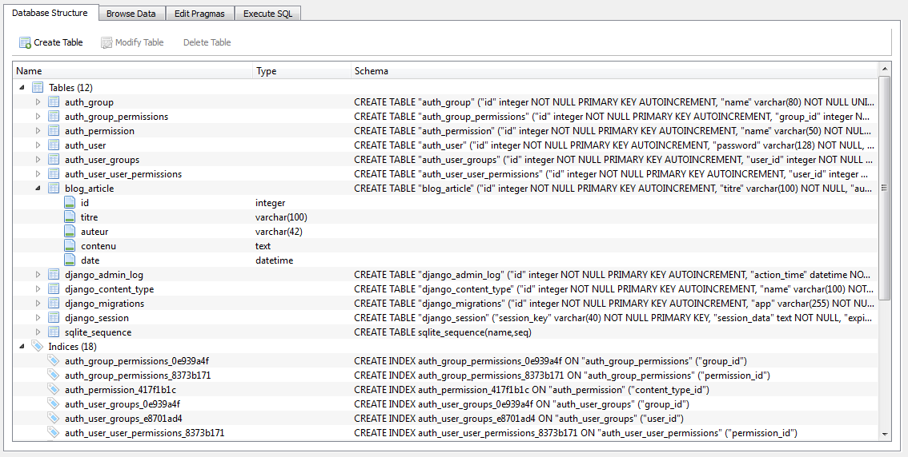

Les modèles
===========

Nous avons vu comment créer des vues et des templates. Cependant, ces derniers sont presque inutiles sans les modèles, car votre site n'aurait rien de dynamique. Autant créer des pages HTML statiques !

Dans ce chapitre, nous verrons les modèles qui, comme expliqué dans la première partie, sont des interfaces permettant plus simplement d'accéder à des données dans une base de données et de les mettre à jour.

Créer un modèle
---------------
Un modèle s'écrit sous la forme d'une classe et représente une table dans la base de données, dont les attributs correspondent aux champs de la table. Ceux-ci se rédigent dans le fichier `models.py` de chaque application. Il est important d'organiser correctement vos modèles pour que chacun ait sa place dans son application, et ne pas mélanger tous les modèles dans le même `models.py`. Pensez à la réutilisation et à la structure du code !

Tout modèle Django se doit d'hériter de la classe mère `Model` incluse dans `django.db.models` (sinon il ne sera pas pris en compte par le framework). Par défaut, le fichier `models.py` généré automatiquement importe le module `models` de `django.db`. Voici un simple exemple de modèle représentant un article de blog :

    from django.db import models

    class Article(models.Model):
        titre = models.CharField(max_length=100)
        auteur = models.CharField(max_length=42)
        contenu = models.TextField(null=True)
        date = models.DateTimeField(auto_now_add=True, auto_now=False,  verbose_name="Date de parution")

        def __str__(self):
            """ 
            Cette méthode que nous définirons dans tous les modèles
            nous permettra de reconnaître facilement les différents objets que nous
            traiterons plus tard et dans l'administration
            """
            return "%s" % self.titre

Pour que Django puisse créer une table dans la base de données, il faut lui préciser le type des champs qu'il doit créer. Pour ce faire, le framework propose une liste de champs qu'il sera ensuite capable de retranscrire en langage SQL. Ces derniers sont également situés dans le module `models`.

Dans l'exemple précédent, nous avons créé quatre attributs avec trois types de champs différents. Un `CharField` (littéralement, un champ de caractères) a été assigné à titre et auteur. Ce champ permet d'enregistrer une chaîne de caractères, dont la longueur maximale a été spécifiée via le paramètre `max_length`. Dans le premier cas, la chaîne de caractères pourra être composée de 100 caractères maximum.

Le deuxième type de champ, `TextField`, permet lui aussi d'enregistrer des caractères, un peu comme `CharField`. En réalité, Django va utiliser un autre type de champ qui ne fixe pas de taille maximale à la chaîne de caractères, ce qui est très pratique pour enregistrer de longs textes.

Finalement, le champ `DateTimeField` prend comme valeur un objet `DateTime` du module `datetime` de la bibliothèque standard. Il est donc possible d'enregistrer autre chose que du texte !

Insistons ici sur le fait que les champs du modèle peuvent prendre plusieurs arguments. Certains sont spécifiques au champ, d'autres non. Par exemple, le champ `DateTimeField` possède un argument facultatif : `auto_now_add`. S'il est mis à `True`, lors de la création d'une nouvelle entrée, Django mettra automatiquement à jour la valeur avec la date et l'heure de la création de l'objet. Un autre argument du même genre existe, `auto_now`, qui permet à peu près la même chose, mais fera en sorte que la date soit mise à jour à chaque modification de l'entrée.

L'argument `verbose_name` en revanche est un argument commun à tous les champs de Django. Il peut être passé à un `DateTimeField`, `CharField`, `TextField`, etc. Il sera notamment utilisé dans l'administration générée automatiquement pour donner une précision quant au nom du champ. Ici, nous avons insisté sur le fait que la date correspond bien à la date de parution de l'article. Le paramètre `null`, lorsque mis à `True`, indique à Django que ce champ peut être laissé vide et qu'il est donc optionnel.

Il existe beaucoup d'autres champs disponibles, ceux-ci sont repris dans la documentation de Django. N'hésitez pas à la consulter en cas de doute ou question !

Pour que Django crée la table associée au modèle, il faut lancer la commande `makemigrations` via l'utilitaire `manage.py`. Cette commande va déterminer quelles modifications ont été apportées aux modèles et va détecter quels changements il faut opérer en conséquence sur la structure de la base de données. Ensuite, il faut utiliser la commande `migrate` qui va réaliser ces changements dans la base de données. Pour rajouter votre nouveau modèle, il faut donc lancer :

    python manage.py makemigrations
    python manage.py migrate

Par la suite, si vous ajoutez ou modifiez un modèle, vous devrez tout d'abord utiliser la commande `python manage.py makemigrations` qui va détecter les dernières modifications, et à nouveau réutiliser `migrate` qui va mettre à jour la base de données selon les modifications déterminées. 

La table associée au modèle `Article` étant créée, nous pouvons commencer à jouer avec !

Jouons avec des données
-----------------------

Django propose un interpréteur interactif Python synchronisé avec votre configuration du framework. Il est possible via celui-ci de manipuler nos modèles comme si nous étions dans une vue. Pour ce faire, il suffit d'utiliser une autre commande de l'utilitaire `manage.py` :

    $ python manage.py shell
    Python 2.7.3 (default, Apr 24 2012, 00:00:54) 
    [GCC 4.7.0 20120414 (prerelease)] on linux2
    Type "help", "copyright", "credits" or "license" for more information.
    (InteractiveConsole)
    >>>

Commençons par importer le modèle que nous avons justement créé :

    >>> from blog.models import Article

Pour ajouter une entrée dans la base de données, il suffit de créer une nouvelle instance de la classe `Article` et de la sauvegarder. Chaque instance d'un modèle correspond donc à une entrée dans la base de données. Nous pouvons spécifier la valeur des attributs directement pendant l'instanciation de classe, ou l'assigner par la suite :

    >>> article = Article(titre="Bonjour", auteur="Maxime")
    >>> article.contenu = "Les crêpes bretonnes sont trop bonnes !"

Vous pourriez vous demander pourquoi n'avons-nous pas mis de valeur à l'attribut date du modèle. `date` est un `DateTimeField` dont le paramètre `auto_now_add` a été mis à `True`. Dès lors, Django se charge tout seul de le mettre à jour avec la bonne date et heure lors de la création. Cependant, il est tout de même obligatoire de remplir tous les champs pour chaque entrée sauf cas comme celui-là, sans quoi Django retournera une erreur !

Nous pouvons bien évidemment accéder aux attributs de l'objet comme pour n'importe quel autre objet Python :

    >>> article.auteur
    Maxime

Pour sauvegarder l'entrée dans la base de données (les modifications ne sont pas enregistrées en temps réel), il suffit d'appeler la méthode `save`, de la classe mère `Model` dont hérite chaque modèle :

    >>> article.save()

L'entrée a été créée et enregistrée !

Bien évidemment, il est toujours possible de modifier l'objet par la suite :

    >>> article.titre = "Salut !"
    >>> article.auteur = "Mathieu"
    >>> article.save()

Il ne faut cependant pas oublier d'appeler la méthode `save` à chaque modification, sinon les changements ne seront pas sauvegardés.

Pour supprimer une entrée dans la base de données, rien de plus simple, il suffit d'appeler la méthode `delete` d'un objet :

    >>> article.delete()

Nous avons vu comment créer, éditer et supprimer des entrées. Il serait pourtant également intéressant de pouvoir les obtenir par la suite, pour les afficher par exemple. Pour ce faire, chaque modèle (la classe, et non l'instance, attention !), possède plusieurs méthodes dans la sous-classe `objects`. Par exemple, pour obtenir toutes les entrées enregistrées d'un modèle, il faut appeler la méthode `all` :

    >>> Article.objects.all()
    []

Bien évidemment, étant donné que nous avons supprimé l'article créé un peu plus tôt, l'ensemble renvoyé est vide, créons rapidement deux nouvelles entrées :

    >>> Article(auteur="Mathieu", titre="Les crêpes", contenu="Les crêpes c'est cool").save()
    >>> Article(auteur="Maxime", titre="La Bretagne", contenu="La Bretagne c'est trop bien").save()

Cela étant fait, réutilisons la méthode `all` :

    >>> Article.objects.all()
    [<Article: Les crêpes>, <Article: La Bretagne>]

L'ensemble renvoyé par la fonction n'est pas une vraie liste, mais un `QuerySet`. Il s'agit d'un conteneur itérable qui propose d'autres méthodes sur lesquelles nous nous attarderons par la suite. Nous avons donc deux éléments, chacun correspondant à un des articles que nous avons créés.

Nous pouvons donc par exemple afficher les différents titres de nos articles :

    >>> for article in Article.objects.all():
    ... print(article.titre)
    Les crêpes
    La Bretagne

Maintenant, imaginons que vous souhaitiez sélectionner tous les articles d'un seul auteur uniquement. La méthode `filter` a été conçue dans ce but. Elle prend en paramètre une valeur d'un ou plusieurs attributs et va passer en revue toutes les entrées de la table et ne sélectionner que les instances qui ont également la valeur de l'attribut correspondant. Par exemple :

    >>> for article in Article.objects.filter(auteur="Maxime"):
    ... print(article.titre, "par", article.auteur)
    La Bretagne par Maxime

Efficace ! L'autre article n'a pas été repris dans le `QuerySet`, car son auteur n'était pas Maxime mais Mathieu.

Une méthode similaire à `filter` existe, mais fait le contraire : `exclude`. Comme son nom l'indique, elle exclut les entrées dont la valeur des attributs passés en arguments coïncide :

    >>> for article in Article.objects.exclude(auteur="Maxime"):
    ... print(article.titre, "par", article.auteur)
    Les crêpes par Mathieu

Sachez que vous pouvez également filtrer ou exclure des entrées à partir de plusieurs champs : `Article.objects.filter(titre="Coucou", auteur="Mathieu")` renverra un `QuerySet` vide, car il n'existe aucun article de Mathieu intitulé « Coucou ».

Il est même possible d'aller plus loin, en filtrant par exemple les articles dont le titre doit contenir certains caractères (et non pas être strictement égal à une chaîne entière). Si nous souhaitons prendre tous les articles dont le titre comporte le mot « crêpe », il faut procéder ainsi :

    >>> Article.objects.filter(titre__contains="crêpe")
    [<Article: Les crêpes>]

Ces méthodes de recherche spéciales sont construites en prenant le champ concerné (ici titre), auquel nous ajoutons deux underscores « \_\_ », suivis finalement de la méthode souhaitée. Ici, il s'agit donc de `titre__contains`, qui veut dire littéralement « prends tous les éléments dont le titre contient le mot passé en argument ».

D'autres méthodes du genre existent, notamment la possibilité de prendre des valeurs du champ (strictement) inférieures ou (strictement) supérieures à l'argument passé, grâce à la méthode `lt` (« less than », plus petit que) et `gt` (« greater than », plus grand que) :

    >>> from datetime import datetime
    >>> Article.objects.filter(date__lt=datetime.now())
    [<Article: Les crêpes>, <Article: La Bretagne>]

Les deux articles ont été sélectionnés, car ils remplissent tous deux la condition (leur date de parution est inférieure au moment actuel). Si nous avions utilisé `gt` au lieu de `lt`, la requête aurait renvoyé un `QuerySet` vide, car aucun article n'a été publié après le moment actuel.

De même, il existe `lte` et `gte` qui opèrent de la même façon, la différence réside juste dans le fait que ceux-ci prendront tout élément inférieur/supérieur ou égal (lte : « less than or equal », plus petit ou égal, idem pour gte).

Sur la page d'accueil de notre blog, nous souhaiterons organiser les articles par date de parution, du plus récent au plus ancien. Pour ce faire, il faut utiliser la méthode `order_by`. Cette dernière prend comme argument une liste de chaînes de caractères qui correspondent aux attributs du modèle :

    >>> Article.objects.order_by('date')
    [<Article: Les crêpes>, <Article: La Bretagne>]

Le tri se fait par ordre ascendant (ici du plus ancien au plus récent, nous avons enregistré l'article sur les crêpes avant celui sur la Bretagne). Pour spécifier un ordre descendant, il suffit de précéder le nom de l'attribut par le caractère « - » :

    >>> Article.objects.order_by('-date')
    [<Article: La Bretagne>, <Article: Les crêpes>]

Il est possible de passer plusieurs noms d'attributs à `order_by`. La priorité de chaque attribut dans le tri est déterminée par sa position dans la liste d'arguments. Ainsi, si nous trions les articles par nom et que deux d'entre eux ont le même nom, Django les départagera selon le deuxième attribut, et ainsi de suite tant que des attributs comparés seront identiques.

Accessoirement, nous pouvons inverser les éléments d'un QuerySet en utilisant la méthode `reverse`.

Finalement, dernière caractéristique importante des méthodes de `QuerySet`, elles sont cumulables, ce qui garantit une grande souplesse dans vos requêtes :

    >>> Article.objects.filter(date__lt=datetime.now()).order_by('date','titre').reverse()
    [<Article: La Bretagne>, <Article: Les crêpes>]

Pour terminer cette (longue) section, nous allons introduire des méthodes qui, contrairement aux précédentes, retournent un seul objet et non un `QuerySet`.

Premièrement, `get`, comme son nom l'indique, permet d'obtenir une et une seule entrée d'un modèle. Il prend les mêmes arguments que `filter` ou `exclude`. S'il ne retrouve aucun élément correspondant aux conditions, ou plus d'un seul, il retourne une erreur :

    >>> Article.objects.get(titre="Je n'existe pas")
    ...
    DoesNotExist: Article matching query does not exist. Lookup parameters were {'titre': "Je n'existe pas"}
    >>> Article.objects.get(auteur="Mathieu").titre
    Les crêpes
    >>> Article.objects.get(titre__contains="L")
    ...
    MultipleObjectsReturned: get() returned more than one Article -- it returned 2! Lookup parameters were {'titre__contains': 'L'}

Dans le même style, il existe une méthode permettant de créer une entrée si aucune autre n'existe avec les conditions spécifiées. Il s'agit de `get_or_create`. Cette dernière va renvoyer un tuple contenant l'objet désiré et un booléen qui indique si une nouvelle entrée a été créée ou non :

    Article.objects.get_or_create(auteur="Mathieu")
    >>> (<Article: Les crêpes>, False)
    Article.objects.get_or_create(auteur="Zozor", titre="Hi han")
    >>> (<Article: Hi han>, True)

Les liaisons entre modèles
--------------------------

Il est souvent pratique de lier deux modèles entre eux, pour relier un article à une catégorie par exemple. Django propose tout un système permettant de simplifier grandement les différents types de liaison. Nous traiterons ce sujet dans ce sous-chapitre.

Reprenons notre exemple des catégories et des articles. Lorsque vous concevrez votre base de données, vous allez souvent faire des liens entre les classes (qui représentent nos tables SQL dans notre site), comme à la figure suivante.

Pour traduire cette relation, nous allons d'abord devoir créer un autre modèle représentant les catégories. Ce dernier est relativement simple :

    class Categorie(models.Model):
        nom = models.CharField(max_length=30)

        def __str__(self):
            return self.nom

Maintenant, créons la liaison depuis notre modèle `Article`, qu'il va falloir modifier en lui ajoutant un nouveau champ :

    class Article(models.Model):
        titre = models.CharField(max_length=100)
        auteur = models.CharField(max_length=42)
        contenu = models.TextField(null=True)
        date = models.DateTimeField(auto_now_add=True, auto_now=False, verbose_name="Date de parution")
        categorie = models.ForeignKey('Categorie')

        def __str__(self):
            return self.titre

Nous avons donc ajouté un champ `ForeignKey`. En français, ce terme est traduit par « clé étrangère ». Il va enregistrer une clé, un identifiant propre à chaque catégorie enregistrée (il s'agit la plupart du temps d'un nombre), qui permettra donc de retrouver la catégorie associée.

Utilisez `makemigrations` et `migrate` comme décrits précédemment pour mettre à jour votre base de données.

La base de données étant prête, ouvrez à nouveau un shell via `manage.py shell`. Importons les modèles et créons une nouvelle catégorie :

    >>> from blog.models import Categorie, Article
    >>> cat = Categorie(nom="Crêpes")
    >>> cat.save()
    >>> art = Article()
    >>> art.titre="Les nouvelles crêpes"
    >>> art.auteur="Maxime"
    >>> art.contenu="On a fait de nouvelles crêpes avec du trop bon rhum"
    >>> art.categorie = cat
    >>> art.save()

Pour accéder aux attributs et méthodes de la catégorie associée à l'article, rien de plus simple :

    >>> art.categorie.nom
    Crêpes

Dans cet exemple, si un article ne peut avoir qu'une seule catégorie, une catégorie peut en revanche avoir plusieurs articles. Pour réaliser l'opération en sens inverse (accéder aux articles d'une catégorie depuis cette dernière), une sous-classe s'est créée toute seule avec la `ForeignKey` :

    >>> cat.article_set.all()
    [<Article: Les nouvelles crêpes>]

Le nom que prendra une relation en sens inverse est composé du nom du modèle source (qui a la `ForeignKey` comme attribut), d'un seul underscore « _ » et finalement du mot set qui signifie en anglais « ensemble ». Nous accédons donc ici à l'ensemble des articles d'une catégorie. Cette relation opère exactement comme n'importe quelle sous-classe `objects` d'un modèle, et renvoie ici tous les articles de la catégorie. Nous pouvons utiliser les méthodes que nous avons vues précédemment : `all`, `filter`, `exclude`, `order_by` …

Point important : il est possible d'accéder aux attributs du modèle lié par une clé étrangère depuis un `filter`, `exclude`, `order_by` … Nous pourrions ici par exemple filtrer tous les articles dont le titre de la catégorie possède un certain mot :

    >>> Article.objects.filter(categorie__nom__contains="crêpes")
    [<Article: Les nouvelles crêpes>]

Accéder à un élément d'une clé étrangère se fait en ajoutant deux underscores « __ », comme avec les méthodes de recherche spécifiques, suivis du nom de l'attribut recherché. Comme montré dans l'exemple, nous pouvons encore ajouter une méthode spéciale de recherche sans aucun problème !

Un autre type de liaison existe, très similaire au principe des clés étrangères : le `OneToOneField`. Ce dernier permet de lier un modèle à un autre tout aussi facilement, et garantit qu'une fois la liaison effectuée plus aucun autre objet ne pourra être associé à ceux déjà associés. La relation devient unique. Si nous avions utilisé notre exemple avec un `OneToOneField`, chaque catégorie ne pourrait avoir qu'un seul article associé, et de même pour chaque article.

Un autre bref exemple :

    class Moteur(models.Model):
        nom = models.CharField(max_length=25)

        def __str__(self):
            return self.nom

    class Voiture(models.Model):
        nom = models.CharField(max_length=25)
        moteur = models.OneToOneField(Moteur)

        def __str__(self):
            return self.nom

N'oubliez pas de mettre à jour votre base de données.

Nous avons deux objets, un moteur nommé « Vroum » et une voiture nommée « Crêpes-mobile » qui est liée au moteur. Nous pouvons accéder du moteur à la voiture ainsi, depuis `manage.py shell` :

    >>> from blog.models import Moteur, Voiture
    >>> moteur = Moteur.objects.create(nom="Vroum") # create crée directement l'objet et l'enregistre
    >>> voiture = Voiture.objects.create(nom="Crêpes-mobile", moteur=moteur)
    >>> moteur.voiture
    <Voiture: Crêpes-mobile>
    >>> voiture.moteur
    <Moteur: Vroum>

Ici, le `OneToOneField` a créé une relation en sens inverse qui ne va plus renvoyer un `QuerySet`, mais directement l'élément concerné (ce qui est logique, celui-ci étant unique). Cette relation inverse prendra simplement le nom du modèle, qui n'est donc plus suivi par `_set`.

Sachez qu'il est possible de changer le nom de la variable créée par la relation inverse (précédemment `article_set` et moteur). Pour ce faire, il faut utiliser l'argument `related_name` du `ForeignKey` ou `OneToOneField` et lui passer une chaîne de caractères désignant le nouveau nom de la variable (à condition que cette chaîne représente bien un nom de variable valide !). Cette solution est notamment utilisée en cas de conflit entre noms de variables. Accessoirement, il est même possible de désactiver la relation inverse en donnant `related_name='+'`.

Finalement, dernier type de liaison, le plus complexe : le `ManyToManyField` (traduit littéralement, « plusieurs-à-plusieurs »). Reprenons un autre exemple simple : nous construisons un comparateur de prix pour les ingrédients nécessaires à la réalisation de crêpes. Plusieurs vendeurs proposent plusieurs produits, parfois identiques, à des prix différents.

Il nous faudra trois modèles :

    class Produit(models.Model):
        nom = models.CharField(max_length=30)

        def __str__(self):
            return self.nom

    class Vendeur(models.Model):
        nom = models.CharField(max_length=30)
        produits = models.ManyToManyField(Produit, through='Offre')
        
        def __str__(self):
            return self.nom

    class Offre(models.Model):
        prix = models.IntegerField()
        produit = models.ForeignKey(Produit)
        vendeur = models.ForeignKey(Vendeur)

        def __str__(self):
            return "{0} vendu par {1}".format(self.produit, self.vendeur)

Explications ! Les modèles `Produit` et `Vendeur` sont classiques, à l'exception du fait que nous avons utilisé un `ManyToManyField` dans `Vendeur`, au lieu d'une `ForeignKey` ou de `OneToOneField` comme précédemment. La nouveauté, en revanche, est bien le troisième modèle : `Offre`. C'est celui-ci qui fait le lien entre `Produit` et `Vendeur` et permet d'ajouter des informations supplémentaires sur la liaison (ici le prix, caractérisé par un `IntegerField` qui enregistre un nombre).

Un `ManyToManyField` va toujours créer une table intermédiaire qui enregistrera les clés étrangères des différents objets des modèles associés. Nous pouvons soit laisser Django s'en occuper tout seul, soit la créer nous-mêmes pour y ajouter des attributs supplémentaires (pour rappel, ici nous ajoutons le prix). Dans ce deuxième cas, il faut spécifier le modèle faisant la liaison via l'argument `through` du `ManyToManyField` et ne surtout pas oublier d'ajouter des `ForeignKey` vers les deux modèles qui seront liés.

Mettez à jour la base de données et lancez un shell. Enregistrons un vendeur et deux produits :

    >>> from blog.models import Vendeur, Produit, Offre
    >>> vendeur = Vendeur.objects.create(nom="Carouf")
    >>> p1 = Produit.objects.create(nom="Lait") 
    >>> p2 = Produit.objects.create(nom="Farine")

Désormais, la gestion du `ManyToMany` se fait de deux manières différentes. Soit nous spécifions manuellement la table intermédiaire, soit nous laissons Django le faire. Étant donné que nous avons opté pour la première méthode, tout ce qu'il reste à faire, c'est créer un nouvel objet Offre qui reprend le vendeur, le produit et son prix :

    >>> o1 = Offre.objects.create(vendeur=vendeur, produit=p1, prix=10)
    >>> o2 = Offre.objects.create(vendeur=vendeur, produit=p2, prix=42)

Si nous avions laissé Django générer automatiquement la table, il aurait fallu procéder ainsi :

    vendeur.produits.add(p1,p2)

Pour supprimer une liaison entre deux objets, deux méthodes se présentent encore. Avec une table intermédiaire spécifiée manuellement, il suffit de supprimer l'objet faisant la liaison (supprimer un objet `Offre` ici), autrement nous utilisons une autre méthode du `ManyToManyField` :

    vendeur.produits.remove(p1) # Nous avons supprimé p1, il ne reste plus que p2 qui est lié au vendeur

Ensuite, pour accéder aux objets du modèle source (possédant la déclaration du `ManyToManyField`, ici `Vendeur`) associés au modèle destinataire (ici `Produit`), rien de plus simple, nous obtenons à nouveau un `QuerySet` :

    >>> vendeur.produits.all()
    [<Produit: Lait>, <Produit: Farine>]

Encore une fois, toutes les méthodes des `QuerySet` (`filter`, `exclude`, `order_by`, `reverse` …) sont également accessibles.

Comme pour les `ForeignKey`, une relation inverse s'est créée :

    >>> p1.vendeur_set.all()
    [<Vendeur: Carouf>]

Pour rappel, il est également possible avec des `ManyToMany` de modifier le nom de la variable faisant la relation inverse via l'argument `related_name`.

Accessoirement, si nous souhaitons accéder aux valeurs du modèle intermédiaire (ici `Offre`), il faut procéder de manière classique :

    >>> Offre.objects.get(vendeur=vendeur, produit=p1).prix
    10

Finalement, pour supprimer toutes les liaisons d'un `ManyToManyField`, que la table intermédiaire soit générée automatiquement ou manuellement, nous pouvons appeler la méthode `clear` :

    >>> vendeur.produits.clear()
    >>> vendeur.produits.all()
    []

Et tout a disparu !

Les modèles dans les vues
-------------------------

Nous avons vu comment utiliser les modèles dans la console, et d'une manière plutôt théorique. Nous allons ici introduire les modèles dans un autre milieu plus utile : les vues.

### Afficher les articles du blog

Pour afficher les articles de notre blog, il suffit de reprendre une de nos requêtes précédentes, et l'incorporer dans une vue. Dans notre template, nous ajouterons un lien vers notre article pour pouvoir le lire en entier. Le problème qui se pose ici, et que nous n'avons pas soulevé avant, est le choix d'un identifiant. En effet, comment passer dans l'URL une information facile à transcrire pour désigner un article particulier ?

En réalité, nos modèles contiennent plus d'attributs et de champs SQL que nous en déclarons. Nous pouvons le remarquer depuis la commande `python manage.py sqlmigrate blog 0001_initial`, qui renvoie la structure SQL des tables créées :

    BEGIN;
    CREATE TABLE "blog_categorie" (
        "id" integer NOT NULL PRIMARY KEY,
        "nom" varchar(30) NOT NULL
    )
    ;
    CREATE TABLE "blog_article" (
        "id" integer NOT NULL PRIMARY KEY,
        "titre" varchar(100) NOT NULL,
        "auteur" varchar(42) NOT NULL,
        "contenu" text NOT NULL,
        "date" datetime NOT NULL,
        "categorie_id" integer NOT NULL REFERENCES "blog_categorie" ("id")
    )
    ;
    COMMIT;

Note : nous n'avons sélectionné ici que les modèles `Categorie` et `Article`. Le `0001_initial` correspond à la première migration créée pour cette application.

Chaque table contient les attributs définis dans le modèle, mais également un champ id qui est un nombre auto-incrémenté (le premier article aura l'ID 1, le deuxième l'ID 2, etc.), et donc unique ! C'est ce champ qui sera utilisé pour désigner un article particulier. Passons à quelque chose de plus concret, voici un exemple d'application :

    from django.http import Http404
    from django.shortcuts import render
    from blog.models import Article

    def accueil(request):
        """ Afficher tous les articles de notre blog """
        articles = Article.objects.all() # Nous sélectionnons tous nos  articles
        return render(request, 'blog/accueil.html', {'derniers_articles':articles})

    def lire(request, id):
        """ Afficher un article complet """
        pass # Le code de cette fonction est donné un peu plus loin.

-----------

    urlpatterns = patterns('blog.views',
        url(r'^$', 'accueil'),
        url(r'^article/(?P<id>\d+)$', 'lire'),
    )

-----------

    <h1>Bienvenue sur le blog des crêpes bretonnes !</h1>
    
        

            <h3>{{ article.titre }}</h3>
            
{{ article.contenu|truncatewords_html:80 }}

            
<a href="">Lire la suite</a>
        

     
        
Aucun article.

    

Nous récupérons tous les articles via la méthode `objects.all()` et nous renvoyons la liste au template. Dans le template, il n'y a rien de fondamentalement nouveau non plus : nous affichons un à un les articles. Le seul point nouveau est celui que nous avons cité précédemment : nous faisons un lien vers l'article complet, en jouant avec le champ id de la table SQL. Si vous avez correctement suivi le sous-chapitre sur les manipulations d'entrées et tapé nos commandes, vous devriez avoir un article enregistré.
Afficher un article précis

L'affichage d'un article précis est plus délicat : il faut vérifier que l'article demandé existe, et renvoyer une erreur 404 si ce n'est pas le cas. Notons déjà qu'il n'y a pas besoin de vérifier si l'ID précisé est bel et bien un nombre, cela est déjà spécifié dans `urls.py`.

Une vue possible est la suivante :

    def lire(request, id):
        try:
            article = Article.objects.get(id=id)
        except Article.DoesNotExist:
            raise Http404
        return render(request, 'blog/lire.html', {'article':article})

C'est assez verbeux, or les développeurs Django sont très friands de raccourcis. Un raccourci particulièrement utile ici est `get_object_or_404`, permettant de récupérer un objet selon certaines conditions, ou renvoyer la page d'erreur 404 si aucun objet n'a été trouvé. Le même raccourci existe pour obtenir une liste d'objets : `get_list_or_404`.

Il faut ajouter l'import `get_object_or_404`, attention !

    from django.shortcuts import render, get_object_or_404

    def lire(request, id):
        article = get_object_or_404(Article, id=id)
        return render(request, 'blog/lire.html', {'article':article})

Voici le template `lire.html` associé à la vue :

    <h1>{{ article.titre }} dans    {{ article.categorie.nom }}</h1>
    
Rédigé par {{ article.auteur }}, le {{ article.date|date:"DATE_FORMAT" }}

    
{{ article.contenu|linebreaks }}

Ce qui nous donne la figure suivante :

 : http://127.0.0.1:8000/blog/article/2")

### Des URL plus esthétiques

Comme vous pouvez le voir, nos URL contiennent pour le moment un ID permettant de déterminer quel article il faut afficher. C'est relativement pratique, mais cela a l'inconvénient de ne pas être très parlant pour l'utilisateur. Pour remédier à cela, nous voyons de plus en plus fleurir sur le web des adresses contenant le titre de l'article réécrit. Par exemple, nous pourrions avoir, à la place de /blog/article/2, /blog/article/les-crepes-a-la-biere, ce qui nous permet de savoir de quoi parle le lien, sans même avoir cliqué dessus. Cette chaîne est couramment appelée un slug. Et pour définir ce terme barbare, rien de mieux que Wikipédia :

    Un slug est en journalisme un label court donné à un article publié, ou en cours d'écriture. Il permet d'identifier l'article tout au long de sa production et dans les archives. Il peut contenir des informations sur l'état de l'article, afin de les catégoriser.

Nous allons intégrer la même chose à notre système de blog. Pour cela, il existe un type de champ un peu spécial dans les modèles : le `SlugField`. Il permet de stocker une chaîne de caractères, d'une certaine taille maximale. Ainsi, notre modèle devient le suivant :

    class Article(models.Model):
        titre = models.CharField(max_length=100)
        slug = models.SlugField(max_length=100)
        auteur = models.CharField(max_length=42)
        contenu = models.TextField(null=True)
        date = models.DateTimeField(auto_now_add=True, auto_now=False, verbose_name="Date de parution")

        def __str__(self):
            return self.titre
    
N'oubliez pas de mettre à jour la structure de votre table, comme nous l'avons déjà expliqué précédemment, et de créer une nouvelle entrée à partir de `manage.py shell` !

Désormais, nous pouvons aisément ajouter notre slug dans l'URL, en plus de l'ID lors de la construction d'une URL. Nous pouvons par exemple utiliser des URL comme celle-ci : `/blog/article/1-titre-de-l-article`. La mise en œuvre est également rapide à mettre en place :

    urlpatterns = patterns('blog.views',
        url(r'^/$', 'accueil'),
        url(r'^article/(?P<id>\d+)-(?P<slug>.+)$', 'lire'), 
    )

    from django.shortcuts import render, get_object_or_404
    def lire(request, id, slug):
        article = get_object_or_404(Article, id=id, slug=slug)
        return render(request, 'blog/lire.html', {'article':article})

    
<a href="">Lire la suite</a>

Il existe également des sites qui n'utilisent qu'un slug dans les adresses. Dans ce cas, il faut faire attention à avoir des slugs uniques dans votre base, ce qui n'est pas forcément le cas avec notre modèle ! Si vous créez un article « Bonne année » en 2012, puis un autre avec le même titre l'année suivante, ils auront le même slug. Il existe cependant des snippets qui contournent ce souci.

L'inconvénient ici est qu'il faut renseigner pour le moment le slug à la main à la création d'un article. Nous verrons au chapitre suivant qu'il est possible d'automatiser son remplissage.

En résumé
---------

- Un modèle représente une table dans la base de données et ses attributs correspondent aux champs de la table.
- Tout modèle Django hérite de la classe mère `Model` incluse dans `django.db.models`.
- Chaque attribut du modèle est typé et décrit le contenu du champ, en fonction de la classe utilisée : `CharField`, `DateTimeField`, `IntegerField` …
- Les requêtes à la base de données sur le modèle Article peuvent être effectuées via des appels de méthodes sur Article.objects, tels que `all()`, `filter(nom="Un nom")` ou encore `order_by('date')`.
- L'enregistrement et la mise à jour d'articles dans la base de données se fait par la manipulation d'objets de la classe `Article`, et via l'appel à la méthode `save()`.
- Deux modèles peuvent être liés ensemble par le principe des clés étrangères. La relation dépend cependant des contraintes de multiplicité qu'il faut respecter : `OneToOneField`, `ManyToManyField`.
- Il est possible d'afficher les attributs d'un objet dans un template de la même façon qu'en Python via des appels du type `article.nom`. Il est également possible d'itérer une liste d'objets, pour afficher une liste d'articles par exemple.

