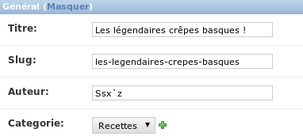

L'administration
================

Sur un bon nombre de sites, l'interface d'administration est un élément capital à ne pas négliger lors du développement. C'est cette partie qui permet en effet de gérer les diverses informations disponibles : les articles d'un blog, les comptes utilisateurs, etc.
Un des gros points forts de Django est que celui-ci génère de façon automatique l'administration en fonction de vos modèles. Celle-ci est personnalisable à souhait en quelques lignes et est très puissante.

Nous verrons dans ce chapitre comment déployer l'administration et la personnaliser.

Mise en place de l'administration 
---------------------------------

### Les modules `django.contrib`

L'administration Django est *optionnelle* : il est tout à fait possible de développer un site sans l'utiliser. Pour cette raison, elle est placée dans le module `django.contrib`, contenant un ensemble d'extensions fournies par Django, réutilisables dans n'importe quel projet. Ces modules sont bien pensés et vous permettent d'éviter de réinventer la roue à chaque fois.
Nous allons étudier ici le module `django.contrib.admin` qui génère l'administration. Il existe toutefois bien d'autres modules, dont certains que nous aborderons par la suite : `django.contrib.messages` (gestion de messages destinés aux visiteurs), `django.contrib.auth` (système d'authentification et de gestion des utilisateurs), etc.

### Accédons à cette administration !

Ce module est optionnel mais il est tellement utilisé que la configuration par défaut l'intègre désormais. Cependant, pour ceux qui auraient modifié la configuration, voici un petit rappel.  
Si jamais vous n'avez rien changé et que votre premier `syncdb` au chapitre précédent vous a fait créer un super-utilisateur, vous pouvez sauter cette sous-partie.

#### Import des modules

- Ayez dans votre liste `INSTALLED_APPS` les applications suivantes, déjà présent au début de la liste par défaut : 

        'django.contrib.admin',
        'django.contrib.auth',
        'django.contrib.contenttypes',
        'django.contrib.sessions',

- Le module admin nécessite aussi l'import de *middlewares*, normalement inclus par défaut également :

        'django.contrib.sessions.middleware.SessionMiddleware',
        'django.middleware.common.CommonMiddleware',
        'django.contrib.auth.middleware.AuthenticationMiddleware',

Sauvegardez le fichier settings.py. Désormais, lors du lancement du serveur, le module contenant l'administration sera importé.

### Mise à jour de la base de données

Pour fonctionner, il faut créer de nouvelles tables dans la base de données, qui serviront à enregistrer les actions des administrateurs, définir les droits de chacun, etc. Pour ce faire, il faut procéder comme avec les modèles et utiliser la commande suivante : `python manage.py syncdb`. À la première exécution, cette commande vous demandera de renseigner des informations pour créer un compte super-utilisateur, qui sera au début le seul compte à pouvoir accéder à l'administration. Cette opération commence notamment par la directive suivante :

    You have installed Django's auth system, and don't have any superusers defined.
    Would you like to create one now? (yes/no):

Répondez `yes` et insérez les informations utilisateur que Django vous demande.

Si vous sautez cette étape, il sera toujours possible de (re)créer un compte via la commande `python manage.py createsuperuser`.

### Intégration à notre projet : définissons-lui une adresse

Enfin, tout comme pour nos vues, il est nécessaire de dire au serveur « Quand j'appelle cette URL, redirige-moi vers l'administration. » En effet, pour l'instant nous avons bel et bien importé le module, mais nous ne pouvons pas encore y accéder.

Comme pour les vues, cela se fait à partir d'un `urls.py`. Ouvrez le fichier `crepes_bretonnes/urls.py`.
Par défaut, Django a déjà indiqué une ligne pour l'administration. Votre fichier `urls.py` devrait ressembler à ceci :

    from django.conf.urls import patterns, include, url
    from django.contrib import admin
    
    urlpatterns = patterns('',
        # D'autres éventuelles directives.
        # Celles de notre application blog notamment
        url(r'^admin/', include(admin.site.urls)),
    )

Nous voyons que par défaut, l'administration sera disponible à l'adresse `http://localhost:8000/admin/`. Nous pouvons donc tester en lancant le serveur Django. Vous pouvez dès lors accéder à l'administration depuis l'URL définie (voir la figure suivante), il suffira juste de vous connecter avec le nom d'utilisateur et le mot de passe que vous avez spécifiés lors du `syncdb` ou `createsuperuser`.

Première prise en main 
----------------------
Une fois que vous avez saisi vos identifiants de super-utilisateur, vous devez arriver sur une page semblable à la figure suivante.

C'est encore un peu vide, mais ne vous inquiétez pas, nous allons bientôt pouvoir manipuler nos modèles `Article` et `Catégorie`, rédigés dans le chapitre précédent.  
Tout d'abord, faisons un petit tour des fonctionnalités disponibles. Sur cette page, vous avez la liste des modèles que vous pouvez gérer. Ces modèles sont au nombre de 2 : `Groupes` et `Utilisateurs`. Ce sont les modèles de l'application `django.contrib.auth`.  
Chaque modèle possède ensuite une interface qui permet de réaliser les 4 opérations de base « [**CRUD**](https://fr.wikipedia.org/wiki/CRUD) » : *Create, Read, Update, Delete* (littéralement créer, lire, mettre à jour, supprimer).  
Pour ce faire, allons dans l'administration des comptes sur notre site, en cliquant sur `Utilisateurs`. Pour le moment, vous n'avez logiquement qu'un compte dans la liste, le vôtre, comme vous pouvez le voir sur la figure suivante.

C'est à partir d'ici que nous pouvons constater la puissance de cette administration : sans avoir écrit une seule ligne de code, il est possible de *manipuler la liste des utilisateurs dans tous les sens* : la filtrer selon certains paramètres, la trier avec certains champs, effectuer des actions sur certaines lignes, etc.  
Pour essayer ces opérations, nous allons d'abord créer un deuxième compte utilisateur. Il suffit de cliquer sur le bouton *Ajouter utilisateur*, disponible en haut à droite. Le premier formulaire vous demande de renseigner le nom d'utilisateur et le mot de passe. Nous pouvons déjà remarquer sur la figure suivante que les formulaires peuvent gérer des contraintes, et l'affichage d'erreurs.

Une fois cela validé, vous accédez directement à un formulaire plus complet, permettant de renseigner plus d'informations sur l'utilisateur qui vient d'être créé : ses informations personnelles, mais aussi ses droits sur le site.  
Django fournit de base une *gestion précise des droits*, par groupe et par utilisateur, offrant souplesse et rapidité dans l'attribution des droits. Ainsi, ici nous pouvons voir qu'il est possible d'assigner un ou plusieurs groupes à l'utilisateur, et des *permissions spécifiques*. Ces groupes peuvent être créés dans l'administration des groupes que nous avons vu sur l'accueil au début.   
Également, deux champs importants sont *Statut équipe* et *Statut super-utilisateur* : le premier permet de définir si l'utilisateur peut accéder au panel d'administration, et le second de donner « les pleins pouvoirs » à l'utilisateur (voir la figure suivante).

Une fois que vous avez fini de gérer l'utilisateur, vous êtes redirigés vers la liste de tout à l'heure, avec une ligne en plus. Désormais, vous pouvez tester le tri, et les filtres qui sont disponibles à la droite du tableau ! Nous verrons d'ailleurs plus tard comment définir les champs à afficher, quels filtres utiliser, etc.

En définitive, pour finir ce rapide tour des fonctionnalités, vous avez peut-être remarqué la présence d'un bouton *Historique* en haut de chaque fiche utilisateur ou groupe. Ce bouton est très pratique, puisqu'il vous permet de suivre les modifications apportées, et donc de voir rapidement l'évolution de l'objet sur le site. En effet, *chaque action effectuée via l'administration est inscrite dans un journal des actions*. 

De même, sur l'index vous avez la liste de vos dernières actions, vous permettant de voir ce que vous avez fait récemment, et d'accéder rapidement aux liens, en cas d'erreur par exemple.

Administrons nos propres modèles 
--------------------------------

Pour le moment, nous avons vu comment manipuler les données des objets de base de Django, ceux concernant les utilisateurs. Il serait pratique désormais de *faire de même avec nos propres modèles*. Comme dit précédemment, l'administration est auto-générée : vous n'aurez pas à écrire beaucoup de lignes pour obtenir le même résultat que ci-avant. En réalité, quatre lignes suffisent : modifiez le fichier `admin.py` dans le répertoire `blog/` et insérez ces lignes :

    from django.contrib import admin
    from blog.models import Categorie, Article
    
    admin.site.register(Categorie)
    admin.site.register(Article)

Ici, nous indiquons à Django de prendre en compte les modèles `Article` et `Catégorie` dans l'administration. Rafraîchissez la page (relancez le serveur Django si nécessaire) et vous devez voir apparaître une nouvelle section, pour notre blog, semblable à la figure suivante.

Les fonctionnalités sont les mêmes que celles pour les utilisateurs : nous pouvons éditer des articles, des catégories, les supprimer, consulter l'historique, etc. Vous pouvez désormais créer vos articles depuis cette interface et voir le résultat depuis les vues que nous avons créées précédemment.
Comme vous pouvez le voir, l'administration *prend en compte la clé étrangère* de la catégorie.

### Comment cela fonctionne-t-il ?

Au lancement du serveur, le framework va chercher dans chaque application installée (celles qui sont listées dans `INSTALLED_APPS`) un fichier `admin.py`, et si celui-ci existe exécutera son contenu.  
Ainsi, si nous souhaitons activer l'administration pour toutes nos applications, il suffit de créer un fichier `admin.py` dans chacune, et d'appeler la méthode `register()` de `admin.site` sur chacun de nos modèles.  
Nous pouvons alors deviner que le module `django.contrib.auth` contient son propre fichier `admin.py`, qui génère l'administration des utilisateurs et des groupes.  

Personnalisons l'administration 
-------------------------------
Avant tout, créez quelques articles depuis l'administration, si ce n'est déjà fait. Cela vous permettra de tester tout au long de ce chapitre les différents exemples qui seront donnés.

### Modifier l'aspect des listes

Dans un premier temps, nous allons voir comment améliorer la liste. En effet, pour le moment, nos listes sont assez vides, comme vous pouvez le constater sur la figure suivante.

Le tableau ne contient qu'une colonne contenant le titre de notre article. Cette colonne n'est pas due au hasard : c'est en réalité le résultat de la méthode `__str__` que nous avons définie dans notre modèle.

    class Article(models.Model):
        titre = models.CharField(max_length=100)
        auteur = models.CharField(max_length=42)
        slug = models.SlugField(max_length=100)
        contenu = models.TextField()
        date = models.DateTimeField(auto_now_add=True, auto_now=False, verbose_name="Date de parution")
        categorie = models.ForeignKey(Categorie)
    
        def __str__(self):
            return self.titre

Ce résultat par défaut est assez utile, mais nous aimerions pouvoir gérer plus facilement nos articles : les trier selon certains champs, filtrer par catégorie, etc. Pour ce faire, nous devons créer une nouvelle classe dans notre fichier `admin.py`, contenant actuellement ceci :

    from django.contrib import admin
    from blog.models import Categorie, Article
    
    admin.site.register(Categorie)
    admin.site.register(Article)

Nous allons donc créer une nouvelle classe pour chaque modèle. Notre classe héritera de `admin.ModelAdmin` et aura principalement 5 attributs :

 - `list_display` : Liste des champs du modèle à afficher dans le tableau
 - `list_filter` : Liste des champs à partir desquels nous pourrons filtrer les entrées
 - `date_hierarchy` : Permet de filtrer par date de façon intuitive
 - `ordering` : Tri par défaut du tableau
 - `search_fields` : Configuration du champ de recherche

Nous pouvons dès lors rédiger notre première classe adaptée au modèle `Article` :

    class ArticleAdmin(admin.ModelAdmin):
       list_display   = ('titre', 'auteur', 'date')
       list_filter    = ('auteur','categorie', )
       date_hierarchy = 'date'
       ordering       = ('date', )
       search_fields  = ('titre', 'contenu')

Ces attributs définissent les règles suivantes :

 - Le tableau affiche les champs `titre`, `auteur` et `date`. Notez que les en-têtes sont nommés selon leur attribut `verbose_name` respectif.
 - Il est possible de filtrer selon les différents auteurs et la catégorie des articles (menu de droite).
 - L'ordre par défaut est la date de parution, dans l'ordre croissant (du plus ancien au plus récent).
 - Il est possible de chercher les articles contenant un mot, soit dans leur titre, soit dans leur contenu.
 - Enfin, il est possible de voir les articles publiés sur une certaine période (première ligne au-dessus du tableau).

Désormais, il faut spécifier à Django de prendre en compte ces données pour le modèle `Article`. Pour ce faire, modifions la ligne `admin.site.register(Article)`, en ajoutant un deuxième paramètre :

    admin.site.register(Article, ArticleAdmin)

Avec ce deuxième argument, Django prendra en compte les règles qui ont été spécifiées dans la classe `ArticleAdmin`.

    from django.contrib import admin
    from blog.models import Categorie, Article
    
    class ArticleAdmin(admin.ModelAdmin):
        list_display   = ('titre', 'categorie', 'auteur', 'date')
        list_filter    = ('auteur','categorie', )
        date_hierarchy = 'date'
        ordering       = ('date', )
        search_fields  = ('titre', 'contenu')
    
    admin.site.register(Categorie)
    admin.site.register(Article, ArticleAdmin)

Vous pouvez maintenant observer le résultat sur la figure suivante :

Il se peut que vous ayez l'erreur "*This query requires pytz, but it isn't installed.*". Si c'est le cas, vous avez besoin d'installer `pytz`, possible avec `pip install pytz` notamment.

Les différents changements opérés sont désormais visibles. Vous pouvez bien sûr modifier selon vos besoins : supprimer une colonne qui vous parait inutile, changer le tri…

Pour terminer, nous allons voir comment créer des colonnes plus complexes. Il peut arriver que vous ayez envie d'*afficher une colonne après un certain traitement*. Par exemple, afficher les 40 premiers caractères de notre article. Pour ce faire, nous allons devoir créer une méthode dans notre `ModelAdmin`, qui va se charger de renvoyer ce que nous souhaitons, et la lier à notre `list_display`.

Créons tout d'abord notre méthode. Celles de notre `ModelAdmin` auront toujours la même structure :

    def apercu_contenu(self, article):
        """ 
        Retourne les 40 premiers caractères du contenu de l'article. S'il
        y a plus de 40 caractères, il faut ajouter des points de suspension.
        """
        text = article.contenu[0:40]
        if len(article.contenu) > 40:
            return '%s…' % text
        else:
            return text

La méthode prend *en argument l'instance de l'article*, et nous permet d'accéder à tous ses attributs. Ensuite, il suffit d'exécuter quelques opérations, puis de renvoyer une chaîne de caractères. Il faut ensuite intégrer cela dans notre `ModelAdmin`.

Ensuite, pour l'utiliser dans `list_display`, on peut traiter la fonction comme un champ. Il suffit donc d'ajouter `'apercu_contenu'` à la liste, Django s'occupe du reste. Pour ce qui est de l'en-tête, il faudra par contre ajouter une ligne supplémentaire pour spécifier le titre de la colonne :

    # -*- coding:utf-8 -*-
    from django.contrib import admin
    from blog.models import Categorie, Article
    
    class ArticleAdmin(admin.ModelAdmin):
        list_display   = ('titre', 'categorie', 'auteur', 'date', 'apercu_contenu')
        list_filter    = ('auteur','categorie', )
        date_hierarchy = 'date'
        ordering       = ('date', )
        search_fields  = ('titre', 'contenu')
    
        def apercu_contenu(self, article):
            """ 
            Retourne les 40 premiers caractères du contenu de l'article. S'il
            y a plus de 40 caractères, il faut ajouter des points de suspension. 
            """
            text = article.contenu[0:40]
            if len(article.contenu) > 40:
                return '%s…' % text
            else:
                return text
    
        # En-tête de notre colonne
        apercu_contenu.short_description = 'Aperçu du contenu'
    
    admin.site.register(Categorie)
    admin.site.register(Article, ArticleAdmin)

### Modifier le formulaire d'édition

Nous allons désormais nous occuper du formulaire d'édition. Pour le moment, comme vous pouvez le voir sur la figure suivante, nous avons un formulaire affichant tous les champs, hormis la date de publication (à cause du paramètre `auto_now_add=True` dans le modèle).

L'ordre d'apparition des champs dépend actuellement de l'ordre de déclaration dans notre modèle. Nous allons ici séparer le contenu des autres champs.
Tout d'abord, modifions l'ordre via un nouvel attribut dans notre `ModelAdmin` : `fields`. Cet attribut prend une liste de champs, qui seront affichés dans l'ordre souhaité. Cela nous permettra de cacher des champs (inutile dans le cas présent) et, bien évidemment, de changer leur ordre :

    fields = ('titre', 'slug', 'auteur', 'categorie', 'contenu')

Nous observons peu de changements, à part le champ *Catégorie* qui est désormais au-dessus de *Contenu* :

Pour le moment, notre formulaire est dans un unique **fieldset** (ensemble de champs). Conséquence : tous les champs sont les uns à la suite des autres, sans distinction. Nous pouvons *hiérarchiser* cela en utilisant un attribut plus complexe que `fields`.
À titre d'exemple, nous allons mettre les champs `titre`, `auteur` et `categorie` dans un fieldset et `contenu` dans un autre.

    fieldsets = (
        # Fieldset 1 : meta-info (titre, auteur…)
       ('Général', {
            'classes': ['collapse',],
            'fields': ('titre', 'slug', 'auteur', 'categorie')
        }),
        # Fieldset 2 : contenu de l'article
        ('Contenu de l\'article', {
           'description': 'Le formulaire accepte les balises HTML. Utilisez-les à bon escient !',
           'fields': ('contenu', )
        }),
    )

Voyons pas à pas la construction de ce tuple :

 1. Nos deux éléments dans le tuple `fieldset`, qui correspondent à nos deux fieldsets distincts.

 2. Chaque élément contient un tuple contenant exactement deux informations : son nom, et les informations sur son contenu, sous forme de dictionnaire.

 3. Ce dictionnaire contient trois types de données :

     1. `fields` : liste des champs à afficher dans le fieldset ;

     2. `description` : une description qui sera affichée en haut du fieldset, avant le premier champ ;

     3. `classes` : des classes CSS supplémentaires à appliquer sur le fieldset (par défaut il en existe trois : `wide`, `extrapretty` et `collapse`).

Attention, si vous mettez en place l'attribut `fieldset`, il faut retirer `field`. C'est soit l'un, soit l'autre ! Au final, nous avons donc séparé les champs en deux fieldsets et affiché quelques informations supplémentaires pour aider à la saisie. Au final, nous avons le fichier `admin.py` suivant :

    # -*- coding:utf-8 -*-
    from django.contrib import admin
    from blog.models import Categorie, Article
    
    class ArticleAdmin(admin.ModelAdmin):
    
        # Configuration de la liste d'articles
        list_display   = ('titre', 'categorie', 'auteur', 'date')
        list_filter    = ('auteur','categorie', )
        date_hierarchy = 'date'
        ordering       = ('date', )
        search_fields  = ('titre', 'contenu')
    
        # Configuration du formulaire d'édition
        fieldsets = (
        	# Fieldset 1 : meta-info (titre, auteur…)
           ('Général', {
                'classes': ['collapse', ],
                'fields': ('titre', 'slug', 'auteur', 'categorie')
            }),
            # Fieldset 2 : contenu de l'article
            ('Contenu de l\'article', {
               'description': 'Le formulaire accepte les balises HTML. Utilisez-les à bon escient !',
               'fields': ('contenu', )
            }),
        )
    
        # Colonnes personnalisées 
        def apercu_contenu(self, article):
            """ 
            Retourne les 40 premiers caractères du contenu de l'article. S'il
            y a plus de 40 caractères, il faut rajouter des points de suspension.
            """
            text = article.contenu[0:40]
            if len(article.contenu) > 40:
                return '%s…' % text
            else:
                return text
    
        apercu_contenu.short_description = 'Aperçu du contenu'
    
    admin.site.register(Categorie)
    admin.site.register(Article, ArticleAdmin)

… qui donne la figure suivante.

Si ni le champ `fields`, ni le champ `fieldset` ne sont présents, Django affichera par défaut tous les champs qui ne sont pas des `AutoField` (clés primaire incrémentale `id` notamment), et qui ont l'attribut `editable` à `True` (ce qui est le cas par défaut de nombreux champs). Comme nous l'avons vu, l'ordre des champs sera alors celui du modèle.

### Retour sur notre problème de slug

Souvenez-vous, au chapitre précédent nous avons parlé des slugs, ces chaînes de caractères qui permettent d'identifier un article dans notre URL. Dans notre zone d'administration, ce champ est actuellement ignoré… Nous souhaitons toutefois le remplir, mais en plus que cela se fasse automatiquement !

Nous avons notre champ slug que nous pouvons désormais éditer à la main. Mais nous pouvons aller encore plus loin, en ajoutant une option qui remplit instantanément ce champ grâce à un script JavaScript. Pour ce faire, il existe un attribut aux classes `ModelAdmin` nommé `prepopulated_fields`. Ce champ a pour principal usage de remplir les champs de type `SlugField` en fonction d'un ou plusieurs autres champs :

    prepopulated_fields = {'slug': ('titre', ), }

Ici, notre champ `slug` est rempli automatiquement en fonction du champ `titre`. Il est possible bien entendu de concaténer plusieurs chaînes, si vous voulez par exemple faire apparaître l'auteur.

### En résumé

 - L'administration est un outil optionnel : il est possible de ne pas l'utiliser. Une fois activée, de très nombreuses options sont automatisées, sans qu'il y ait besoin d'ajouter une seule ligne de code !
 - Ce module requiert l'usage de l'authentification et la création d'un super-utilisateur afin d'en restreindre l'accès aux personnes de confiance.
 - De base, l'administration permet la gestion complète des utilisateurs, de groupes et des droits de chacun, de façon très fine.
 - L'administration d'un modèle créé dans une de nos applications est possible en l'enregistrant dans le module d'administration, via `admin.site.register(MonModele)` dans le fichier `admin.py` de l'application.
 - Il est également possible de personnaliser cette interface pour chaque module, en précisant ce qu'il faut afficher dans les tableaux de listes, ce qui peut être édité, etc.