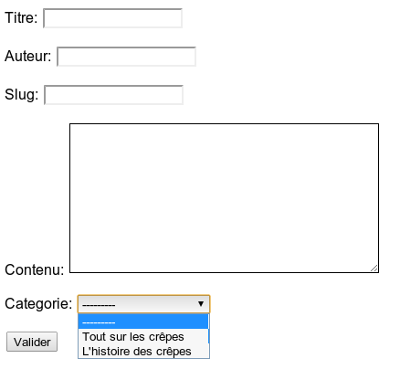

Les formulaires
===============

Si vous avez déjà fait du web auparavant, vous avez forcément dû concevoir des formulaires. Entre le code HTML à réaliser, la validation des données entrées par l'utilisateur et la mise à jour de celles-ci dans la base de données, réaliser un formulaire était un travail fastidieux. Heureusement, Django est là pour vous simplifier la tâche !

Créer un formulaire
-------------------

La déclaration d'un formulaire est très similaire à la déclaration d'un modèle. Il s'agit également d'une classe héritant d'une classe mère fournie par Django. Les attributs eux aussi correspondent aux champs du formulaire.

Si les modèles ont leurs fichiers `models.py`, les formulaires n'ont malheureusement pas la chance d'avoir un endroit qui leur est défini par défaut. Cependant, toujours dans une optique de code structuré, nous vous invitons à créer dans chaque application (bien que pour le moment nous n'en ayons qu'une) un fichier `forms.py` dans lequel nous créerons nos formulaires.

Un formulaire hérite donc de la classe mère `Form` du module `django.forms`. Tous les champs sont bien évidemment également dans ce module et reprennent la plupart du temps les mêmes noms que ceux des modèles. Voici un bref exemple de formulaire de contact :

    from django import forms

    class ContactForm(forms.Form):
        sujet = forms.CharField(max_length=100)
        message = forms.CharField(widget=forms.Textarea)
        envoyeur = forms.EmailField(label="Votre adresse mail")
        renvoi = forms.BooleanField(help_text="Cochez si vous souhaitez obtenir une copie du mail envoyé.", required=False)

Tout comme les champs de modèles, un champ de formulaire peut avoir des arguments qui lui sont propres (ici `max_length` pour sujet), ou avoir des arguments génériques à tous les champs (ici `label`, `help_text`, `widget` et `required`).

Un `CharField` enregistre toujours du texte. Notons une différence avec le `CharField` des modèles : l'argument `max_length` devient optionnel. L'attribut message qui est censé recueillir de grands et longs textes est, lui, identique.

Notons que contrairement aux modèles, Django ne propose pas de champ `TextField`. Tant que nous recueillons du texte, il faut utiliser un `CharField`. En revanche, il semble logique que les boîtes de saisie pour le sujet et pour le message ne doivent pas avoir la même taille ! Le message est souvent beaucoup plus long. Pour ce faire, Django propose en quelque sorte de « maquiller » les champs du formulaire grâce aux widgets. Ces derniers transforment le code HTML pour le rendre plus adapté à la situation actuelle.
Nous avons utilisé ici le widget `forms.Textarea` pour le champ message. Celui-ci fera en sorte d'agrandir considérablement la boîte de saisie pour le champ et la rendre plus confortable pour le visiteur.

Il existe bien d'autres widgets (tous également dans `django.forms`) : `PasswordInput`(pour cacher le mot de passe), `DateInput`(pour entrer une date), `CheckboxInput` (pour avoir une case à cocher), etc. N'hésitez pas à consulter la documentation Django pour avoir une liste exhaustive !

Il est très important de comprendre la logique des formulaires. Lorsque nous choisissons un champ, nous le faisons selon le type de données qu'il faut recueillir (du texte, un nombre, une adresse e-mail, une date…). C'est le champ qui s'assurera que ce qu'a entré l'utilisateur est valide. En revanche, tout ce qui se rapporte à l'apparence du champ concerne les widgets.

Généralement, il n'est pas utile de spécifier des widgets pour tous les champs. Par exemple, le `BooleanField`, qui recueille un booléen, utilisera par défaut le widget `CheckboxInput` et l'utilisateur verra donc une boîte à cocher. Néanmoins, si cela ne vous convient pas pour une quelconque raison, vous pouvez toujours changer.

Revenons rapidement à notre formulaire : l'attribut `email` contient un `EmailField`. Ce dernier s'assurera que l'utilisateur a bel et bien envoyé une adresse e-mail correcte et le `BooleanField` de `renvoi` affichera une boîte à cocher, comme nous l'avons expliqué ci-dessus.

Ces deux derniers champs possèdent des arguments génériques : `label`, `help_text` et `required`. `label` permet de modifier le nom de la boîte de saisie qui est généralement défini selon le nom de la variable. `help_text` permet d'ajouter un petit texte d'aide concernant le champ. Celui-ci apparaîtra généralement à droite ou en bas du champ. Finalement, `required` permet d'indiquer si le champ doit obligatoirement être rempli ou non. Il s'agit d'une petite exception lorsque cet argument est utilisé avec `BooleanField`, car si la boîte n'est pas cochée, Django considère que le champ est invalide car laissé « vide ». Cela oblige l'utilisateur à cocher la boîte, et ce n'est pas ce que nous souhaitons ici.

La documentation officielle liste tous les champs et leurs options. N'hésitez pas à y jeter un coup d'œil si vous ne trouvez pas le champ qu'il vous faut.

Utiliser un formulaire dans une vue
-----------------------------------

Nous avons vu comment créer un formulaire. Passons à la partie la plus intéressante : utiliser celui-ci dans une vue.

Avant tout, il faut savoir qu'il existe deux types principaux de requêtes HTTP (HTTP est le protocole, le « langage », que nous utilisons pour communiquer sur le web). Le type de requête le plus souvent utilisé est le type GET. Il demande une page et le serveur web la lui renvoie, aussi simplement que cela. Le deuxième type, qui nous intéresse le plus ici, est POST. Celui-ci va également demander une page du serveur, mais va en revanche aussi envoyer des données à celui-ci, généralement depuis un formulaire. Donc, pour savoir si l'utilisateur a complété un formulaire ou non, nous nous fions à la requête HTTP qui nous est transmise :

- GET : pas de formulaire envoyé ;
- POST : formulaire complété et envoyé.

L'attribut `method` de l'objet request passé à la vue indique le type de requête (il peut être mis à GET ou POST). Les données envoyées par l'utilisateur via une requête POST sont accessibles sous forme d'un dictionnaire depuis `request.POST`. C'est ce dictionnaire que nous passerons comme argument lors de l'instanciation du formulaire pour vérifier si les données sont valides ou non.

Une vue qui utilise un formulaire suit la plupart du temps une certaine procédure. Cette procédure, bien que non officielle, est reprise par la majorité des développeurs Django, probablement en raison de son efficacité.

La voici :

    from blog.forms import ContactForm
    def contact(request):
        if request.method == 'POST':  # S'il s'agit d'une requête POST
            form = ContactForm(request.POST)  # Nous reprenons les données
            if form.is_valid(): # Nous vérifions que les données envoyées sont valides
                # Ici nous pouvons traiter les données du formulaire
                sujet = form.cleaned_data['sujet']
                message = form.cleaned_data['message']
                envoyeur = form.cleaned_data['envoyeur']
                renvoi = form.cleaned_data['renvoi']
                # Nous pourrions ici envoyer l'e-mail grâce aux données que nous venons de récupérer
                envoi = True
        else: # Si ce n'est pas du POST, c'est probablement une requête GET
            form = ContactForm()  # Nous créons un formulaire vide
        return render(request, 'blog/contact.html', locals())

-----------

    url(r'^contact/$', 'contact'),

Si le formulaire est valide, un nouvel attribut de l'objet `form` est apparu, il nous permettra d'accéder aux données : `cleaned_data`. Ce dernier va renvoyer un dictionnaire contenant comme clés les noms de vos différents champs (les mêmes noms qui ont été renseignés dans la déclaration de la classe), et comme valeurs les données validées de chaque champ. Par exemple, nous pourrions accéder au sujet du message ainsi :

    >>> form.cleaned_data["sujet"]
    "Le super sujet qui a été envoyé"

Côté utilisateur, cela se passe en trois étapes :

1.  Le visiteur arrive sur la page, complète le formulaire et l'envoie.
2.  Si le formulaire est faux, nous retournons la même page tant que celui-ci n'est pas correct.
3.  Si le formulaire est correct, nous le redirigeons vers une autre page.

Il est important de remarquer que si le formulaire est faux il n'est pas remis à zéro ! Un formulaire vide est créé lorsque la requête est de type GET. Par la suite, elles seront toujours de type POST. Dès lors, si les données sont fausses, nous retournons encore une fois le template avec le formulaire invalide. Celui-ci contient encore les données fausses et des messages d'erreur pour aider l'utilisateur à le corriger.

Si nous avons fait la vue, il ne reste plus qu'à faire le template. Ce dernier est très simple à faire, car Django va automatiquement générer le code HTML des champs du formulaire. Il faut juste spécifier une balise form et un bouton. Exemple :

    Votre message a bien été envoyé !
    <form action="" method="post">
    {{ form.as_p }}
    <input type="submit" value="Submit" />
    </form>

Chaque formulaire (valide ou non) possède plusieurs méthodes qui permettent de générer le code HTML des champs du formulaire de plusieurs manières. Ici, il va le générer sous la forme d'un paragraphe (`as_p`, p pour la balise `
`), mais il pourrait tout aussi bien le générer sous la forme de tableau grâce à la méthode `as_table` ou sous la forme de liste grâce à `as_ul`. Utilisez ce que vous pensez être le plus adapté.
D'ailleurs, ces méthodes ne créent pas seulement le code HTML des champs, mais ajoutent aussi les messages d'erreur lorsqu'un champ n'est pas correct !

Dans le cas actuel, le code suivant sera généré (avec un formulaire vide) :

    
<label for="id_sujet">Sujet:</label> <input id="id_sujet" type="text" name="sujet" maxlength="100" />

    
<label for="id_message">Message:</label> <textarea id="id_message" rows="10" cols="40" name="message"></textarea>

    
<label for="id_envoyeur">Votre adresse mail:</label> <input type="text" name="envoyeur" id="id_envoyeur" />

    
<label for="id_renvoi">Renvoi:</label> <input type="checkbox" name="renvoi" id="id_renvoi" /> Cochez si vous souhaitez obtenir une copie du mail envoyé.

Et voici à la figure suivante l'image du rendu (bien entendu, libre à vous de l'améliorer avec un peu de CSS).

Le tag `` est une fonctionnalité très pratique de Django. Il empêche les attaques de type CSRF (*Cross-site request forgery*). Imaginons qu'un de vos visiteurs obtienne l'URL qui permet de supprimer tous les articles de votre blog. Heureusement, seul un administrateur peut effectuer cette action. Votre visiteur peut alors tenter de vous rediriger vers cette URL à votre insu, ce qui supprimerait tous vos articles ! Pour éviter ce genre d'attaques, Django va sécuriser le formulaire en y ajoutant un code unique et caché qu'il gardera de côté. Lorsque l'utilisateur renverra le formulaire, il va également renvoyer le code avec. Django pourra alors vérifier si le code envoyé est bel et bien le code qu'il a généré et mis de côté. Si c'est le cas, le framework sait que l'administrateur a vu le formulaire et qu'il est sûr de ce qu'il fait !

Créons nos propres règles de validation
---------------------------------------

Imaginons que nous, administrateurs du blog sur les crêpes bretonnes, recevions souvent des messages impolis des fanatiques de la pizza italienne depuis le formulaire de contact. Chacun ses goûts, mais nous avons d'autres chats à fouetter !

Pour éviter de recevoir ces messages, nous avons eu l'idée d'intégrer un filtre dans notre formulaire pour que celui-ci soit invalide si le message contient le mot « pizza ». Heureusement pour nous, il est facile d'ajouter de nouvelles règles de validation sur un champ. Il y a deux méthodes : soit le filtre ne s'applique qu'à un seul champ et ne dépend pas des autres, soit le filtre dépend des données des autres champs.

Pour la première méthode (la plus simple), il faut ajouter une méthode à la classe `ContactForm` du formulaire dont le nom doit obligatoirement commencer par `clean_`, puis être suivi par le nom de la variable du champ. Par exemple, si nous souhaitons filtrer le champ message, il faut ajouter une méthode semblable à celle-ci :

    def clean_message(self):
        message = self.cleaned_data['message']
        if "pizza" in message:
            raise forms.ValidationError("On ne veut pas entendre parler de pizza !", code="pizza_dans_message")
        return message  # Ne pas oublier de renvoyer le contenu du champ traité

Nous récupérons le contenu du message comme depuis une vue, en utilisant l'attribut `cleaned_data` qui retourne toujours un dictionnaire. Dès lors, nous vérifions si le message contient bien le mot « pizza », et si c'est le cas nous retournons une exception avec une erreur (il est important d'utiliser l'exception `forms.ValidationError` et de lui attribuer un code unique à l'exception !). Django se servira du contenu de l'erreur passée en argument pour indiquer quel champ n'a pas été validé et pourquoi.

Le rendu HTML nous donne le résultat que vous pouvez observer sur la figure suivante, avec des données invalides après traitement du formulaire.

Maintenant, imaginons que nos fanatiques de la pizza italienne se soient adoucis et que nous ayons décidé d'être moins sévères, nous ne rejetterions que les messages qui possèdent le mot « pizza » dans le message et dans le sujet (juste parler de pizzas dans le message serait accepté). Étant donné que la validation dépend de plusieurs champs en même temps, nous devons écraser la méthode `clean` héritée de la classe mère `Form`. Les choses se compliquent un petit peu :

    def clean(self):
        cleaned_data = super(ContactForm, self).clean()
        sujet = cleaned_data.get('sujet')
        message = cleaned_data.get('message')
        if sujet and message:  # Est-ce que sujet et message sont valides ?
            if "pizza" in sujet and "pizza" in message:
                raise forms.ValidationError("Vous parlez de pizzas dans le sujet ET le message ? Non mais ho !")

La première ligne de la méthode permet d'appeler la méthode clean héritée de `Form`. En effet, si nous avons un formulaire d'inscription qui prend l'adresse e-mail de l'utilisateur, avant de vérifier si celle-ci a déjà été utilisée, il faut laisser Django vérifier si l'adresse e-mail est valide ou non. Appeler la méthode mère permet au framework de vérifier tous les champs comme d'habitude pour s'assurer que ceux-ci sont corrects, suite à quoi nous pouvons traiter ces données en sachant qu'elles ont déjà passé la validation basique.

La méthode mère `clean` va également renvoyer un dictionnaire avec toutes les données valides. Dans notre dernier exemple, si l'adresse e-mail spécifiée était incorrecte, elle ne sera pas reprise dans le dictionnaire renvoyé. Pour savoir si les valeurs que nous souhaitons filtrer sont valides, nous utilisons la méthode `get` du dictionnaire qui renvoie la valeur d'une clé si elle existe, et renvoie `None` sinon. Par la suite, nous vérifions que les valeurs des variables ne sont pas à `None (if sujet and message)` et nous les traitons comme d'habitude.

Voici à la figure suivante ce que donne le formulaire lorsqu'il ne passe pas la validation que nous avons écrite.

Il faut cependant remarquer une chose : le message d'erreur est tout en haut et n'est plus lié aux champs qui n'ont pas passé la vérification. Si sujet et message étaient les derniers champs du formulaire, le message d'erreur serait tout de même tout en haut. Pour éviter cela, il est possible d'assigner une erreur à un champ précis :

    def clean(self):
        cleaned_data = super(ContactForm, self).clean()
        sujet = cleaned_data.get('sujet')
        message = cleaned_data.get('message')
        if sujet and message:  # Est-ce que sujet et message sont valides ?
            if "pizza" in sujet and "pizza" in message:
                msg = "Vous parlez déjà de pizzas dans le sujet, n'en parlez plus dans le message !"
                self.add_error('message', msg)

Le début est identique, en revanche, si les deux champs contiennent le mot « pizza », nous ne renvoyons plus une exception, mais nous utilisons la méthode `add_error` qui permet de déclarer une erreur concernant un champ précis, en indiquant le message d'erreur associé. Notons qu'au lieu d'utiliser une chaine de caractères pour le message d'erreur, vous pouvez également spécifier comme deuxième paramètre de la méthode une instance de `forms.ValidationError`, comme utilisé précédemment.

Voici le résultat à la figure suivante :

Des formulaires à partir de modèles
-----------------------------------

Dernière fonctionnalité que nous verrons à propos des dictionnaires : les `ModelForm`. Il s'agit de formulaires générés automatiquement à partir d'un modèle, ce qui évite la plupart du temps de devoir écrire un formulaire pour chaque modèle créé. C'est un gain de temps non négligeable ! Ils reprennent la plupart des caractéristiques des formulaires classiques et s'utilisent comme eux.

Dans le chapitre sur les modèles, nous avons créé une classe `Article`. Pour rappel, la voici :

    class Article(models.Model):
        titre = models.CharField(max_length=100)
        auteur = models.CharField(max_length=42)
        slug = models.SlugField(max_length=100)
        contenu = models.TextField(null=True)
        date = models.DateTimeField(auto_now_add=True, auto_now=False, verbose_name="Date de parution")
        categorie = models.ForeignKey(Categorie)

        def __str__(self):
            return self.titre

Pour faire un formulaire à partir de ce modèle, c'est très simple :

    from django import forms
    from models import Article
    class ArticleForm(forms.ModelForm):
        class Meta:
            model = Article

Et c'est tout ! Notons que nous héritons maintenant de `forms.ModelForm` et non plus de `forms.Form`. Il y a également une sous-classe `Meta` (comme pour les modèles), qui permet de spécifier des informations supplémentaires. Dans l'exemple, nous avons juste indiqué sur quelle classe le `ModelForm` devait se baser (à savoir le modèle `Article`, bien entendu).

Le rendu HTML du formulaire est plutôt éloquent. Observez la figure suivante :

En plus de convertir les champs de modèle vers des champs de formulaire adéquats, Django va même chercher toutes les catégories enregistrées dans la base de données et les propose comme choix pour la `ForeignKey` !

Le framework va aussi utiliser certains paramètres des champs du modèle pour les champs du formulaire. Par exemple, l'argument `verbose_name` du modèle sera utilisé comme l'argument `label` des formulaires, `help_text` reste `help_text` et `blank` devient `required` (`blank` est un argument des champs des modèles qui permet d'indiquer à l'administration et aux `ModelForm` si un champ peut être laissé vide ou non, il est par défaut à `False`).

Une fonctionnalité très pratique des `ModelForm` est qu'il n'y a pas besoin d'extraire les données une à une pour créer ou mettre à jour un modèle. En effet, il fournit directement une méthode save qui va mettre à jour la base de données toute seul. Petit exemple dans le shell :

    >>> from blog.models import Article, Categorie
    >>> from blog.forms import ArticleForm
    >>> donnees = {
    ... 'titre':"Les crêpes c'est trop bon",
    ... 'slug':"les-crepes-cest-trop-bon",
    ... 'auteur':"Maxime",
    ... 'contenu':"Vous saviez que les crêpes bretonnes c'est trop bon ? La pêche c'est nul à côté.",
    ... 'categorie':Categorie.objects.all()[0].id  # Nous prenons l'identifiant de la première catégorie qui vient
    ... }
    >>> form = ArticleForm(donnees)
    >>> Article.objects.all()
    []
    >>> form.save()
    <Article: Les crêpes c'est trop bon>
    >>> Article.objects.all()
    [<Article: Les crêpes c'est trop bon>]

Tout objet d'un modèle sauvegardé possède un attribut `id`, c'est un identifiant propre à chaque entrée. Avec les `ForeignKey`, c'est lui que nous utilisons généralement comme clé étrangère.

Pratique, n'est-ce pas ? Nous avons ici simulé avec un dictionnaire le contenu d'un éventuel `request.POST` et l'avons passé au constructeur d'`ArticleForm`. Depuis la méthode save, le `ModelForm` va directement créer une entrée dans la base de données et retourner l'objet créé.

De la même façon, il est possible de mettre à jour une entrée très simplement. En donnant un objet du modèle sur lequel le `ModelForm` est basé, il peut directement remplir les champs du formulaire et mettre l'entrée à jour selon les modifications de l'utilisateur.
Pour ce faire, dans une vue, il suffit d'appeler le formulaire ainsi :

    form = ArticleForm(instance=article)  # article est bien entendu un objet d'Article quelconque dans la base de données

Django se charge du reste, comme vous pouvez le voir sur la figure suivante !

Une fois les modifications du formulaire envoyées depuis une requête POST, il suffit de reconstruire un `ArticleForm` à partir de l'article et de la requête et d'enregistrer les changements si le formulaire est valide :

    form = ArticleForm(request.POST, instance=article)
    if form.is_valid():
        form.save()

L'entrée est désormais à jour.

Si vous souhaitez que certains champs ne soient pas éditables par vos utilisateurs, il est possible de sélectionner ceux qui vous intéressent, toujours grâce à la sous-classe `Meta`:

    class ArticleForm(forms.ModelForm):
        class Meta:
            model = Article
            fields = ('titre','contenu',)

Petite précision : l'attribut `fields` permet également de déterminer l'ordre des champs. Le premier du tuple arriverait en première position dans le formulaire, le deuxième en deuxième position, etc.

Observez le résultat à la figure suivante :

Cependant, lors de la création d'une nouvelle entrée, si certains champs obligatoires du modèle (ceux qui n'ont pas `null=True` comme argument) ont été exclus, il ne faut pas oublier de les rajouter par la suite. Il ne faut donc pas appeler la méthode `save` telle quelle sur un `ModelForm` dans lesquels certains champs obligatoires du modèle n'ont pas été repris, sinon Django lèvera une exception. Un paramètre spécial de la méthode `save` a été prévu pour cette situation :

    >>> from blog.models import Article, Categorie
    >>> from blog.forms import ArticleForm
    >>> donnees = {
    ... 'titre':"Un super titre d'article !",
    ... 'contenu':"Un super contenu ! (ou pas)"
    ... }
    >>> form = ArticleForm(donnees)  # Pas besoin de spécifier les autres champs, ils ont été exclus
    >>> article = form.save(commit=False)  # Ne sauvegarde pas directement l'article dans la base de données
    >>> article.categorie = Categorie.objects.all()[0]  # Nous ajoutons les attributs manquants
    >>> article.auteur = "Mathieu"
    >>> article.save()

La chose importante dont il faut se souvenir ici est donc `form.save(commit=False)` qui permet de ne pas sauvegarder directement l'article dans la base de données, mais renvoie un objet avec les données du formulaire sur lequel nous pouvons continuer à travailler.

En résumé
---------

- Un formulaire est décrit par une classe, héritant de `django.forms.Form`, où chaque attribut est un champ du formulaire défini par le type des données attendues.
- Chaque classe de `django.forms` permet d'affiner les données attendues : taille maximale du contenu du champ, champ obligatoire ou optionnel, valeur par défaut…
- Il est possible de récupérer un objet `Form` après la validation du formulaire et de vérifier si les données envoyées sont valides, via `form.is_valid()`.
- La validation est personnalisable, grâce à la réécriture des méthodes `clean_NOM_DU_CHAMP()` et `clean()`.
- Pour moins de redondances, la création de formulaires à partir de modèles existant se fait en héritant de la classe `ModelForm`, à partir de laquelle nous pouvons modifier les champs éditables et leurs comportements.

