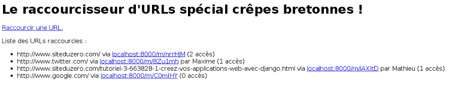
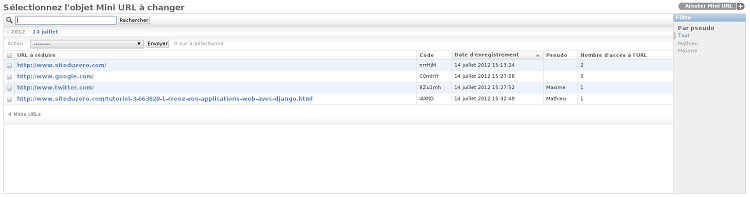
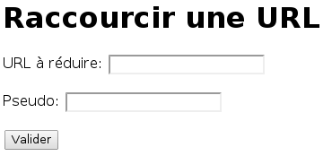

TP : un raccourcisseur d'URL
============================

Dans ce chapitre, nous allons mettre en pratique tout ce que vous avez appris jusqu'ici. Il s'agit d'un excellent exercice qui permet d'apprendre à lier les différents éléments du framework que nous avons étudiés (URL, modèles, vues, formulaires, administration et templates).

Cahier des charges
------------------

Pour ce travail pratique, nous allons réaliser un raccourcisseur d'URL. Ce type de service est notamment utilisé sur les sites de microblogging (comme Twitter) ou les messageries instantanées, où utiliser une très longue URL est difficile, car le nombre de caractères est limité.

Typiquement, si vous avez une longue URL, un raccourcisseur créera une autre URL, beaucoup plus courte, que vous pourrez distribuer. Lorsque quelqu'un cliquera sur le lien raccourci, il sera directement redirigé vers l'URL plus longue.
Par exemple, `tib.ly/abcde` redirigerait vers `www.example.com/avec-une/URL-super-longue`. Le raccourcisseur va générer un code (ici `abcde`) qui sera propre à l'URL plus longue. Un autre code redirigera le visiteur vers une autre URL.

Vous allez devoir créer une nouvelle application que nous nommerons `mini_url`. Cette application ne contiendra qu'un seul modèle appelé `MiniURL`, c'est lui qui enregistrera les raccourcis. Il comportera les champs suivants :

 - L'URL longue : `URLField` ;
 - Le code qui permet d'identifier le raccourci ;
 - La date de création du raccourci ;
 - Le pseudo du créateur du raccourci (optionnel) ;
 - Le nombre d'accès au raccourci (une redirection = un accès).

Nous avons indiqué le type du champ pour l'URL, car vous ne l'avez pas vu dans le cours auparavant. Les autres sont classiques et ont été vus, nous supposons donc que vous choisirez le bon type.
Les deux premiers champs (URL et code) devront avoir le paramètre `unique=True`. Ce paramètre garantit que deux entrées ne partageront jamais le même code ou la même URL, ce qui est primordial ici.
Finalement, le nombre d'accès sera par défaut mis à 0 grâce au paramètre `default=0`.

Vous devrez également créer un formulaire, plus spécialement un `ModelForm` basé sur le modèle `MiniURL`. Il ne contiendra que les champs URL et pseudo, le reste sera soit initialisé selon les valeurs par défaut, soit généré par la suite (le code notamment).

Nous vous fournissons la fonction qui permet de générer le code :

    import random
    import string

    def generer(nb_caracteres):
        caracteres = string.ascii_letters + string.digits
        aleatoire = [random.choice(caracteres) for _ in range(nb_caracteres)]
        
        return ''.join(aleatoire)

En théorie, il faudrait vérifier que le code n'est pas déjà utilisé ou alors faire une méthode nous assurant l'absence de doublon. Dans un souci de simplicité et de pédagogie, nous allons sauter cette étape.

Vous aurez ensuite trois vues :

 - Une vue affichant toutes les redirections créées et leurs informations, triées par ordre descendant, de la redirection avec le plus d'accès vers celle en ayant le moins ;
 - Une vue avec le formulaire pour créer une redirection ;
 - Une vue qui prend comme paramètre dans l'URL le code et redirige l'utilisateur vers l'URL longue.

Partant de ces trois fonctions, il ne faudra que 2 templates (la redirection n'en ayant pas besoin), et 3 routages d'URL bien entendu.

L'administration devra être activée, et le modèle accessible depuis celle-ci. Il devra être possible de rechercher des redirections depuis la longue URL via une barre de recherche, tous les champs devront être affichés dans une catégorie et le tri par défaut sera fait selon la date de création du raccourci.

Voici aux figures suivantes ce que vous devriez obtenir.

Si vous coincez sur quelque chose, n'hésitez pas à aller relire les explications dans le chapitre concerné, tout y a été expliqué.

Correction
----------

Normalement, cela ne devrait pas avoir posé de problèmes !

Il fallait donc créer une nouvelle application et l'inclure dans votre `settings.py` :

    python manage.py startapp mini_url

Votre `models.py` devrait ressembler à ceci :

    from django.db import models
    import random
    import string
    
    
    class MiniURL(models.Model):
        url = models.URLField(verbose_name="URL à réduire", unique=True)
        code = models.CharField(max_length=6, unique=True)
        date = models.DateTimeField(auto_now_add=True, verbose_name="Date d'enregistrement")
        pseudo = models.CharField(max_length=255, blank=True, null=True)
        nb_acces = models.IntegerField(default=0, verbose_name="Nombre d'accès à l'URL")
    
        def __str__(self):
            return "[{0}] {1}".format(self.code, self.url)
    
        def save(self, *args, **kwargs):
            if self.pk is None:
                self.generer(6)
    
            super(MiniURL, self).save(*args, **kwargs)
    
        def generer(nb_caracteres):
            caracteres = string.ascii_letters + string.digits
            aleatoire = [random.choice(caracteres) for _ in range(nb_caracteres)]
            
            self.code = ''.join(aleatoire)

        class Meta:
            verbose_name = "Mini URL"
            verbose_name_plural = "Minis URL"

Il y a plusieurs commentaires à faire dessus. Tout d'abord, nous avons surchargé la méthode `save()`, afin de générer automatiquement le code de notre URL. Nous avons pris le soin d'intégrer la méthode `generer()` au sein du modèle, mais il est aussi possible de la déclarer à l'extérieur et de faire `self.code = generer(6)`. Il ne faut surtout pas oublier la ligne qui appelle le `save()` parent, sinon lorsque vous validerez votre formulaire il ne se passera tout simplement rien !

La classe `Meta` ici est similaire à la classe `Meta` d'un `ModelForm`, elle permet d'indiquer des métadonnées concernant le modèle. Ici nous avons modifié le nom qui sera utilisé dans les `ModelForm`, l'administration (`verbose_name`) et sa forme plurielle (`verbose_name_plural`).

Après la création de nouveaux modèles, il fallait les ajouter dans la base de données via les commandes `python manage.py makemigrations` puis `python manage.py migrate` (n'oubliez pas d'ajouter l'application dans votre `settings.py` !) :

    $ python3 manage.py makemigrations
    Migrations for 'mini_url':
      0001_initial.py:
        - Create model MiniURL
    $ python3 manage.py migrate
    Operations to perform:
      Synchronize unmigrated apps: admin, contenttypes, auth, sessions
      Apply all migrations: blog, mini_url
    Synchronizing apps without migrations:
      Creating tables...
      Installing custom SQL...
      Installing indexes...
    Running migrations:
      Applying mini_url.0001_initial... OK

Le `forms.py` est tout à fait classique :

    from django import forms
    from mini_url.models import MiniURL
    
    class MiniURLForm(forms.ModelForm):
        class Meta:
            model = MiniURL
            fields = ('url','pseudo')

De même pour `admin.py` :

    from django.contrib import admin
    from mini_url.models import MiniURL
    
    class MiniURLAdmin(admin.ModelAdmin):
        list_display   = ('url', 'code', 'date', 'pseudo','nb_acces')
        list_filter    = ('pseudo',)
        date_hierarchy = 'date'
        ordering       = ('date', )
        search_fields  = ('url',)
    
    admin.site.register(MiniURL, MiniURLAdmin)

Voici `mini_url/urls.py`. N'oubliez pas de l'importer dans votre urls.py principal. Rien de spécial non plus :

    from django.conf.urls import patterns, url
    
    urlpatterns = patterns('mini_url.views',
        url(r'^$', 'liste', name='url_liste'),  # Une string vide indique la racine
        url(r'^nouveau/$', 'nouveau', name='url_nouveau'),
        url(r'^(?P<code>\w{6})/$', 'redirection', name='url_redirection'),  # (?P<code>\w{6}) capturera 6 caractères alphanumériques. 
    )

La directive permettant d'importer le `mini_url/urls.py` dans votre `urls.py` principal :

    url(r'^m/', include('mini_url.urls')),

Nous avons nommé les URL ici pour des raisons pratiques que nous verrons plus tard dans ce cours. Pour finir, le fichier `views.py`:

    from django.shortcuts import redirect, get_object_or_404, render
    from mini_url.models import MiniURL
    from mini_url.forms import MiniURLForm
    
    
    def liste(request):
        """Affichage des redirections"""
        minis = MiniURL.objects.order_by('-nb_acces')
    
        return render(request, 'mini_url/liste.html', locals())
    
    
    def nouveau(request):
        """Ajout d'une redirection"""
        if request.method == "POST":
            form = MiniURLForm(request.POST)
            if form.is_valid():
                form.save()
                return redirect(liste)
        else:
            form = MiniURLForm()
    
        return render(request, 'mini_url/nouveau.html', {'form': form})
    
    
    def redirection(request, code):
        """Redirection vers l'URL enregistrée"""
        mini = get_object_or_404(MiniURL, code=code)
        mini.nb_acces += 1
        mini.save()
    
        return redirect(mini.url, permanent=True)

Notez qu'à cause de l'argument `permanent=True`, le serveur renvoie le code HTTP 301 (redirection permanente).   
Sachez que certains navigateurs mettent en cache une redirection permanente. Ainsi, la prochaine fois que le visiteur cliquera sur votre lien, le navigateur se souviendra de la redirection et vous redirigera sans même appeler votre page. Le nombre d'accès ne sera alors pas incrémenté.

Pour terminer, les deux templates, `liste.html` et `nouveau.html`. Remarquez `{{ request.get_host }}` qui donne le nom de domaine et le port utilisé. Pendant le développement, il s'agit de `localhost:8000`. Néanmoins, si nous avions un autre domaine comme bit.ly, c'est ce domaine qui serait utilisé (il serait d'ailleurs beaucoup plus court et pratique comme raccourcisseur d'URL).

**liste.html** :

    <h1>Le raccourcisseur d'URL spécial crêpes bretonnes !</h1>
    
    
<a href="">Raccourcir une URL.</a>

    
    
Liste des URL raccourcies :

    <ul>
        
        <li> {{ mini.url }} via <a href="http://{{ request.get_host }}">{{ request.get_host }}</a>
        par {{ mini.pseudo }} ({{ mini.nb_acces }} accès)</li>
        
        <li>Il n'y en a pas actuellement.</li>
        
    </ul>

**nouveau.html** :

    <h1>Raccourcir une URL</h1>
    
    <form method="post" action="">
        
        {{ form.as_p }}
        <input type="submit"/>
    </form>

À part la sous-classe `Meta` du modèle et `request.get_host`, tout le reste a été couvert dans les chapitres précédents. Si quelque chose vous semble étrange, n'hésitez pas à aller relire le chapitre concerné.

Ce TP conclut la partie 2 du tutoriel. Nous avons couvert les bases du framework. Vous devez normalement être capables de réaliser des applications basiques. Dans les prochaines parties, nous allons approfondir ces bases et étudier les autres bibliothèques que Django propose.

Avant d'aller plus loin, nous vous conseillons de copier/coller le code que nous avons fourni en solution dans votre projet. Nous serons amenés à l'utiliser dans les chapitres suivants.

En attendant, voici quelques idées d'améliorations pour ce TP :

 - Intégrer un style CSS et des images depuis des fichiers statiques via le tag `` ;
 - Donner davantage de statistiques sur les redirections ;
 - Proposer la possibilité de rendre anonyme une redirection.
