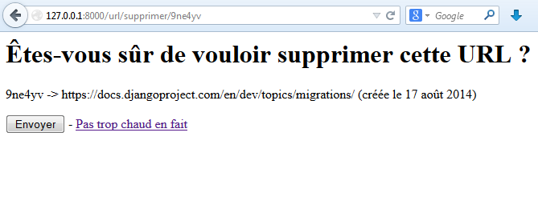

faq/Les vues génériques
===================

Sur la plupart des sites web, il existe certains types de pages où créer une vue comme nous l'avons fait précédemment est lourd et presque inutile : pour une simple page HTML sans informations dynamiques par exemple, ou encore de simple listes d'objets sans traitements particuliers. Django est conçu pour n'avoir à écrire que le *minimum* (philosophie DRY), le framework inclut donc un système de vues génériques, qui évite au développeur de devoir écrire des fonctions simples et identiques, nous permettant de gagner du temps et des lignes de code.

Ce chapitre est assez long et dense en informations. Nous vous conseillons de lire en plusieurs fois : nous allons faire plusieurs types distincts de vues, qui ont chacune une utilité différente. Il est tout à fait possible de poursuivre ce cours sans connaître tous ces types.

Premiers pas avec des pages statiques 
-------------------------------------

Les vues génériques sont en quelque sorte des vues très modulaires, prêtes à être utilisées directement, incluses par défaut dans le framework et cela sans devoir écrire la vue elle-même. Pour illustrer le fonctionnement global des vues génériques, prenons cet exemple de vue classique, qui ne s'occupe que d'afficher un template à l'utilisateur, sans utiliser de variables : 


    from django.shortcuts import render
    
    def faq(request):
        return render(request, 'blog/faq.html', {})

... et son URL associée :

    url('faq', 'blog.views.faq', name='faq'),

Une première caractéristique des vues génériques est que ce ne sont pas des fonctions, comme la vue que nous venons de présenter, mais des classes. L'amalgame *1 vue = 1 fonction* en est du coup quelque peu désuet. 

Il existe deux méthodes principales d'utilisation pour les vues génériques :

1. Soit nous créons une classe, héritant d'un type de vue générique dont nous surchargerons les attributs ;
2. Soit nous appelons directement la classe générique, en passant en arguments les différentes informations à utiliser.

Toutes les classes de vues génériques sont situées dans `django.views.generic`. Un premier type de vue générique est `TemplateView`. Typiquement, `TemplateView` permet, comme son nom l'indique, de créer une vue qui s'occupera du rendu d'un template.  
Comme dit précédemment, créons une classe héritant de `TemplateView`, et surchargeons ses attributs :

    from django.views.generic import TemplateView
    
    class FAQView(TemplateView):
        template_name = "blog/faq.html"  # chemin vers le template à afficher

Dès lors, il suffit de router notre URL vers une méthode héritée de la classe `TemplateView`, nommée `as_view` :

```python
from django.conf.urls import patterns, url, include
from blog.views import FAQView  # N'oubliez pas d'importer la classe mère

urlpatterns = patterns('',
   (r'^faq$', FAQView.as_view()),   # Nous demandons la vue correspondant à la classe FAQView
)
```

C'est tout ! Lorsqu'un visiteur accède à `/blog/faq`, le contenu du template `blog/faq.html` sera affiché.   
En réalité, la méthode `as_view` de `FAQView` retourne une vue (donc une fonction classique) qui se basera sur ses attributs pour déterminer son fonctionnement. Étant donné que nous avons indiqué un template à utiliser depuis l'attribut `template_name`, la classe l'utilisera pour générer une vue adaptée.

Nous avons indiqué précédemment qu'il y avait deux méthodes pour utiliser les vues génériques. Le principe de la seconde est de directement instancier `TemplateView` dans le fichier `urls.py`, en lui passant en argument notre `template_name` :

```python
from django.conf.urls import patterns, url, include
from django.views.generic import TemplateView  # L'import a changé, attention !

urlpatterns = patterns('',
   url(r'^faq', TemplateView.as_view(template_name='blog/faq.html')),
)
```

Vous pouvez alors retirer `FAQView`, la classe ne sert plus à rien. Pour les `TemplateView`, la première méthode présente peu d'intérêt, cependant nous verrons par la suite qu'hériter d'une classe sera plus facile que tout définir dans `urls.py`.

Lister et afficher des données 
------------------------------

Jusqu'ici, nous avons vu comment *afficher des pages statiques* avec des vues génériques. Bien que ce soit pratique, il n'y a jusqu'ici rien de très puissant.

Abordons maintenant quelque chose de plus intéressant. Un schéma utilisé presque partout sur le web est le suivant : vous avez une liste d'objets (des articles, des images, etc.), et lorsque vous cliquez sur un élément, vous êtes redirigés vers une page présentant plus en détail ce même élément.

Nous avons déjà réalisé quelque chose de semblable dans le chapitre sur les modèles précédemment avec notre liste d'articles et l'affichage individuel d'articles. Nous allons repartir de la même idée, mais cette fois-ci avec des vues génériques. Pour ce faire, nous utiliserons deux nouvelles classes : `ListView` et `DetailView`. Nous réutiliserons les deux modèles `Article` et `Categorie`, qui ne changeront pas.

### Une liste d'objets en quelques lignes avec ListView

Commençons par une simple liste de nos articles, sans pagination. À l'instar de `TemplateView`, nous pouvons utiliser `ListView` directement en lui passant en paramètre le modèle à traiter :

```python
from django.conf.urls import patterns, url, include
from django.views.generic import ListView
from blog.models import Article

urlpatterns = patterns('',
    # Nous allons réécrire l'URL de l'accueil
    url(r'^$', ListView.as_view(model=Article,)),

    # Et nous avons toujours nos autres pages…
    url(r'^article/(?P<id>\d+)$', 'blog.views.lire'),
    url(r'^(?P<page>\d+)$', 'blog.views.archives'),
    url(r'^categorie/(?P<slug>.+)$', 'blog.views.voir_categorie'),
)
```

Avec cette méthode, Django impose quelques conventions :

- Le template devra s'appeler `<app>/<model>_list.html`. Dans notre cas, le template serait nommé `blog/article_list.html`.
- L'unique variable retournée par la vue générique et utilisable dans le template est appelée `object_list`, et contiendra ici tous nos articles.

Il est possible de redéfinir ces valeurs en passant des arguments supplémentaires à notre `ListView` : 

```python
urlpatterns = patterns('',
    url(r'^$', ListView.as_view(model=Article,
                    context_object_name="derniers_articles",
                    template_name="blog/accueil.html")),
    ...
)
```

Par souci d'économie, nous souhaitons réutiliser le template `blog/accueil.html` qui utilisait comme nom de variable `derniers_articles` à la place d'`object_list`, celui par défaut de Django.

Vous pouvez dès lors supprimer la fonction `accueil` dans `views.py`, et vous obtiendrez le même résultat qu'avant (ou presque, si vous avez plus de 5 articles) ! L'ordre d'affichage des articles est celui défini dans le modèle, via l'attribut `ordering` de la sous-classe `Meta`, qui se base par défaut sur la clé primaire de chaque entrée. 

Il est possible d'aller plus loin : nous ne souhaitons généralement pas tout afficher sur une même page, mais par exemple filtrer les articles affichés. Il existe donc plusieurs attributs et méthodes de `ListView` qui étendent les possibilités de la vue.

Par souci de lisibilité, nous vous conseillons plutôt de renseigner les classes dans `views.py`, comme vu précédemment. Tout d'abord, changeons notre `urls.py`, pour appeler notre nouvelle classe :

```python
from blog.views import ListeArticles

urlpatterns = patterns('',
    url(r'^$', ListeArticles.as_view(), name="blog_liste"),  # Via la fonction as_view, comme vu tout à l'heure
    ...
)
```

C'est l'occasion d'expliquer l'intérêt de l'argument `name`. Pour profiter au maximum des possibilités de Django, il est possible d'écrire les URL via la fonction `reverse`, et son tag associé dans les templates. L'utilisation du tag `url` se fera dès lors ainsi : ``. Cette fonctionnalité ne dépend pas des vues génériques, mais est inhérente au fonctionnement des URL en général. Vous pouvez donc également associer le paramètre `name` à une vue normale.

Ensuite, créons notre classe qui reprendra les mêmes attributs que notre `ListView` de tout à l'heure :

```python
class ListeArticles(ListView):
    model = Article
    context_object_name = "derniers_articles"
    template_name = "blog/accueil.html"
```


Désormais, nous souhaitons paginer nos résultats, afin de n'afficher que 5 articles par page, par exemple. Il existe un attribut adapté : 

```python
class ListeArticles(ListView):
    model = Article
    context_object_name = "derniers_articles"
    template_name = "blog/accueil.html"
    paginate_by = 5
```

De cette façon, la page actuelle est définie via l'argument page, passé dans l'URL (`/?page=2` par exemple). Il suffit dès lors d'adapter le template pour faire apparaître la pagination. Sachez que vous pouvez définir le style de votre pagination dans un template séparé, et l'inclure à tous les endroits nécessaires, via `` par exemple. Nous parlerons plus loin du fonctionnement de la pagination, dans la partie IV.

```html
<h1>Bienvenue sur le blog des crêpes bretonnes !</h1>


    <div class="article">
       <h3>{{ article.titre }}</h3>
       <p>{{ article.contenu|truncatewords_html:80 }}</p>
       <p><a href="">Lire la suite</a>
    </div>


{# Mise en forme de la pagination ici #}

    <div class="pagination">
           
               <a href="?page={{ page_obj.previous_page_number }}">Précédente</a> —
           
           Page {{ page_obj.number }} sur {{ page_obj.paginator.num_pages }} 
           
              — <a href="?page={{ page_obj.next_page_number }}">Suivante</a>
           
    </div>

```

Allons plus loin ! Nous pouvons également surcharger la sélection des objets à récupérer, et ainsi soumettre nos propres filtres :

```python
class ListeArticles(ListView):
    model = Article
    context_object_name = "derniers_articles"
    template_name = "blog/accueil.html"
    paginate_by = 5
    queryset = Article.objects.filter(categorie__id=1)
```

Ici, seuls les articles de la première catégorie créée seront affichés. Vous pouvez bien entendu effectuer des requêtes identiques à celle des vues, avec du tri, plusieurs conditions, etc. Il est également possible de passer des arguments pour rendre la sélection un peu plus dynamique en ajoutant l'ID souhaité dans l'URL.

```python
from django.conf.urls import patterns, url
from blog.views import ListeArticles

urlpatterns = patterns('blog.views',
    url(r'^categorie/(\d+)$', ListeArticles.as_view(), name='blog_categorie'),
    url(r'^article/(?P<id>\d+)$', 'lire'),
    url(r'^(?P<page>\d+)$', 'archives')
)
```

Dans la vue, nous sommes obligés de surcharger `get_queryset`, qui renvoie la liste d'objets à afficher. En effet, il est impossible d'accéder aux paramètres lors de l'assignation d'attributs comme nous le faisons depuis le début.

```python
class ListeArticles(ListView):
    model = Article
    context_object_name = "derniers_articles"
    template_name = "blog/accueil.html"
    paginate_by = 10

    def get_queryset(self):
       return Article.objects.filter(categorie__id=self.args[0])
```

Il est bien entendu possible de nommer les arguments également. Dans ce cas, il faut utiliser l'attribut kwargs au lieu de args. Ainsi, avec `r'categorie/(?P<id>\d+)'`, on obtient :

```python
def get_queryset(self):
    return Article.objects.filter(categorie__id=self.kwargs['id'])
```

Pour finir, il est possible d'ajouter des éléments au contexte, c'est-à-dire les variables qui sont renvoyées au template. Par exemple, renvoyer l'ensemble des catégories, afin de faire une liste de liens vers celles-ci. Pour ce faire, nous allons ajouter au tableau `context` une clé `categories` qui contiendra notre liste :

```python
def get_context_data(self, **kwargs):
       # Nous récupérons le contexte depuis la super-classe
       context = super().get_context_data(**kwargs)
       # Nous ajoutons la liste des catégories, sans filtre particulier
       context['categories'] = Categories.objects.all()
       return context
```

Il est facile d'afficher la liste des catégories dans notre template :

```html
<h3>Catégories disponibles</h3>
<ul>

    <li><a href="">{{ categorie.nom }}</a></li>

</ul>
```

Afficher un article via DetailView
----------------------------------

Malgré tout cela, nous ne pouvons afficher que des listes, et non pas un objet précis. Heureusement, la plupart des principes vus précédemment avec les classes héritant de `ListView` sont applicables avec celles qui héritent de `DetailView`.  
Le but de `DetailView` est de renvoyer un seul objet d'un modèle, et non une liste. Pour cela, il va falloir passer un paramètre bien précis dans notre URL : `pk`, qui représentera *la clé primaire de l'objet à récupérer* :

```python
from blog.views import ListeArticles, LireArticle

urlpatterns = patterns('blog.views',
    url(r'^categorie/(\w+)$', ListeArticles.as_view(), name='blog_categorie'),
    url(r'^article/(?P<pk>\d+)$', LireArticle.as_view(), name='blog_lire'),
)
```

Maintenant que nous avons notre URL, avec la clé primaire en paramètre, il nous faut écrire la classe qui va récupérer l'objet voulu et le renvoyer à un template précis :

```python
from django.views.generic import DetailView 

class LireArticle(DetailView):
    context_object_name = "article"
    model = Article
    template_name = "blog/lire.html"
```

… et encore une fois l'ancienne vue devient inutile. Souvenez-vous que notre fonction `lire` gérait le cas où l'ID de l'article n'existait pas, il en est de même ici. Comme tout à l'heure, vu que nous avons nommé notre objet `article`, il n'y a *aucune modification à faire* dans le template :

```html
<h1>{{ article.titre }} <span class="small">dans {{ article.categorie.nom }}</span></h1>
<p class="infos">Rédigé par {{ article.auteur }}, le {{ article.date|date:"DATE_FORMAT" }}</p>
<div class="contenu">{{ article.contenu|linebreaks }}</div>
```

Comme pour les `ListView`, il est possible de personnaliser la sélection avec `get_queryset`, afin de ne sélectionner l'article que s'il est public par exemple. Une autre spécificité utile lorsque nous affichons un objet, c'est d'avoir la possibilité de modifier un de ses attributs, par exemple son nombre de vues ou sa date de dernier accès. Pour faire cette opération, il est possible de surcharger la méthode `get_object`, qui renvoie l'objet à afficher :

```python
class LireArticle(DetailView):
    context_object_name = "article"
    model = Article
    template_name = "blog/lire.html"

    def get_object(self):
        # Nous récupérons l'objet, via la super-classe
        article = super().get_object()
    
        article.nb_vues += 1  # Imaginons que nous ayons un attribut « Nombre de vues »
        article.save()
    
        return article
```

Enfin, sachez que la variable `request`, qui contient les informations sur la requête et l'utilisateur, est également disponible dans les vues génériques. C'est un *attribut de la classe*, que vous pouvez donc appeler dans n'importe quelle méthode via `self.request`.

Agir sur les données
--------------------

Jusqu'ici, nous n'avons fait qu'*afficher des données*, statiques ou en provenance de modèles. Nous allons maintenant nous occuper de la gestion de données. Pour cette partie, nous reprendrons comme exemple notre application de raccourcisseur d'URL que nous avons développée lors du chapitre précédent. Pour rappel, dans le [schéma CRUD](https://fr.wikipedia.org/wiki/CRUD), il y a quatre types d'actions applicables sur une donnée :

- `Create` (créer) ;
- `Read` (lire, que nous avons déjà traité juste au-dessus) ;
- `Update` (mettre à jour) ;
- `Delete` (supprimer).

Nous montrerons comment réaliser ces opérations dans l'ordre indiqué. En effet, chacune possède une vue générique associée.

### CreateView

Commençons par la création d'objets, souvent utile sur le web de nos jours : un site un tant soit peu communautaire permet à n'importe qui de fournir du contenu : des commentaires, des posts de forum, etc., ou encore de poster un lien pour le minifier. Pour simplifier notre formulaire d'ajout de liens, nous allons surcharger la classe `CreateView` :

```python
from django.views.generic import CreateView
from django.core.urlresolvers import reverse_lazy

class URLCreate(CreateView):
    model = MiniURL
    template_name = 'mini_url/nouveau.html'
    form_class = MiniURLForm
    success_url = reverse_lazy(liste)
```

Comme tout à l'heure, l'attribut `model` permet de spécifier avec quel modèle nous travaillons, et template_name permet de spécifier le chemin vers le template (par défaut, le chemin est `<app>/<model>_create_form.html`, avec le nom du modèle tout en minuscules).  
La nouveauté ici réside dans les deux attributs suivants. Le premier, `form_class` permet de spécifier quel `ModelForm` utiliser pour *définir les champs disponibles à l'édition*, et tout ce qui est propriété du formulaire. Ici, nous allons réutiliser la classe que nous avions écrite précédemment étant donné qu'elle est suffisante pour l'exemple.

Le dernier argument permet quant à lui de spécifier vers où rediriger l'utilisateur quand le formulaire est validé et enregistré. Nous avons utilisé ici `reverse_lazy`, qui permet d'utiliser la méthode `reverse()`, même si la configuration des URL n'a pas encore eu lieu (ce qui est le cas ici, puisque les vues génériques, faites par des classes sont interprétées en Python avant l'éxécution des `urls.py`).

Le comportement de cette classe est similaire à notre ancienne vue `nouveau()` : s'il n'y a pas eu de requêtes de type *POST*, elle affiche le formulaire, selon les propriétés de `form_class`, et dans le template fourni. Une fois validé et si, et seulement si, le formulaire est considéré comme correct (`if form.is_valid()` dans notre ancienne vue), alors la méthode `save()` est appelée sur l'objet généré par le formulaire, puis redirige l'utilisateur vers l'URL `success_url`.

Notre template est déjà prêt pour cette vue, puisque l'objet `Form` renvoyé par cette vue générique est nommé `form`, en minuscules, comme nous l'avions fait avec l'ancienne méthode. Il nous faut juste éditer le fichier `urls.py` :

```python
from django.conf.urls import patterns, url
from views import URLCreate

urlpatterns = patterns('mini_url.views',
    url(r'^$', 'liste', name='url_liste'),  # Une string vide indique la racine
    url(r'^nouveau$', URLCreate.as_view(), name='url_nouveau'),
    url(r'^(?P<code>\w{6})$', 'redirection', name='url_redirection'),  # (?P<code>\w{6}) capturera 6 caractères alphanumériques.
)
```

Une fois cette ligne modifiée, nous pouvons retenter la génération d'une URL raccourcie. Si vous vous rendez sur `/url/nouveau`, vous remarquerez que le comportement de la page n'a pas changé. En réalité, notre nouvelle vue en fait autant que l'ancienne, mais nous avons écrit sensiblement moins. 

### UpdateView

Après la création, attaquons-nous à la mise à jour des données. Imaginons que nous souhaitions pouvoir changer l'URL ou le pseudo entré, il nous faut une nouvelle vue, qui va nous permettre de fournir de nouveau ces informations. Cette fois, nous allons hériter de la classe `UpdateView` qui se présente comme `CreateView` :

```python
from django.views.generic import CreateView, UpdateView
from django.core.urlresolvers import reverse_lazy

class URLUpdate(UpdateView):
    model = MiniURL
    template_name = 'mini_url/nouveau.html'
    form_class = MiniURLForm
    success_url = reverse_lazy(liste)
``` 

Cette nouvelle classe est quasiment identique à la précédente : nous n'avons même pas pris le soin de changer le nom du template ! En fait, les attributs des classes `CreateView` et `UpdateView` sont les mêmes, et leur fonctionnement est très proche. En effet, entre la création d'un objet et sa mise à jour, la page n'a pas réellement besoin d'être modifiée. Tout au plus, en cas de mise à jour, les champs sont auto-complétés avec les données de l'objet.

Par défaut, le nom du template attribué à une vue générique de type `UpdateView` est `<app>/<model>_update_form.html`, afin de pouvoir le différencier de la création.

Pour rendre notre template totalement fonctionnel, il faut juste remplacer la ligne

```html
<form method="post" action="">
```

par

```html
<form method="post" action="">
```

Puisque nous utilisons cette page pour deux types d'actions, ayant deux URL distinctes, il suffit de se dire : « *Quand nous validons le formulaire, nous soumettons la requête à la même adresse que la page actuelle.* » Il ne reste plus qu'à modifier notre `urls.py`. Comme pour `DetailView`, il faut récupérer la clé primaire, appelée `pk`. Pas de changement profond, voici la ligne :

```python
# Pensez à importer URLUpdate en début de fichier
url(r'^edition/(?P<pk>\d)$', URLUpdate.as_view(), name='url_update'),  
```

Désormais, vous pouvez accéder à l'édition d'un objet `MiniURL`. Pour y accéder, cela se fait depuis les adresses suivantes : `/url/edition/1` pour le premier objet, `/url/edition/2` pour le deuxième, etc.

Vous pouvez le constater sur la figure suivante : le résultat est satisfaisant. Bien évidemment, la vue est très minimaliste : n'importe qui peut éditer tous les liens, il n'y a pas de message de confirmation, etc. Par contre, il y a une gestion des objets qui n'existe pas en renvoyant une page d'erreur 404, des formulaires incorrects, etc. Tout cela est améliorable.


#### Améliorons nos URL avec la méthode get_object()

Pour le moment, nous utilisons l'identifiant numérique, nommé `pk`, qui est la clé primaire dans l'URL. Ce n'est pas forcément le meilleur choix (pour le référencement par exemple). Nous pourrions prendre le code présent dans l'URL réduite.


Nous savons que chaque entrée possède un code unique donc il n'y a pas de soucis d'unicité. Surchargeons alors la méthode `get_object`, qui s'occupe de récupérer l'objet à mettre à jour.

```python
class URLUpdate(UpdateView):
    model = MiniURL
    template_name = 'mini_url/nouveau.html'
    form_class = MiniURLForm
    success_url = reverse_lazy(liste)

    def get_object(self, queryset=None):
           code = self.kwargs.get('code', None)
           return get_object_or_404(MiniURL, code=code)
```

Nous utilisons encore une fois la fonction `get_object_or_404`, qui nous permet de renvoyer une page d'erreur si jamais le code demandé n'existe pas. Le code de l'adresse est accessible depuis le dictionnaire `self.kwargs`, qui contient les arguments nommés dans l'URL. Il faut donc changer un peu `urls.py` également, pour accepter l'argument `code`, qui prend des lettres et des chiffres :

```python
url(r'^edition/(?P<code>\w{6})$', URLUpdate.as_view(), name='url_update'),
```


#### Effectuer une action lorsque le formulaire est validé avec form_valid()

De la même façon, il est possible de changer le comportement lorsque le formulaire est validé, en redéfinissant la méthode `form_valid`. Cette méthode est appelée dès qu'un formulaire est soumis et considéré comme validé. Par défaut, il s'occupe _d'enregistrer les modifications et de rediriger l'utilisateur_, mais vous pouvez très bien changer son comportement :


```python
def form_valid(self, form):
    self.object = form.save()
    messages.success(self.request, "Votre profil a été mis à jour avec succès.")  # Envoi d'un message à l'utilisateur
    return HttpResponseRedirect(self.get_success_url())
```


Ici, nous précisons à l'utilisateur, au moyen d'une méthode particulière, que l'édition s'est bien déroulée. Grâce à ce genre de méthodes, vous pouvez affiner le fonctionnement de votre vue, tout en conservant la puissance de la généricité.

### DeleteView

Pour terminer, attaquons-nous à la suppression d'un objet. Comme pour `UpdateView`, cette vue prend un objet et demande la confirmation de suppression. Si l'utilisateur confirme, alors la suppression est effectuée, puis l'utilisateur est redirigé. Les attributs de la vue sont donc globalement identiques à ceux utilisés précédemment :


```python
class URLDelete(DeleteView):
    model = MiniURL
    context_object_name = 'mini_url'
    template_name = 'mini_url/supprimer.html'
    success_url = reverse_lazy(liste)

    def get_object(self, queryset=None):
        code = self.kwargs.get('code', None)
        return get_object_or_404(MiniURL, code=code)
```

Toujours pareil, la vue est associée à notre modèle, un template, et une URL à cibler en cas de réussite. Nous avons encore une fois la sélection de notre objet via le code assigné en base plutôt que la clé primaire. Cette fois-ci, nous devons créer notre template `supprimer.html`, qui demandera juste à l'utilisateur s'il est sûr de vouloir supprimer, et le cas échéant le redirigera vers la liste.


```html
<h1>Êtes-vous sûr de vouloir supprimer cette URL ?</h1>

<p>{{ mini_url.code }} -&gt; {{ mini_url.url }} (créée le {{ mini_url.date|date:"DATE_FORMAT" }})</p>

<form method="post" action="">
     <!-- Nous prenons bien soin d'ajouter le csrf_token -->
   <input type="submit" value"Oui, supprime moi ça" /> - <a href="">Pas trop chaud en fait</a>
</form>
```

Encore une fois, notre ligne en plus dans le fichier `urls.py` ressemble beaucoup à celle de `URLUpdate` :


```python
# Ne pas oublier l'import de URLDelete !
url(r'^supprimer/(?P<code>\w{6})$', URLDelete.as_view(), name='url_delete'),  
```

Afin de faciliter le tout, deux liens ont été ajoutés dans la liste définie dans le template `liste.html`, afin de pouvoir mettre à jour ou supprimer une URL rapidement : 


```html
<h1>Le raccourcisseur d'URL spécial crêpes bretonnes !</h1>

<p><a href="">Raccourcir une URL.</a></p>

<p>Liste des URL raccourcies :</p>
<ul>
    
    <li> <a href="">Mettre à jour</a> -  <a href="">Supprimer</a>
    | {{ mini.url }} via <a href="http://{{ request.get_host }}">{{ request.get_host }}</a>
    par {{ mini.pseudo }} ({{ mini.nb_acces }} accès)</li>
    
    <li>Il n'y en a pas actuellement.</li>
    
</ul>
```


Même refrain : nous enregistrons, et nous pouvons tester grâce au lien ajouté (voir la figure suivante). 




----------

Ce chapitre touche à sa fin. Néanmoins, nous n'avons même pas pu vous présenter toutes les spécificités des vues génériques ! Il existe en effet une multitude de classes de vues génériques, mais aussi d'attributs et méthodes non abordés ici. Si vous voulez avoir une petite idée de l'étendue du sujet, [le site ccbv.co.uk](http://ccbv.co.uk) présente une documentation exhaustive sur les vues génériques de Django. 

Nous avons présenté les plus communes, celles qui vous seront probablement le plus utile, mais il est clairement impossible de tout présenter sans être indigeste. Par exemple, nous avons décidé de ne pas couvrir toutes les classes qui permettent de faire des pages de tri par date ou d'archives. 
Si vous souhaitez en savoir plus, ces deux liens vous seront plus qu'utiles :


- [Documentation officielle sur les vues génériques](https://docs.djangoproject.com/en/dev/ref/class-based-views/) ;
- [Documentation non officielle mais très complète, listant les attributs et méthodes de chaque classe](http://ccbv.co.uk/).

Ce qu'il faut retenir, c'est que Django vous propose un mécanisme générique pour les cas simples. Cependant, il ne faut pas en abuser, notamment si vous faites plus qu'afficher une simple liste ou un objet. 

En résumé
---------
- Django fournit un ensemble de classes permettant d'éviter de réécrire plusieurs fois le même type de vue (affichage d'un template statique, liste d'objets, création d'objets…) ;
- Les vues génériques peuvent être déclarées directement au sein de `urls.py` (cas le plus pratique pour les `TemplateView`) ou dans `views.py` ;
- Chaque vue générique dispose d'un ensemble d'attributs permettant de définir ce que doit faire la vue : modèle concerné, template à afficher, gestion de la pagination, filtres… ;
- Il est possible d'automatiser les formulaires d'ajout, de mise à jour et de suppression d'objets via des vues génériques ;
- Le module `django.views.generic` regorge de classes (plusieurs dizaines en tout), n'hésitez pas à regarder si l'une d'entre elles fait ce que vous souhaitez avant de vous lancer.