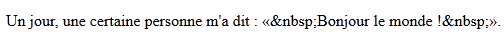
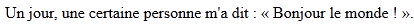
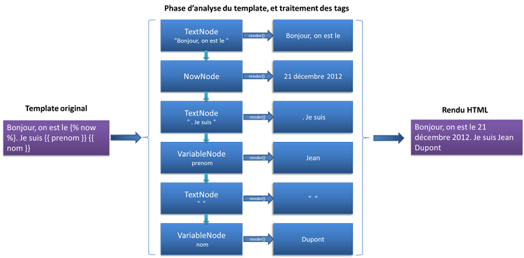
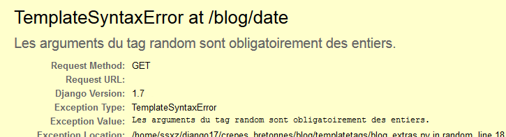

Simplifions nos templates : filtres, tags et contextes
======================================================

Comme nous l'avons vu rapidement dans le premier chapitre sur les templates, Django offre une panoplie de filtres et de tags. Cependant, il se peut que vous ayez un jour un besoin particulier impossible à combler avec les filtres et tags de base. Heureusement, Django permet également de créer nos propres filtres et tags, et même de générer des variables par défaut lors de la construction d'un template (ce que nous appelons le contexte du template). Nous aborderons ces différentes possibilités dans ce chapitre.


Préparation du terrain : architecture des filtres et tags
---------------------------------------------------------

Pour construire nos propres filtres et tags, Django impose que ces derniers soient placés dans une application, tout comme les vues ou les modèles. À partir d'ici, nous retrouvons deux écoles dans la communauté de Django :

 - Soit votre fonctionnalité est propre à une application (par exemple un filtre utilisé uniquement lors de l'affichage d'articles sur votre blog), dans ce cas vous pouvez directement le(s) placer au sein de l'application concernée ; nous préférons cette méthode ;
 - Soit vous créez une application à part, qui regroupe tous vos filtres et tags personnalisés de votre projet.

Une fois ce choix fait, la procédure est identique : l'application choisie doit contenir un dossier nommé `templatetags` (attention au `s` final !), dans lequel il faut créer un fichier Python par groupe de filtres/tags (plus de détails sur l'organisation de ces fichiers viendront plus tard). Pour le moment, nous allons en créer un, appelé `blog_extras.py`.   
Ce dossier `templatetags` doit en réalité être un module Python classique afin que les fichiers qu'il contient puissent être importés. Il est donc impératif de créer un fichier `__init__.py` vide, sans quoi Django ne pourra rien faire.

La nouvelle structure de l'application « blog » est donc la suivante : 

```
blog/
   __init__.py
   models.py
   templatetags/
      __init__.py
      blog_extras.py
   views.py
```

Une fois les fichiers créés, il est nécessaire de spécifier une instance de classe qui nous permettra d'_enregistrer nos filtres et tags_, de la même manière que dans nos fichiers `admin.py` avec `admin.site.register()`. Pour ce faire, il faut déclarer les deux lignes suivantes au début du fichier `blog_extras.py` :

```python
from django import template

register = template.Library()
```

L'application incluant les `templatetags` doit être incluse dans le fameux `INSTALLED_APPS` de notre `settings.py`, si vous avez décidé d'ajouter vos tags et filtres personnalisés dans une application spécifique. Une fois les nouveaux tags et filtres codés, il sera possible de les intégrer dans n'importe quel template du projet via la ligne suivante :

```jinja

```

Le nom `blog_extras` dans ce tag vient du nom de fichier que nous avons renseigné plus haut, à savoir `blog_extras.py`, sans l'extension `.py`.  
Tous les dossiers `templatetags` de toutes les applications partagent le même espace de noms. Si vous utilisez des filtres et tags de plusieurs applications, veillez à ce que leur noms de fichiers soient différents, afin qu'il n'y ait pas de conflit !

Sachez qu'il est possible de charger plusieurs module de filtres et tags par ``, qui comprend un nombre illimité d'arguments : 

```jinja
=
```

Nous pouvons désormais entrer dans le vif du sujet, à savoir la création de filtres et de tags !


Personnaliser l'affichage de données avec nos propres filtres
-------------------------------------------------------------

Commençons par les filtres. En soi, un filtre est une fonction classique qui prend 1 ou 2 arguments :

 - La variable à afficher, qui peut être n'importe quel objet en Python ;
 - Et de façon facultative, un paramètre.

Comme petit rappel au cas où vous auriez la mémoire courte, voici un exemple d'utilisation de deux filtres : l'un sans paramètre, le deuxième avec.

```jinja
{{ texte|upper }}            -> Filtre upper sur la variable "texte"
{{ texte|truncatewords:80 }} -> Filtre truncatewords, avec comme argument "80" sur la variable "texte"
```

Les fonctions Python associées à ces filtres ne sont appelées qu'au sein du template. Pour cette raison, il faut éviter de lancer des exceptions, et toujours renvoyer un résultat. En cas d'erreur, il est plus prudent de renvoyer l'entrée de départ ou une chaîne vide, afin d'éviter des effets de bord lors du « chaînage » de filtres par exemple.

### Un premier exemple de filtre sans argument

Attaquons la réalisation de notre premier filtre. Pour commencer, prenons comme exemple le modèle [« Citation » de Wikipédia](http://fr.wikipedia.org/wiki/Modèle:Citation) : nous allons encadrer la chaîne fournie par des guillemets français doubles.
Ainsi, si dans notre template nous avons `{{ "Bonjour le monde !"|citation }}`, le résultat dans notre page sera _« Bonjour le monde ! »_.

Pour ce faire, il faut ajouter une fonction nommée `citation` dans `blog_extras.py`. Cette fonction n'a pas d'argument particulier à Django et son écriture est assez intuitive :

```python
def citation(texte):   
    """
    Affiche le texte passé en paramètre, encadré de guillemets 
    français doubles et d'espaces insécables
    """
    return "«&nbsp;%s&nbsp;»" % texte
```

Une fois la fonction écrite, il faut préciser au framework d'attacher cette méthode au filtre qui a pour nom `citation`. Encore une fois, il y a deux façons différentes de procéder :

 - Soit en ajoutant la ligne `@register.filter` comme décorateur de la fonction. L'argument `name` peut être indiqué pour choisir le nom du filtre ;
 - Soit en appelant la méthode `register.filter('citation', citation)`.
 
Notons qu'avec ces deux méthodes le nom du filtre n'est donc pas directement lié au nom de la fonction, et cette dernière aurait pu s'appeler `filtre_citation` ou autre, cela n'aurait posé aucun souci tant qu'elle est correctement renseignée par la suite.

Ainsi, ces trois fonctions sont équivalentes :


```python
from django import template

register = template.Library()

@register.filter
def citation(texte):   
    return "«&nbsp;%s&nbsp;»" % texte


@register.filter(name='mon_filtre_citation')
def citation2(texte):
    return "«&nbsp;%s&nbsp;»" % texte

def citation3(texte):
    return "«&nbsp;%s&nbsp;»" % texte

register.filter('un_autre_filtre_citation', citation3)
```

Par commodité, nous n'utiliserons plus que les première et deuxième méthodes dans ce cours. La dernière est pour autant tout à fait valide, libre à vous de l'utiliser si vous préférez celle-ci.

Nous pouvons maintenant essayer le nouveau filtre dans un template. Il faut tout d'abord charger les filtres dans notre template, via le tag `load`, introduit récemment, puis appeler notre filtre `citation` sur une chaîne de caractères quelconque :

```jinja

Un jour, une certaine personne m'a dit : {{ "Bonjour le monde !"|citation }}
```

Et là… c'est le drame ! En effet, voici le résultat à la figure suivante.



Par défaut, Django échappe automatiquement tous les caractères spéciaux des chaînes de caractères affichées dans un template, ainsi que le résultat des filtres. Nous allons donc devoir préciser au framework que le résultat de notre filtre est contrôlé et sécurisé, et qu'il n'est pas nécessaire de l'échapper. Pour cela, il est nécessaire de transformer un peu l'enregistrement de notre fonction avec `register`. La méthode `filter` peut prendre comme argument `is_safe`, qui permet de signaler au framework par la suite que notre chaîne est sûre :


```python
@register.filter(is_safe=True)
def citation(texte):
    return "«&nbsp;%s&nbsp;»" % texte
```

De cette façon, tout le HTML renvoyé par le filtre est correctement interprété et nous obtenons le résultat voulu (voir la figure suivante).



Cependant, un problème se pose avec cette méthode. En effet, si du HTML est présent dans la chaîne donnée en paramètre, il sera également interprété. Ainsi, si dans le template nous remplaçons l'exemple précédent par `{{ "<strong>Bonjour</strong> le monde !"|citation }}`, alors le mot « Bonjour » sera en gras. En soi, ce n'est pas un problème si vous êtes sûrs de la provenance de la chaîne de caractères. Il se pourrait en revanche que, parfois, vous deviez afficher des données entrées par vos utilisateurs, et à ce moment-là n'importe quel visiteur mal intentionné pourrait y placer du code HTML dangereux, ce qui conduirait à des failles de sécurité.

Pour éviter cela, nous allons échapper les caractères spéciaux de notre argument de base. Cela peut être fait via la fonction `espace` du module `django.utils.html`. Au final, voici ce que nous obtenons :

```python
from django import template
from django.utils.html import escape

register = template.Library()

@register.filter(is_safe=True)
def citation(texte):
    return "«&nbsp;%s&nbsp;»" % escape(texte)
```

Finalement, notre chaîne est encadrée de guillemets et d'espaces insécables corrects, mais l'intérieur du message est tout de même échappé.

### Un filtre avec arguments

Nous avons pour le moment traité uniquement le cas des filtres sans paramètre. Cependant, il peut arriver que l'affichage doive être _différent selon un paramètre spécifié_, et ce indépendamment de la variable de base.
Un exemple parmi tant d'autres est la troncature de texte, il existe même déjà un filtre pour couper une chaîne à une certaine position. Nous allons ici plutôt réaliser un filtre qui va couper une chaîne après un certain nombre de caractères, mais sans couper en plein milieu d'un mot.

Comme nous l'avons précisé tout à l'heure, la forme d'un filtre avec un argument est la suivante :

```jinja
{{ ma_chaine|smart_truncate:40 }}
```

Nous souhaitons ici appeler un nouveau filtre `smart_truncate` sur la variable `ma_chaine`, tout en lui passant en argument le nombre 40. La structure du filtre sera similaire à l'exemple précédent. Il faudra cependant bien vérifier que le paramètre est bien un nombre et qu'il y a des caractères à tronquer. Voici un début de fonction :

```python
def smart_truncate(texte, nb_caracteres):

    # Nous vérifions tout d'abord que l'argument passé est bien un nombre
    try:
           nb_caracteres = int(nb_caracteres)
    except ValueError:
           return texte  # Retour de la chaîne originale sinon

    # Si la chaîne est plus petite que le nombre de caractères maximum voulus,
    # nous renvoyons directement la chaîne telle quelle.
    if len(texte) <= nb_caracteres:
           return texte

    # […]
```

La suite de la fonction est tout aussi classique : nous coupons notre chaîne au nombre de caractères maximum voulu, et nous retirons la dernière suite de lettres, si jamais cette chaîne est coupée en plein milieu d'un mot :


```python
def smart_truncate(texte, nb_caracteres):
    """
    Coupe la chaîne de caractères jusqu'au nombre de caractères souhaité,
    sans couper la nouvelle chaîne au milieu d'un mot.
    Si la chaîne est plus petite, elle est renvoyée sans points de suspension.
    ---
    Exemple d'utilisation :
    {{ "Bonjour tout le monde, c'est Diego"|smart_truncate:18 }} renvoie
    "Bonjour tout le..."
    """

    # Nous vérifions tout d'abord que l'argument passé est bien un nombre
    try:
           nb_caracteres = int(nb_caracteres)
    except ValueError:
           return texte  # Retour de la chaîne originale sinon

    # Si la chaîne est plus petite que le nombre de caractères maximum voulus,
    # nous renvoyons directement la chaîne telle quelle.
    if len(texte) <= nb_caracteres:
           return texte

    # Sinon, nous coupons au maximum, tout en gardant le caractère suivant
    # pour savoir si nous avons coupé à la fin d'un mot ou en plein milieu
    texte = texte[:nb_caracteres + 1]

    # Nous vérifions d'abord que le dernier caractère n'est pas une espace,
    # autrement, il est inutile d'enlever le dernier mot !
    if texte[-1:] != ' ':
           mots = texte.split(' ')[:-1]
           texte = ' '.join(mots)
    else:
           texte = texte[0:-1]

    return texte + '…'
```

Il ne reste plus qu'à enregistrer notre filtre (via le décorateur `@register.filter` au-dessus de la ligne `def smart_truncate(texte, nb_caracteres):` par exemple) et vous pouvez dès à présent tester ce tout nouveau filtre :


```jinja
<p>
   {{ "Bonjour"|smart_truncate:14 }}<br />
   {{ "Bonjour tout le monde"|smart_truncate:15 }}<br />
   {{ "Bonjour tout le monde, c'est bientôt Noël"|smart_truncate:18 }}<br />
   {{ "To be or not to be, that's the question"|smart_truncate:16 }}<br />
</p>
```

Ce qui affiche le paragraphe suivant :


> Bonjour  
> Bonjour tout le...  
> Bonjour tout le...  
> To be or not to...  

Pour finir, il est possible de mixer les cas filtre sans argument et filtre avec un argument. Dans notre cas de troncature, nous pouvons par exemple vouloir par défaut tronquer à partir du 20ème caractère, si aucun argument n'est passé. Dans ce cas, la méthode est classique : nous pouvons indiquer qu'un argument est facultatif et lui _donner une valeur par défaut_, comme n'importe quelle fonction Python. Il suffit de changer la déclaration de la fonction par :


```python
def smart_truncate(texte, nb_caracteres=20):
```

Désormais, la syntaxe suivante est acceptée :

```jinja
{{ "To be or not to be, that's the question"|smart_truncate }}<br />
```

et renvoie *« To be or not to be,... »*.

Les contextes de templates
--------------------------

Avant d'attaquer les tags, nous allons aborder un autre point essentiel qui est la création de **_template context processor_** (ou en français, des processeurs de contextes de templates). Le but des _template context processor_ est de préremplir le contexte de la requête et ainsi de disposer de données dans tous les templates de notre projet. Le contexte est l'ensemble des variables disponibles dans votre template. Prenons l'exemple suivant :


```python
return render(request, 'blog/archives.html', {'news': news, 'date': date_actuelle})
```

Ici, nous indiquons au template les variables `news` et `date_actuelle` qui seront incorporées au contexte, avec les noms `news` et `date`. Cependant, par défaut notre contexte ne contiendra pas que ces variables, il est même possible d'en ajouter davantage, si le besoin se fait sentir.

Pour mieux comprendre l'utilité des contextes, démarrons par un petit exemple.

### Un exemple maladroit : afficher la date sur toutes nos pages

Il arrive que vous ayez besoin d'accéder à certaines variables depuis tous vos templates, et que ceux-ci soient enregistrés dans votre base de données, un fichier, un cache, etc.
Imaginons que vous souhaitiez afficher dans tous vos templates la date du jour. Une première idée serait de récupérer la date sur chacune des vues : 

```python
from django.shortcuts import render
from datetime import datetime

def accueil(request):
    date_actuelle = datetime.now()
    # […] Récupération d'autres données (exemple : une liste de news)
    return render(request, 'accueil.html', locals())

def contact(request):
    return render(request, 'contact.html', {'date_actuelle': datetime.now()})
```


Une fois cela fait, il suffit après d'intégrer la date via `{{ date_actuelle }}` dans un template parent, à partir duquel tous les autres templates seront étendus. Néanmoins, cette méthode est lourde et répétitive, c'est ici que les processeurs de contextes entrent en jeu.

Sachez que l'exemple pris ici n'est pas réellement pertinent puisque Django permet déjà par défaut d'afficher la date avec le tag ``. Néanmoins il s'agit d'un exemple simple et concret qui s'adapte bien à l'explication.

### Factorisons encore et toujours

Pour résoudre ce problème, nous allons créer une fonction qui sera appelée à chaque page, et qui se chargera d'incorporer la date dans les données disponibles de façon automatique.

Tout d'abord, créez un fichier Python, que nous appellerons `context_processors.py`, par convention, dans une de vos applications. Vu que cela concerne tout le projet, il est même conseillé de le créer dans le sous-dossier ayant le même nom que votre projet (`crepes_bretonnes` dans le cas de ce cours).

Dans ce fichier, nous allons coder une ou plusieurs fonctions, qui renverront des dictionnaires de données que le framework intégrera à tous nos templates.
Tout d'abord, écrivons notre fonction qui va récupérer la date actuelle. La fonction ne prend qu'un paramètre, qui est notre déjà très connu objet `request`.
En retour, la fonction renvoie un dictionnaire, contenant les valeurs à intégrer dans les templates, assez similaire au dictionnaire passé à la fonction `render` pour construire un template. Par exemple :

```python
from datetime import datetime

def get_date_actuelle(request):
    date_actuelle = datetime.now()
    return {'date_actuelle': date_actuelle}
```

Sachez que Django _exécute d'abord la vue_ et seulement après le contexte. Faites donc attention à prendre des noms de variables suffisamment explicites et qui ont peu de chances de se retrouver dans vos vues, et donc d'entrer en collision. Si jamais vous appelez une variable `date_actuelle`, elle sera tout simplement *écrasée par la fonction ci-dessus*.

Il faut maintenant indiquer au framework d'exécuter cette fonction à chaque page. Pour cela, nous allons encore une fois nous plonger dans le fichier `settings.py` et y définir une nouvelle variable. À chaque page, Django exécute et récupère les dictionnaires de plusieurs fonctions, listées dans la variable `TEMPLATE_CONTEXT_PROCESSORS`. Par défaut, elle est égale au tuple suivant, qui *n'est pas présent dans le fichier* `settings.py` : 

```python
TEMPLATE_CONTEXT_PROCESSORS = ("django.contrib.auth.context_processors.auth",
    "django.core.context_processors.debug",
    "django.core.context_processors.i18n",
    "django.core.context_processors.media",
    "django.core.context_processors.static",
    "django.core.context_processors.tz",
    "django.contrib.messages.context_processors.messages")
```

Nous voyons que Django utilise lui-même quelques fonctions, afin de nous fournir quelques variables par défaut. Pour éviter de casser ce processus, il faut _recopier cette liste_ et juste _ajouter à la fin_ nos fonctions : 

```python hl_lines="9"
TEMPLATE_CONTEXT_PROCESSORS = ("django.contrib.auth.context_processors.auth",
    "django.core.context_processors.debug",
    "django.core.context_processors.i18n",
    "django.core.context_processors.media",
    "django.core.context_processors.static",
    "django.core.context_processors.tz",
    "django.contrib.messages.context_processors.messages",

    "crepes_bretonnes.context_processors.get_date_actuelle",
)
```

Nous pouvons désormais utiliser notre variable `date_actuelle` dans tous nos templates et afficher fièrement la date sur notre blog :


```jinja
<p>Bonjour à tous, nous sommes le {{ date_actuelle }} et il fait beau en Bretagne !</p>
```

Et peu importe le template où vous intégrez cette ligne, vous aurez forcément le résultat suivant (si vous n'avez pas de variable `date_actuelle` dans votre vue correspondante, bien sûr) :


```html
Bonjour à tous, nous sommes le 9 septembre 2014 21:42:00 et il fait beau en Bretagne !
```

#### Petit point technique sur l'initialisation du contexte

Attention : dans ce cours nous avons toujours utilisé `render` comme retour de nos vues (hormis quelques cas précis où nous avions `HttpResponse`). Comme nous l'avions précisé dans le premier chapitre sur les templates, la fonction `render` est un « raccourci », effectuant plusieurs actions en interne, nous évitant la réécriture de plusieurs lignes de code. Cette méthode prend notamment en charge le fait de charger le contexte !

Cependant, toutes les fonctions de `django.shortcut` ne le font pas, comme par exemple `render_to_response`, dont nous n'avons pas parlé et qui fonctionne de la façon suivante pour le cas des archives de notre blog :

```python
from django.shortcuts import render_to_response
[...]
return render_to_response('blog/archives.html', locals())
```

Si vous rechargez la page, vous remarquerez que la date actuelle a disparu, et que ceci apparaît : « Bonjour à tous, nous sommes le et il fait beau en Bretagne ! ». En effet, par défaut `render_to_response` ne prend pas en compte les fonctions contenues dans `TEMPLATE_CONTEXT_PROCESSOR`… Pour régler ce problème, il faut à chaque fois ajouter un argument :

```python
from django.template import RequestContext
# ...
return render_to_response('blog/archives.html', locals(), context_instance=RequestContext(request))
```

… ce qui est plus lourd à écrire ! Cependant, certains utilisateurs avancés peuvent préférer cette méthode afin de gérer de façon précise le contexte à utiliser.

Faites donc attention à vos contextes si jamais vous vous écartez de la fonction `render`.

Des structures plus complexes : les custom tags 
-----------------------------------------------

Nous avons vu précédemment que les filtres nous permettent de faire de légères opérations sur nos variables, afin de factoriser un traitement qui pourra être souvent répété dans notre template (par exemple la mise en forme d'une citation). Nous allons maintenant aborder les tags, qui sont légèrement plus complexes à mettre en œuvre, mais bien plus puissants.

Alors que les filtres peuvent être comparés à des fonctions, les tags doivent être décomposés en deux parties : la structuration du tag et son rendu. Pour définir de façon précise un tag, nous devons _préciser comment l'écrire et ce qu'il renvoie_.

Pour mieux comprendre, regardons comment marche un template avec Django. 

À la compilation du template, Django découpe votre fichier template en plusieurs nœuds de plusieurs types. Prenons le cas du template suivant :

```jinja
Bonjour, nous sommes le . Je suis {{ prenom }} {{ nom|upper }}
```

Ici, les nœuds détectés lors de la lecture du template seront :

 - `TextNode` : `"Bonjour, nous sommes le "` ;
 - `Now node` (sans argument) ;
 - `TextNode` : `". Je suis "` ;
 - `VariableNode`: `prenom` ;
 - `TextNode` : `" "` ;
 - `VariableNode` : `nom` et un `FilterExpression` `upper`.

Lors de l'exécution de la fonction `render` à la fin d'une vue, Django se charge d'appeler la méthode `render` de chaque nœud et concatène le tout. 
Le schéma de la figure suivante récapitule tout cela. 




Lorsque nous créons un nouveau tag, la fonction appelée à la compilation doit renvoyer un objet dont la classe hérite de `Node`, avec sa propre méthode `render`.
C'est à partir de ce principe que nous obtenons les deux étapes de description d'un tag, à savoir :

 - Décrire comment il peut être écrit pour être reconnu (fonction de compilation) ;
 - Décrire ce qu'il rend, via une classe contenant au moins une fonction `render` (fonction de rendu).

### Première étape : la fonction de compilation

À chaque fois que le parseur de template rencontre un tag, il appelle la méthode correspondant au nom du tag enregistré comme pour nos filtres. La fonction se charge ici de vérifier si les paramètres fournis sont corrects ou de renvoyer une erreur si jamais le tag est mal utilisé. Nous allons nous baser sur un exemple assez simple pour commencer : afficher un nombre aléatoire compris entre deux arguments. Cette opération est notamment impossible avec un filtre, ou du moins pas proprement.

Notre tag pourra être utilisé de la façon suivante : `` et renverra donc un nombre entier compris entre 0 et 42. Il faudra faire attention à ce que les paramètres soient bien des entiers, et que le premier soit inférieur au second.

Contrairement au filtre, Django requiert que _notre méthode prenne deux arguments précis_ : `parser`, qui est l'objet en charge de parser le template actuel (que nous n'utiliserons pas ici), et `token`, qui contient les informations sur le tag actuel, comme les paramètres passés. `token` contient de plus quelques méthodes sympathiques qui vont nous simplifier le traitement des paramètres. Par exemple, la méthode `split_contents()` permet de séparer les arguments dans une liste. Il est extrêmement déconseillé d'utiliser la méthode classique `token.contents.split(' ')`, qui pourrait « casser » vos arguments si jamais il y a des chaînes de caractères avec des espaces.
Voici un bref exemple de fonction de compilation :

```python
from django import template

def random(parser, token):
    """ Tag générant un nombre aléatoire, entre les bornes données en arguments """
    # Séparation des paramètres contenus dans l'objet token. Le premier  
    # élément du token est toujours le nom du tag en cours
    try:
        nom_tag, begin, end = token.split_contents()
    except ValueError:
        msg = 'Le tag %s doit prendre exactement deux arguments.' % token.split_contents()[0]
        raise template.TemplateSyntaxError(msg)

    # Nous vérifions ensuite que nos deux paramètres sont bien des entiers
    try:
        begin, end = int(begin), int(end)
    except ValueError:
        msg = 'Les arguments du tag %s sont obligatoirement des entiers.' % nom_tag
        raise template.TemplateSyntaxError(msg)

    # Nous vérifions si le premier est inférieur au second
    if begin > end:
        msg = 'L\'argument "begin" doit obligatoirement être inférieur à l\'argument "end" dans le tag %s.' % nom_tag
        raise template.TemplateSyntaxError(msg)

    return RandomNode(begin, end)
```

Jusqu'ici, il n'y a qu'une suite de conditions afin de vérifier que les arguments sont bien ceux attendus. Si jamais un tag est mal formé (nombre d'arguments incorrect, types des arguments invalides, etc.), alors le template ne se construira pas et _une erreur HTTP 500 sera renvoyée_ au client, avec comme message d'erreur ce qui est précisé dans la variable `msg`, si jamais vous êtes en mode « debug ».

Il ne nous reste plus qu'à écrire la classe `RandomNode`, qui est renvoyée par la méthode ci-dessus. Vu son appel, il semble évident que sa méthode `__init__` prend trois arguments : `self`, `begin` et `end`. Comme nous l'avons vu tout à l'heure, cette classe doit également définir une méthode `render(self, context)`, qui va renvoyer une chaîne de caractères, qui remplacera notre tag dans notre rendu HTML. Cette méthode prend en paramètre le contexte du template, auquel nous pouvons accéder et que nous pouvons éditer.

```python
from random import randint

class RandomNode(template.Node):
    def __init__(self, begin, end):
        self.begin = begin
        self.end = end

    def render(self, context):
        return str(randint(self.begin, self.end))
```

Comme pour la fonction de structuration, le code en lui-même n'est pas complexe. Nous nous contentons ici de nous souvenir des arguments, et une fois que la fonction `render` est appelée, nous générons un nombre aléatoire. Il ne faut cependant pas oublier de le _transposer en chaîne de caractères_, puisque Django fait après une simple concaténation des nœuds !

Il ne nous reste plus qu'à enregistrer notre tag désormais ! Comme pour les filtres, il existe plusieurs méthodes :

 - `@register.tag()` au début de notre fonction de compilation ;
 - `@register.tag(name='nom_du_tag')` si jamais nous prenons un nom différent ; 
 - `register.tag('nom_du_tag', random)` pour l'enregistrer après la déclaration de la fonction.

Ici, nous allons garder la première méthode, comme pour les filtres. Au final, notre tag complet ressemble à ceci :


```python
from django import template
from random import randint

register = template.Library()

@register.tag
def random(parser, token):
    """ Tag générant un nombre aléatoire, entre les bornes données en arguments """
    try:
        nom_tag, begin, end = token.split_contents()
    except ValueError:
        msg = 'Le tag %s doit prendre exactement deux arguments.' % token.split_contents()[0]
        raise template.TemplateSyntaxError(msg)

    # Nous vérifions que nos deux paramètres sont bien des entiers
    try:
        begin, end = int(begin), int(end)
    except ValueError:
        msg = 'Les arguments du tag %s sont obligatoirement des entiers.' % nom_tag
        raise template.TemplateSyntaxError(msg)

    # Nous vérifions si le premier est bien inférieur au second
    if begin > end:
        msg = 'L\'argument "begin" doit obligatoirement être inférieur à l\'argument "end" dans le tag %s.' % nom_tag
        raise template.TemplateSyntaxError(msg)

    return RandomNode(begin, end)


class RandomNode(template.Node):
    def __init__(self, begin, end):
        self.begin = begin
        self.end = end

    def render(self, context):
        return str(randint(self.begin, self.end))
```

Si vous oubliez d'enregistrer votre tag et que vous tentez tout de même de l'utiliser, vous obtiendrez l'erreur suivante : `Invalid block tag: 'random'`.

Nous allons enfin pouvoir en profiter dans notre template ! En incorporant ``, vous allez afficher un nombre compris entre 1 et 20 à chaque appel de la page.
Vous pouvez d'ailleurs tester les cas incorrects cités dans la méthode de compilation. Par exemple, `` affiche la page d'erreur 500 suivante :




### Passage de variable dans notre tag

Avec le tag que nous venons d'écrire, il n'est possible que de _passer des entiers en paramètres_. Il est cependant parfois pratique de pouvoir donner des variables en arguments, comme nous avons pu le faire avec `` dans le premier TP.
Pour ce faire, il va falloir revoir un peu l'architecture de notre tag. Une variable est par définition indéterminée, il y a donc plusieurs tests que nous ne pourrons faire qu'au rendu, et non plus à la compilation du tag. Nous allons continuer sur notre tag ``, en lui passant en paramètres deux variables, qui seront définies dans notre vue comme ceci :

```python
def ma_vue(request):
    return render(request, 'template.html', {'begin': 1, 'end': 42})
```

```jinja

```

Nous allons devoir changer notre tag pour interpréter les variables et faire attention au cas où une des variables entrées n'existe pas dans notre contexte (qui est l'ensemble des variables passées au template depuis la vue)… Le problème, comme nous l'avons dit plus haut, c'est que ce genre d'informations n'est _disponible qu'au rendu_. Il va donc falloir décaler la plupart de nos tests au rendu. Cela pouvait paraître logique de tester nos entrées dès leur réception, mais cela devient tout simplement impossible.

Tout d'abord, supprimons les tests sur le type et la comparaison entre `begin` et `end` de la méthode de compilation, ce qui nous laisse uniquement :

```python
@register.tag
def random(parser, token):
    """ Tag générant un nombre aléatoire entre les bornes en arguments """
    try:
        nom_tag, begin, end = token.split_contents()
    except ValueError:
        msg = 'Le tag random doit prendre exactement deux arguments.'
        raise template.TemplateSyntaxError(msg)

    return RandomNode(begin, end)
```

Désormais, notre méthode `render` dans la classe `RandomNode` sera un peu plus complexe. Nous allons devoir vérifier dedans si la variable passée en paramètre existe et si oui, vérifier s'il s'agit bien d'un entier. Pour ce faire, il existe dans le module `template` une classe `Variable` qui permet de _récupérer le contenu d'une variable à partir de son nom_ dans le contexte. Si jamais nous lui donnons une constante, nous obtiendrons cette même constante en retour, ce qui nous permet de rester compatibles avec notre ancien tag !

```python
from django.template.base import VariableDoesNotExist

class RandomNode(template.Node):
    def __init__(self, begin, end):
        self.begin = begin
        self.end = end

    def render(self, context):
        not_exist = False

        try:
            begin = template.Variable(self.begin).resolve(context)
            self.begin = int(begin)
        except (VariableDoesNotExist, ValueError):
            not_exist = self.begin
        try:
            end = template.Variable(self.end).resolve(context)
            self.end = int(end)
        except (VariableDoesNotExist, ValueError):
            not_exist = self.end

        if not_exist:
            msg = 'L\'argument "%s" n\'existe pas, ou n\'est pas un entier.' % not_exist
            raise template.TemplateSyntaxError(msg)

        # Nous vérifions si le premier entier est bien inférieur au second
        if self.begin > self.end:
            msg = 'L\'argument "begin" doit obligatoirement être inférieur à l\'argument "end" dans le tag random.'
            raise template.TemplateSyntaxError(msg)

        return str(randint(self.begin, self.end))
```

Quelques explications s'imposent.

 - Notre méthode `__init__` n'a pas changé, elle ne fait que garder les paramètres passés dans des attributs de l'objet.
 - Au début de `render()`, nous vérifions les arguments passés. Via la classe `template`, nous récupérons le contenu de la variable ou les constantes 1 et 10 si jamais nous avons ``. Nous renvoyons une exception de base de Django, `VariableDoesNotExist`, si la variable n'existe pas.
 - En cas d'erreur, nous renvoyons les mêmes messages d'erreur qu'avant, comme si nous étions à la  compilation.
 - Enfin nous vérifions toujours à la fin que la première borne est bien inférieure à la seconde, et nous retournons notre nombre aléatoire.


Vous pouvez désormais tester votre tag dans n'importe quel sens :

```jinja



```

Mais aussi avec des cas qui ne marchent pas :

```jinja
 avec a = "Bonjour"
 où 'fin' n'existe pas
```

### Les _simple tags_

Il ne nous reste plus qu'à voir comment coder des tags simples, qui prennent des arguments et dont la sortie ne dépend que de ces arguments. C'est le cas de notre tag `random` par exemple, qui renvoie un nombre en ne se basant que sur nos deux paramètres. Il est alors possible de simplifier tout notre tag par :

```python
@register.simple_tag(name='random')  # L'argument name est encore une fois facultatif
def random(begin, end):
    try:
       return randint(int(begin), int(end))
    except ValueError:
       raise template.TemplateSyntaxError('Les arguments doivent nécessairement être des entiers')
```

Il est aussi possible d'accéder au contexte depuis ce genre de tags, en le précisant à son enregistrement :

```python
@register.simple_tag(takes_context=True)
def random(context, begin, end):
    # …
```

Alors pourquoi avoir fait toute cette partie si au final nous pouvons faire un tag en moins de lignes, et plus simplement ?
 

D'une part, il n'est pas possible de tout faire avec des _simple tags_. Dès que vous avez besoin d'avoir un état interne par exemple (comme pour `cycle`), il est plus facile de passer via une classe (notre nœud) qui stockera cet état. De plus, les _simple tags_ fonctionnent en réalité de la même façon que nos tags précédents : un objet `SimpleNode` est instancié et sa fonction `render` ne fait qu'appeler notre fonction `random`.

Finalement, sachez que nous n'avons pas présenté ici tous les types de tags possibles, cela serait beaucoup trop lourd et indigeste. Voici des cas spécifiques : 

 - Les tags composés, par exemple ` ` ;
 - Les tags incluant d'autres templates, et possédant leur propre contexte ; 
 - Et enfin, les tags agissant sur le contexte plutôt que de renvoyer une valeur.

Ces types de tags assez spécifiques sont en revanche décrits dans la documentation officielle, n'hésitez pas à y jeter un coup d'œil si vous en avez besoin.

### Quelques points à ne pas négliger

Pour finir, il est important de savoir que les tags renvoient toujours du texte considéré comme sécurisé, c'est-à-dire que le HTML y est interprété. Il est donc important de penser à échapper le HTML quand il est nécessaire, via la fonction `escape`, telle que nous l'avons vue avec les filtres.

De plus, les développeurs de Django recommandent de rester vigilants lorsque nous souhaitons garder un état interne avec les tags. En effet, certains environnements fonctionnent de façon _multithreadée_, et donc un même nœud pourrait être exécuté à deux endroits différents, dans deux contextes différents, dans un ordre indéterminé. Ainsi son état interne est partagé entre les deux contextes et le résultat peut être inattendu.
Dans ce cas, il est conseillé de garder un état interne dans le contexte, via le paramètre disponible dans la fonction `render`, afin de savoir où en était l'exécution pour ce lieu, et non pour l'ensemble du template. 
Ce point est assez complexe, pour plus d'informations à ce sujet, consultez la [la documentation officielle](https://docs.djangoproject.com/en/stable/howto/custom-template-tags/#thread-safety-considerations).

En résumé
---------

- Django permet aux développeurs d'étendre les possibilités des templates en créant des filtres et des tags.
- Les filtres et tags créés sont organisés par modules. Pour utiliser un filtre ou un tag il faut charger son module via ``.
- Les filtres sont de simples fonctions, prenant en entrée 1 ou 2 arguments et renvoyant _toujours_ une chaîne de caractères.
- Le contexte des templates est l'ensemble des variables disponibles et utilisables dans un template. Ce contexte est rempli par toutes les fonctions citées dans `TEMPLATE_CONTEXT_PROCESSORS`, puis par la vue appelée et enfin par les éventuels tags du template.
- Les tags permettent des traitements plus complexes sur les données à afficher. Les tags peuvent avoir une « mémoire », plusieurs arguments, former des blocs…