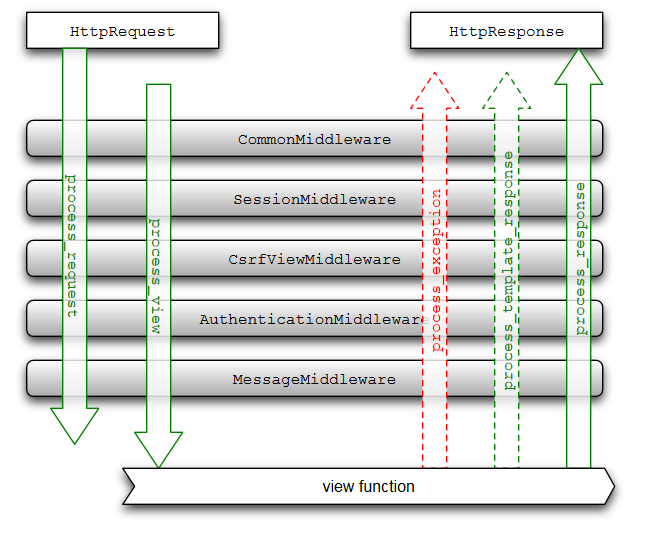

Les signaux et middlewares 
==========================

Django délimite proprement et nettement ses différentes composantes. Il est impossible de se charger du routage des URL depuis un template, et il est impossible de créer des modèles dans les vues. Si cette structuration a bien évidemment des avantages (propreté du code, réutilisation, etc.), sa lourdeur peut parfois empêcher de réaliser certaines actions.

En effet, comment effectuer une action précise à chaque fois qu'une entrée d'un modèle est supprimée, et ce depuis n'importe où dans le code ? Ou comment analyser toutes les requêtes d'un visiteur pour s'assurer que son adresse IP n'est pas bannie ? Pour ces situations un peu spéciales qui nécessitent de répéter la même action à plusieurs moments et endroits dans le code, Django intègre deux mécanismes différents qui permettent de résoudre ce genre de problèmes : les signaux et les middlewares.

Notifiez avec les signaux
-------------------------

Premier mécanisme : les signaux. Un signal est une notification envoyée par une application à Django lorsqu'une action se déroule, et renvoyée par le framework à toutes les autres parties d'applications qui se sont enregistrées pour savoir quand ce type d'action se déroule, et comment.

Reprenons l'exemple de la suppression d'un modèle : imaginons que nous ayons plusieurs fichiers sur le disque dur liés à une instance d'un modèle. Lorsque l'instance est supprimée, nous souhaitons que les fichiers associés soient également supprimés. Cependant, cette entrée peut être supprimée depuis n'importe où dans le code, et vous ne pouvez pas à chaque fois rajouter un appel vers une fonction qui se charge de la suppression des fichiers associés (parce que ce serait trop lourd ou que cela ne dépend simplement pas de vous). Les signaux sont la solution parfaite à ce problème.  

Pour résoudre ce problème, une fois que vous avez écrit la fonction de suppression des fichiers associés, vous n'avez qu'à indiquer à Django d'appeler cette fonction à chaque fois qu'une entrée de modèle est supprimée. En pratique, cela se fait ainsi :

```python
from django.models.signals import post_delete

post_delete.connect(ma_fonction_de_suppression, sender=MonModele)
```

La méthode est d'importer le signal adéquat et d'utiliser la méthode `connect` pour connecter une fonction à ce signal. Le signal ici importé est `post_delete`, et comme son nom l'indique il est notifié à chaque fois qu'une instance a été supprimée. Chaque fois que Django recevra le signal, il le transmettra en appelant la fonction passée en argument (`ma_fonction_de_suppression` ici). Cette méthode peut prendre plusieurs paramètres, comme par exemple ici `sender`, qui permet de restreindre l'envoi de signaux à un seul modèle (`MonModele` donc), sans quoi la fonction sera appelée pour toute entrée supprimée, et quel que soit le modèle dont elle dépend.

Une fonction appelée par un signal prend souvent plusieurs arguments. Généralement, elle prend presque toujours un argument appelé `sender`. Son contenu dépend du type de signal en lui-même (par exemple, pour `post_delete`, la variable `sender` passée en argument sera toujours le modèle concerné, comme vu précédemment). Chaque type de signal possède ses propres arguments. `post_delete` en prend trois :

 - `sender` : le modèle concerné, comme vu précédemment ;
 - `instance` : l'instance du modèle supprimée (celle-ci étant supprimée, il est très déconseillé de modifier ses données ou de tenter de la sauvegarder) ;
 - `using` : l'alias de la base de données utilisée (si vous utilisez plusieurs bases de données).

Notre fonction `ma_fonction_de_suppression` pourrait donc s'écrire de la sorte :

```python
def ma_fonction_de_suppression(sender, instance, **kwargs):
	#processus de suppression selon les données fournies par instance
```

Pourquoi spécifier un `**kwargs` ?

Vous ne pouvez jamais être certains qu'un signal renverra bien tous les arguments possibles, cela dépend du contexte. Dès lors, il est toujours important de spécifier un dictionnaire pour récupérer les valeurs supplémentaires, et si vous avez éventuellement besoin d'une de ces valeurs, il suffit de vérifier si la clé est bien présente dans le dictionnaire.

Cette fonction et sa connexion peuvent être mises n'importe où, tant que Django charge le fichier afin qu'il puisse faire la connexion directement. Le framework charge déjà par défaut certains fichiers comme les `models.py`, `urls.py`, etc. Le meilleur endroit serait donc un de ces fichiers. Généralement, nous choisissons le `models.py` (étant donné que certains signaux agissent à partir d'actions sur des modèles, c'est plutôt un bon choix !).

Petit détail, il est également possible d'enregistrer une fonction à un signal directement lors de sa déclaration avec un décorateur. En reprenant l'exemple ci-dessus :

```python
from django.models.signals import post_delete
from django.dispatch import receiver

@receiver(post_delete, sender=MonModele)
def ma_fonction_de_suppression(sender, instance, **kwargs):
	#processus de suppression selon les données fournies par instance
```

Il existe bien entendu d'autres types de signaux, voici une liste non exhaustive en contenant les principaux, avec les arguments transmis avec la notification :

+--------------------------------------+--------------------------------------------------------------------+-------------------------------------------------------------------------------------+
|Nom                                   |Description                                                         |Arguments                                                                            |
+======================================+====================================================================+=====================================================================================+
|`django.db.models.signals.pre_save`   |Envoyé avant qu'une instance de modèle ne soit enregistrée.         |- `sender` : le modèle concerné                                                      |
|                                      |                                                                    |- `instance` : l'instance du modèle concernée                                        |
|                                      |                                                                    |- `using` : l'alias de la BDD utilisée                                               |
|                                      |                                                                    |- `raw` : un booléen, mis à `True` pour le chargement de fixtures                    |
+--------------------------------------+--------------------------------------------------------------------+-------------------------------------------------------------------------------------+
|`django.db.models.signals.post_save`  |Envoyé après qu'une instance de modèle a été enregistrée.           |- `sender` : le modèle concerné                                                      |
|                                      |                                                                    |- `instance` : l'instance du modèle concernée                                        |
|                                      |                                                                    |- `using` : l'alias de la BDD utilisée                                               |
|                                      |                                                                    |- `raw` : un booléen, mis à `True` pour le chargement de fixtures                    |
|                                      |                                                                    |- `created` : un booléen, mis à `True` si l'instance a été correctement enregistrée  |
+--------------------------------------+----------------------------------------------------------------------------------------------------------------------------------------------------------+
|`django.db.models.signals.pre_delete` |Envoyé avant qu'une instance de modèle ne soit supprimée.           |- `sender` : le modèle concerné                                                      |
|                                      |                                                                    |- `instance` : l'instance du modèle concernée                                        |
|                                      |                                                                    |- `using` : l'alias de la BDD utilisée                                               |
+--------------------------------------+----------------------------------------------------------------------------------------------------------------------------------------------------------+
|`django.db.models.signals.post_delete`|Envoyé après qu'une instance de modèle a été supprimée.             |- `sender` : le modèle concerné                                                      |
|                                      |                                                                    |- `instance` : l'instance du modèle concernée                                        |
|                                      |                                                                    |- `using` : l'alias de la BDD utilisée                                               |
+--------------------------------------+----------------------------------------------------------------------------------------------------------------------------------------------------------+
|`django.core.signals.request_started` |Envoyé à chaque fois que Django reçoit une nouvelle requête HTTP.   |- `sender` : la classe qui a envoyé la requête, par exemple `WsgiHandler`            |
+--------------------------------------+----------------------------------------------------------------------------------------------------------------------------------------------------------+
|`django.core.signals.request_finished`|Envoyé à chaque fois que Django termine de répondre à une requête.  |- `sender` : la classe qui a envoyé la requête, par exemple `WsgiHandler`            |
+--------------------------------------+----------------------------------------------------------------------------------------------------------------------------------------------------------+

Il existe d'autres signaux inclus par défaut. Ils sont expliqués dans la documentation officielle : [https://docs.djangoproject.com/en/stable/ref/signals/](https://docs.djangoproject.com/en/stable/ref/signals/).

Sachez que vous pouvez tester tous ces signaux simplement en créant une fonction affichant une ligne dans la console (avec `print`) et en liant cette fonction aux signaux désirés.

Heureusement, si vous vous sentez limités par la liste de types de signaux fournis par Django, sachez que vous pouvez en créer vous-mêmes. Le processus est plutôt simple. Chaque signal est en fait une instance de `django.dispatch.Signal`. Pour créer un nouveau signal, il suffit donc de créer une nouvelle instance, et de lui dire quels arguments le signal peut transmettre :

```python
from django.dispatch import Signal

crepe_finie = Signal(providing_args=["adresse", "prix"])
```

Ici, nous créons un nouveau signal nommé `crepe_finie`. Nous lui indiquons une liste contenant les noms d'éventuels arguments (les arguments de signaux n'étant jamais fixes, vous pouvez la modifier à tout moment) qu'il peut transmettre, et c'est tout !

Nous pourrions dès lors enregistrer une fonction sur ce signal, comme vu précédemment :

```python
crepe_finie.connect(faire_livraison) # Quand crepe_finie est lancé, appeler 'faire_livraison'
```

Lorsque nous souhaitons lancer une notification à toutes les fonctions enregistrées au signal, il faut utiliser la méthode `send`, et ceci depuis n'importe où. Ici, depuis un modèle :

```python
class Crepe(models.Model):
	nom_recette = models.CharField(max_length=255)
	prix = models.IntegerField()
	#d'autres attributs

	def preparer(self, adresse):
		# Nous préparons la crêpe pour l'expédier à l'adresse transmise
		crepe_finie.send(sender=self, adresse=adresse, prix=self.prix)
```

À chaque fois que la méthode `preparer` d'une crêpe sera appelée, la fonction `faire_livraison` le sera également avec les arguments adéquats.
Notons ici qu'il est toujours obligatoire de préciser un argument `sender` lorsque nous utilisons la méthode `send`. Libre à vous de choisir ce que vous souhaitez transmettre, mais il est censé représenter l'entité qui est à l'origine du signal. Nous avons ici choisi d'envoyer directement l'instance du modèle.

Aussi, la fonction `send` retourne une liste de paires de variables, chaque paire étant un tuple de type `(receveur, retour)`, où le receveur est la fonction appelée, et le retour est la variable retournée par la fonction.
Par exemple, si nous n'avons que la fonction `faire_livraison` connectée au signal `crepe_finie`, et que celle-ci retourne `True` si la livraison s'est bien déroulée (considérons que c'est le cas maintenant), la liste renvoyée par `send` serait `[(faire_livraison, True)]`.

Pour terminer, il est également possible de déconnecter une fonction d'un signal. Pour ce faire, il faut utiliser la méthode `disconnect` du signal, cette dernière s'utilise comme `connect` :


```python
crepe_finie.disconnect(faire_livraison)
```

`crepe_finie` n'appellera plus `faire_livraison` si une notification est envoyée. Sachez que, si vous avez soumis un argument `sender` lors de la connexion, vous devez également le préciser lors de la déconnexion.

Contrôlez tout avec les middlewares
-----------------------------------

Deuxième mécanisme : les _middlewares_. Nous avons vu précédemment que lorsque Django recevait une requête HTTP, il analysait l'URL demandée et en fonction de celle-ci choisissait la vue adaptée, et cette dernière se chargeait de renvoyer une réponse au client (en utilisant éventuellement un template). Nous avons cependant omis une étape, qui se se situe juste avant l'appel de la vue.

En effet, le framework va à ce moment exécuter certains bouts de code appelés des _middlewares_. Il s'agit en quelque sorte de fonctions qui seront exécutées à chaque requête. Il est possible d'appeler ces fonctions à différents moments du processus que nous verrons plus tard.

Typiquement, les middlewares se chargent de modifier certaines variables ou d'interrompre le processus de traitement de la requête, et cela aux différents moments que nous avons listés ci-dessus.

Par défaut, Django inclut plusieurs middlewares dans la configuration par défaut :

```python
MIDDLEWARE_CLASSES = (
    'django.contrib.sessions.middleware.SessionMiddleware',
    'django.middleware.common.CommonMiddleware',
    'django.middleware.csrf.CsrfViewMiddleware',
    'django.contrib.auth.middleware.AuthenticationMiddleware',
    'django.contrib.auth.middleware.SessionAuthenticationMiddleware',
    'django.contrib.messages.middleware.MessageMiddleware',
    'django.middleware.clickjacking.XFrameOptionsMiddleware',
)
```

Il est conseillé de garder ces middlewares et d'ajouter les votres à la suite. Ils s'occupent de certaines tâches pratiques et permettent d'utiliser d'autres fonctionnalités du framework que nous verrons plus tard ou avons déjà vues (comme la sécurisation des formules contre les attaques CSRF, le système utilisateur, l'envoi de notifications aux visiteurs, etc.).

Un middleware se résume à une classe, avec des méthodes spécifiques, mais permet de réaliser des choses très puissantes. Chaque méthode sera appelée à un certain moment du processus de traitement de la requête. Voici les différentes méthodes implémentables, avec leurs arguments :

- `process_request(self, request)` : à l'arrivée d'une requête HTTP, avant de la router vers une vue précise. `request` est un objet `HttpRequest` (le même que celui passé à une vue).
- `process_view(self, request, view_func, view_args, view_kwargs)` : juste avant d'appeler la vue. `view_func` est une référence vers la fonction prête à être appelée par le framework. `view_args` et `view_kwargs` sont les arguments prêts à être appelés avec la vue.
- `process_template_response(self, request, response)` : lorsque le code retourne un objet `TemplateResponse` d'une vue. `response` est un objet `HttpResponse` (celui retourné par la vue appelée).
- `process_response(self, request, response)` : juste avant que Django renvoie la réponse.
- `process_exception(self, request, exception)` : juste avant que Django renvoie une exception si une erreur s'est produite. `exception` est un objet de type `Exception`.

Toutes ces fonctions peuvent ne rien retourner (`None`), ou retourner un `HttpResponse`. En cas de retour vide, Django va continuer le processus normalement (appeler les autres middlewares, lancer la vue, renvoyer la réponse, etc.).   
En revanche, si une valeur est renvoyée, cela doit être impérativement un objet `HttpResponse`. Le processus de traitement de la requête sera arrêté net (plus rien ne sera appelé, même pas un middleware), et l'objet `HttpResponse` retourné sera directement envoyé au client.

Cela vaut pour toutes les méthodes susnommées, à l'exception de `process_response` qui doit obligatoirement renvoyer un objet `HttpResponse` ! Vous pouvez toujours renvoyer celui passé en argument si la réponse n'a pas besoin d'être modifiée.  
Sachez également que vous pouvez altérer par exemple une requête, juste en modifiant des attributs de `request` dans `process_request`. L'instance modifiée de `HttpRequest` sera alors envoyée à la vue.

Dernier point avant de passer à la pratique : les middlewares sont appelés dans l'ordre précisé dans le `settings.py`, de haut en bas, pour toutes les méthodes appelées avant l'appel de la vue (soit `process_request` et `process_view`). Après, les middlewares sont appelés dans le sens inverse, de bas en haut. Au final, les middlewares forment en quelque sorte des « couches » autour de la vue, comme un oignon que l'on traverse.



### Créons notre propre middleware

Comme exemple, nous avons choisi de coder un petit middleware simple mais pratique qui comptabilise le nombre de fois qu'une page est vue et affiche ce nombre à la fin de chaque page. Bien évidemment, vu le principe des middlewares, il n'est nullement nécessaire d'aller modifier une vue pour arriver à nos fins, et cela marche pour toutes nos vues !

Pour ce faire, et pour des raisons de propreté et de structuration du code, le middleware sera placé dans une nouvelle application nommée « stats ».
Pour rappel, pour créer une application, rien de plus simple :

```console
python manage.py startapp stats
```

Une fois cela fait, la prochaine étape consiste à créer un nouveau modèle dans l'application qui permet de tenir compte du nombre de visites d'une page. Chaque entrée du modèle correspondra à une page.
Rien de spécial en définitive :


```python
from django.db import models

class Page(models.Model):
    url = models.URLField()
    nb_visites = models.IntegerField(default=1)

    def __str__(self):
        return self.url
```

Il suffit dès lors d'ajouter l'application au `settings.py` et de lancer un `manage.py migrate`.
Voici notre middleware, que nous avons enregistré dans `stats/middleware.py` :

```python
from models import Page

class StatsMiddleware(object):
    def process_view(self, request, view_func, view_args, view_kwargs):  # À chaque appel de vue
        try:
            p = Page.objects.get(url=request.path)  # Le compteur lié à la page est récupéré
            p.nb_visites += 1
            p.save()
        except Page.DoesNotExist:  # Si la page n'a pas encore été consultée
            Page(url=request.path).save()  # Un nouveau compteur à 1 par défaut est créé

    def process_response(self, request, response):  # À chaque réponse
        if response.status_code == 200:
            p = Page.objects.get(url=request.path)
            response.content += u"Cette page a été vue {0} fois.".format(p.nb_visites)
        return response
```

Il ne nous reste plus qu'à mettre à jour la liste `MIDDLEWARE_CLASSES` dans votre `settings.py` :

```python hl_lines="7"
MIDDLEWARE_CLASSES = (
    'django.middleware.common.CommonMiddleware',
    'django.contrib.sessions.middleware.SessionMiddleware',
    'django.middleware.csrf.CsrfViewMiddleware',
    'django.contrib.auth.middleware.AuthenticationMiddleware',
    'django.contrib.messages.middleware.MessageMiddleware',
    'stats.middleware.StatsMiddleware',
)
```

Pour rappel, avant chaque appel de vue, Django appelle la méthode `process_view`. Cette méthode se charge ici de déterminer si l'URL de la page a déjà été appelée ou non (l'URL est accessible à partir de l'attribut `request.path`, n'hésitez pas à consulter la documentation pour connaître toutes les méthodes et attributs de `HttpRequest`). Si la page a déjà été appelée, il incrémente le compteur de l'entrée. Sinon, il crée une nouvelle entrée.

Au retour, on vérifie tout d'abord si la requête s'est bien déroulée en s'assurant que le code HTTP de la réponse est bien 200 (ce code signifie que tout s'est bien déroulé) ; ensuite nous reprenons le compteur et nous modifions le contenu de la réponse (inclus dans `response.content`, la documentation vous donnera également tout ce qu'il faut savoir sur l'objet `HttpResponse`). Bien évidemment, si vous renvoyez du HTML au client, la phrase ajoutée ne sera pas intégrée correctement au document, néanmoins vous pouvez très bien coder quelque chose de plus sophistiqué qui permette d'insérer la phrase à un endroit valide.

Au final, sur toutes vos pages, vous verrez la phrase avec le nombre de visites qui se rajoute tout seule, sans devoir modifier toutes les vues une à une !


En résumé
---------

 - Un signal est une notification envoyée par une application à Django lorsqu'une action se déroule, et renvoyée par le framework à toutes les autres parties d'applications qui se sont enregistrées pour savoir quand ce type d'action se déroule, et comment.
 - Les signaux permettent d'effectuer des actions à chaque fois qu'un événement précis survient.
 - Les middlewares sont des classes instanciées à chaque requête, exception, ou encore génération de template, dans l'ordre donné par `MIDDLEWARE_CLASSES`.
 - Ils permettent d'effectuer une tâche précise à chaque appel, à des instants précis de l'appel.
