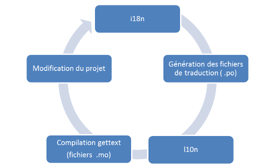

L'internationalisation
======================

De nos jours, la plupart des sites web proposent plusieurs langues à leurs utilisateurs, et ciblent même la langue par défaut en fonction du visiteur. Ce concept apporte son lot de problèmes lors de la réalisation d'un site : que faut-il traduire ? Quelle méthode faut-il utiliser pour traduire facilement l'application, sans dupliquer le code ?

Nous allons voir dans ce chapitre comment traduire notre site en plusieurs langues, de façon optimale sans dupliquer nos templates et vues, via des méthodes fournies dans Django et l'outil **gettext** permettant de créer des fichiers de langue.

Sachez que par convention en informatique le mot « internationalisation » est souvent abrégé par « i18n » ; cela est dû au fait que 18 lettres séparent le « i » du « n » dans ce mot si long à écrire ! Nous utiliserons également cette abréviation tout au long de ce chapitre.

Qu'est-ce que le i18n et comment s'en servir ?
----------------------------------------------

Avant de commencer, vous devez avoir installé gettext sur votre machine. 


### Sous Mac OS X

Vous devez [télécharger le code source](http://www.gnu.org/software/gettext/) et le compiler, ou installer le paquet gettext à partir des MacPorts.

### Sous Linux

Gettext est généralement installé par défaut. Si ce n'est pas le cas, cherchez un paquet nommé « gettext » adapté à votre distribution, ou procédez à l'installation manuelle, comme pour Mac OS X.

### Sous Windows

Voici la méthode d'installation complète :

 1. Téléchargez les archives suivantes [depuis le serveur GNOME](http://ftp.gnome.org/pub/gnome/binaries/win32/dependencies/), ou [un de ses miroirs](http://ftp.gnome.org/pub/GNOME/MIRRORS) (avec X supérieur ou égal à 0.15) :
    - `gettext-runtime-X.zip`
    - `gettext-tools-X.zip`

 2. Extrayez le contenu des deux dossiers dans un répertoire `\bin` commun (par exemple `C:\Program Files\gettext\bin`).
 3. Mettez à jour votre variable d'environnement `PATH` (voir le chapitre d'installation de Django pour plus d'informations) en ajoutant `;C:\Program Files\gettext\bin` à la fin de la valeur de la variable.

Vérifiez en ouvrant une console que la commande `xgettext --version` fonctionne sans erreur. En cas d'erreur, retéléchargez gettext via les liens précédents !

Pour commencer, nous devons nous attarder sur quelques définitions, afin d'avoir les idées au clair. Dans l'introduction, nous avons parlé d'_internationalisation_, dont le but est de traduire une application dans une autre langue. En réalité, ce travail se divise en deux parties :

 1. L'internationalisation (i18n) à proprement parler, qui consiste à adapter la partie technique (le code même de l'application) afin de permettre la traduction littérale par la suite ;
 2. La localisation (l10n), qui est la traduction (et parfois l'adaptation culturelle) de l'application.

La figure suivante schématise les différentes étapes.



Tout au long de ce chapitre, nous allons suivre le déroulement du cycle de la figure précédente, dont tous les détails vous seront expliqués en temps et en heure. Mais tout d'abord, il nous faut configurer un peu notre projet, via `settings.py`.

Par défaut, lors de la création du projet, Django prédéfinit plusieurs variables concernant l'internationalisation et la localisation :

```python
# Internationalization
# https://docs.djangoproject.com/en/1.7/topics/i18n/

LANGUAGE_CODE = 'fr-fr'

TIME_ZONE = 'UTC'

USE_I18N = True

USE_L10N = True
```

`LANGUAGE_CODE` permet de définir la langue par défaut utilisée dans vos applications. La variable `USE_I18N` permet d'activer l'internationalisation, et donc de charger plusieurs éléments en interne permettant son fonctionnement. Si votre site n'utilise pas l'internationalisation, il est toujours bon d'indiquer cette variable à `False`, afin d'éviter le chargement de modules inutilisés. De la même manière, `USE_L10N` permet d'automatiquement formater certaines données en fonction de la langue de l'utilisateur : les dates ou encore la représentation des nombres.

Par exemple, la ligne `` renvoie des résultats différents selon la valeur de `USE_L10N` et de `LANGUAGE_CODE` :

+--------------------------+------------------------------+------------------------+
|`LANGUAGE_CODE`/`USE_L10N`|`False`                       |`True`                  |
+--------------------------+------------------------------+------------------------+
|en-us                     |Jan. 30, 2014, 9:50 p.m.      |Jan. 30, 2014, 9:50 p.m.|
+--------------------------+------------------------------+------------------------+
|fr-fr                     |jan. 30, 2014, 9:50 après-midi|30 janvier 2014 21:50:46|
+--------------------------+------------------------------+------------------------+

Ensuite, nous devons préciser la liste des langues disponibles pour notre projet. Cette liste nous permet d'afficher un formulaire de choix, mais permet aussi à Django de limiter les choix possibles et donc d'éviter de chercher une traduction dans une langue qui n'existe pas. Cette liste se présente comme ceci :

```python
gettext = lambda x: x

LANGUAGES = (
   ('fr', gettext('French')),
   ('en', gettext('English')),
)
```

Au lieu d'importer la fonction `gettext`, introduite par la suite, nous avons créé une fausse fonction qui ne fait rien. En effet, il ne faut pas importer les fonctions de `django.utils.translation` dans notre fichier de configuration, car ce module dépend de notre fichier, ce qui créerait une boucle infinie dans les importations de modules !

Pour la suite de ce chapitre, il sera nécessaire d'avoir les réglages suivants dans votre `settings.py` :

```python
# Nous avons par défaut écrit l'application en français
LANGUAGE_CODE = 'fr-fr'

# Nous souhaitons générer des fichiers contenant les traductions, 
# afin de permettre à l'utilisateur de choisir sa langue par la suite
USE_I18N = True

# Nous adaptons les formats d'écriture de certains champs à la langue française
USE_L10N = True

gettext = lambda x: x

LANGUAGES = (
   ('fr', gettext('French')),
   ('en', gettext('English')),
)
```

Finalement, il nous faut encore ajouter deux lignes : un **middleware** et un **processeur de contexte**. Le premier permet de déterminer selon un certain ordre la langue courante de l'utilisateur. En effet, Django va tenter pour chaque visiteur de trouver la langue la plus adaptée en procédant par étape :

 1. Dans un premier temps, il est possible de configurer les URL pour les préfixer avec la langue voulue. Si ce préfixe apparaît, alors la langue sera forcée.
 2. Si aucun préfixe n'apparaît, le middleware vérifie si une langue est précisée dans la session de l'utilisateur.
 3. En cas d'échec, le middleware vérifie dans les cookies du visiteur si un cookie nommé `_language` (défini par Django) existe.
 4. En cas d'échec, il vérifie la requête HTTP et vérifie si l'en-tête `Accept-Language` est envoyé. Cet en-tête, envoyé par le navigateur du visiteur, spécifie les langues de prédilection, par ordre de priorité. Django essaie chaque langue une par une, selon celles disponibles dans notre projet.
 5. Enfin, si aucune de ces méthodes ne fonctionne, alors Django se rabat sur le paramètre `LANGUAGE_CODE`.

Le second, le _**template context processor**_, nous permettra d'utiliser les fonctions de traduction, via des tags, dans nos templates.

Pour activer correctement l'internationalisation, nous devons donc modifier la liste des middlewares et contextes à charger :

```python
MIDDLEWARE_CLASSES = (
   […] # Liste des autres middlewares déjà chargés
   'django.middleware.locale.LocaleMiddleware',
)
TEMPLATE_CONTEXT_PROCESSORS = (
   […] # Liste des autres template context déjà chargés
   "django.core.context_processors.i18n",
)
```

Nous en avons terminé avec les fichiers de configuration et pouvons dès lors passer à l'implémentation de l'internationalisation dans notre code !

Traduire les chaînes dans nos vues et modèles
---------------------------------------------

Adaptons notre code pour l'internationalisation. Nous devons gérer deux cas distincts : les vues et modèles, dans lesquels nous pouvons parfois avoir des chaînes de caractères à internationaliser, et nos templates, qui contiennent également de nombreuses chaînes de caractères à traduire. Notez qu'ici nous parlerons toujours de traduire dans une autre langue sans pour autant préciser laquelle. En effet, nous nous occupons de préciser ici ce qui doit être traduit, sans spécifier pour autant les différentes traductions.

Commençons par les vues. Pour rendre traduisibles les chaînes de caractères qui y sont présentes, nous allons appliquer une fonction à chacune. Cette fonction se chargera ensuite de renvoyer la bonne traduction selon la langue de l'utilisateur. Si la langue n'est pas supportée ou si la chaîne n'a pas été traduite, la chaîne sera alors affichée dans la langue par défaut.

La bibliothèque dont provient cette fonction spéciale est bien connue dans le domaine de l'internationalisation, puisqu'il s'agit de **gettext**, une bibliothèque logicielle dédiée à l'internationalisation. Dans Django, celle-ci se décompose en plusieurs fonctions que nous allons explorer dans cette partie :

 - `gettext` et `ugettext` ;
 - `gettext_lazy` et `ugettext_lazy` ;
 - `ngettext` et `ungettext` ;
 - `ngettext_lazy` et `ungettext_lazy` ;
 - Etc.

Avant d'explorer les fonctions une à une, sachez que nous allons tout d'abord diviser leur nombre par 2 : si vous regardez attentivement cette liste, vous remarquez que chacune existe avec et sans « u » comme première lettre. Les fonctions commençant par « u » signifient qu'elles supportent l'unicode, alors que les autres retournent des chaînes en ASCII. Nous partons du principe que nous utiliserons uniquement celles préfixées d'un « u », étant donné que la majorité de nos chaînes de caractères utilisent l'unicode.

Pour commencer, créons d'abord une nouvelle vue, qui renverra plusieurs chaînes de caractères au template :

```python
def test_i18n(request):
    nb_chats = 1
    couleur = "blanc"
    chaine = "Bonjour les nouveaux !"
    ip = "Votre IP est %s" % request.META['REMOTE_ADDR']
    infos = "… et selon mes informations, vous avez %s chats %s !" % (nb_chats, couleur)

    return render(request, 'test_i18n.html', locals())
```

Et voici le fichier `test_i18n.html` :

```html
<p>
  Bonjour les nouveaux !<br />
  {{ chaine }}
</p>
<p>
  {{ ip }} {{ infos }}
</p>
```

[[information]]
| Tout au long de ce chapitre, nous ne vous indiquerons plus les directives de routage de `urls.py`. Vous devriez en effet être capables de faire cela vous-mêmes.

Ce fichier contient plusieurs chaînes écrites en français, qu'il faudra nécessairement traduire par la suite. Nous remarquons par ailleurs que certaines peuvent poser problème au niveau des formes du pluriel (dans le cas présent, il ne devrait pas y avoir de « s » à « chats », étant donné qu'il n'y en a qu'un seul !)

Tout d'abord, nous allons importer `ugettext`, afin de pouvoir utiliser la fonction dont nous avons parlé plus haut. Nous pourrions l'importer de la sorte :

```python
from django.utils.translation import ugettext
```

Cependant, nous serons amenés à utiliser très souvent cette méthode, et tout le temps sur le même type d'objet (des chaînes de caractères statiques). Vous verrez alors apparaître de nombreux `ugettext(…)` dans votre application, ce qui serait très redondant. Une habitude, presque devenue une convention, est d'imposer cette fonction avec l'alias `_` (_underscore_), afin de rendre votre code plus lisible :

```python
from django.utils.translation import ugettext as _
```

Dès lors, il ne nous reste plus qu'à appliquer cette méthode à nos chaînes :

```python
def test_i18n(request):
    nb_chats = 1
    couleur = "blanc"
    chaine = _("Bonjour les nouveaux !")
    ip = _("Votre IP est %s") % request.META['REMOTE_ADDR']
    infos = _("… et selon mes informations, vous avez %s chats %s !") % (nb_chats, couleur)

    return render(request, 'test_i18n.html', locals())
```

En testant ce code, rien ne change à l'affichage de la page. En effet, la fonction `gettext` n'a aucun effet pour le moment, puisque nous utilisons la langue par défaut à l'affichage. Avant d'aller plus loin, il convient de préciser que ce code n'est en réalité pas totalement correct. Dans un premier temps, les pluriels ne s'accordent pas en fonction de la valeur de `nb_chats`, et cela même dans la langue par défaut. Pour corriger cela, il faut utiliser une autre fonction, cousine de `gettext`, qui est `ungettext`, dans le même module. Cette fonction permet de fournir une chaîne pour le cas singulier, une pour le cas pluriel et enfin la variable déterminant le cas à afficher. Pour le cas de nos amis les félins, cela donne :

```python
from django.utils.translation import ugettext as _
from django.utils.translation import ungettext

def test_i18n(request):
    nb_chats = 2
    couleur = "blanc"
    chaine = _("Bonjour les nouveaux !")
    ip = _("Votre IP est %s") % request.META['REMOTE_ADDR']
    infos = ungettext(
        "… et selon mes informations, vous avez %s chat %s !",
        "… et selon mes informations, vous avez %s chats %ss !",
        nb_chats) % (nb_chats, couleur)

    return render(request, 'test_i18n.html', locals())
```

Vous pouvez déjà tester, en changeant la variable `nb_chats` de 2 à 1, les « s » après « chat » et « blanc » disparaissent.

Cependant, nous pourrions avoir un autre problème. Parfois, l'ordre des variables peut être différent selon la traduction. Par exemple, « J'ai un chat blanc » peut être traduit par « I have one white cat » en anglais. Si "chat" et "blanc" sont des variables, on aura besoin d'inverser leurs ordre dans la chaine. En effet, avec `_("J'ai un %s %s")` on obtiendrait en anglais "I have one cat white"...

Pour corriger cela, il est possible de nommer les variables au sein de la chaîne de caractères, ce que nous vous recommandons de faire tout le temps, même si vous n'avez qu'une variable dans votre chaîne : 

```python
def test_i18n(request):
    nb_chats = 2
    couleur = "blanc"
    chaine = _("J'ai un %(animal)s %(col)s.") % {'animal': 'chat', 'col': couleur}
    infos = ungettext(
        "… et selon mes informations, vous avez %(nb)s chat %(col)s !",
        "… et selon mes informations, vous avez %(nb)s chats %(col)ss !",
        nb_chats) % {'nb': nb_chats, 'col': couleur}

    return render(request, 'test_i18n.html', locals())
```

De cette façon, il sera possible d'inverser l'ordre de `%(animal)s` et `%(couleur)s`, permettant la traduction la plus naturelle possible.

Pour finir la thématique des vues, nous allons aider encore un peu plus les traducteurs. Il se peut que certaines chaînes soient difficiles à traduire hors de leur contexte. Par exemple, imaginons que vous ayez la chaîne suivante :

```python
quota = _("3 livres")
```

Ici, si nous ne connaissons pas du tout le contexte, le mot « livre » pourrait correspondre à l'objet que nous lisons, mais aussi à l'unité de poids dans le système de mesures anglo-saxon. Dans ce cas, il est bon de préciser au traducteur ce que signifie réellement la chaîne. Pour ce faire, nous allons commenter notre code, en préfixant le commentaire par `Translators` :


```python
# Translators: This message informs the user about how many books he can borrow
quota = _("3 livres")
```

Ainsi, vous signalez aux traducteurs la signification de votre chaîne, pour éviter toute ambiguïté. Dans le même genre, il se peut qu'apparaisse deux fois la même chaîne, mais ne signifiant pas la même chose, typiquement les [homographes](http://fr.wikipedia.org/wiki/Homonymie#Homographie) ! Pour résoudre ce problème, il est possible d'ajouter un marqueur de contexte, permettant de différencier les deux chaînes, et ainsi générer deux traductions distinctes. Cela nécessite l'import de la fonction `pgettext` : 

```python hl_lines="4-5"
from django.utils.translation import pgettext

sujet = _("tu")
verbe = pgettext("verbe 'avoir'", "as")
valeur = pgettext("carte de jeu", "as")
couleur = _("trèfle")
carte = _("%(suj)s %(ver)s : %(val)s de %(col)s") % {
    "suj": sujet, 
    "ver": verbe, 
    "val": valeur, 
    "col": couleur}
```

### Cas des modèles

Pour nos modèles, la technique est en réalité la même, sauf qu'il faut utiliser la méthode `ugettext_lazy` au lieu de `ugettext` pour la même raison que celle évoquée avec les vues génériques et la fonction `reverse_lazy` : nous souhaitons que la traduction soit effectuée à l'exécution et non à la déclaration des classes, lors de la validation des modèles par le serveur. La traduction sera alors effectuée seulement quand la chaîne sera affichée. L'utilisation des fonctions `pgettext` et `ungettext` est également similaire à ce mode de fonctionnement, au détail près qu'il faut les suffixer par `_lazy`.

De la même façon, nous allons appeler la fonction `ugettext_lazy` (que nous renommons en `_`, pour plus de simplicité comme nous l'avons fait plus haut) et l'appliquer à toutes nos chaînes de caractères, par exemple ici avec le fichier `models.py` de notre application `mini_url` :

```python
from django.db import models
import random
import string
from django.utils.translation import ugettext_lazy as _


class MiniURL(models.Model):
    url = models.URLField(verbose_name=_("URL à réduire"), unique=True)
    code = models.CharField(max_length=6, unique=True)
    date = models.DateTimeField(auto_now_add=True, verbose_name=_("Date d'enregistrement"))
    pseudo = models.CharField(max_length=255, blank=True, null=True)
    nb_acces = models.IntegerField(default=0, verbose_name=_("Nombre d'accès à l'URL"))

    def __str__(self):
        return "[{0}] {1}".format(self.code, self.url)

    def save(self, *args, **kwargs):
        if self.pk is None:
            self.generer(6)

        super(MiniURL, self).save(*args, **kwargs)

    def generer(nb_caracteres):
        caracteres = string.ascii_letters + string.digits
        aleatoire = [random.choice(caracteres) for _ in range(nb_caracteres)]
        
        self.code = ''.join(aleatoire)

    class Meta:
        verbose_name = _("Mini URL")
        verbose_name_plural = _("Minis URLs")
```

Traduire les chaînes dans nos templates
---------------------------------------

La traduction dans les templates repose également sur l'outil *gettext*. Cependant, dans nos templates, les tags permettant l'internationalisation ont des noms différents des fonctions disponibles dans `django.utils.translation`. 

Commençons d'abord par importer les tags nécessaires. Comme pour nos propres _templatetags_, les tags d'internationalisation sont disponibles après avoir effectué un ``, au début de chacun de vos templates. Dès que vous souhaitez internationaliser un template, pensez donc à ajouter tout en haut cette ligne.

Nous allons maintenant voir les deux tags, assez similaires, permettant de faire de la traduction dans nos templates, à savoir `` et ``.


### Le tag 

Ce tag permet de traduire à la fois une chaîne de caractères constante, mais aussi une variable :

```jinja
<h2></h2>
<p></p>
```

En interne, ces blocs appellent la fonction `ugettext()`, introduite précédemment. Vous pouvez donc imaginer que le fonctionnement est identique à ce que nous avons vu. Dans le cas d'une variable (`` dans le code précédent), la traduction sera recherchée à l'exécution de la page, en fonction du contenu même de la variable. Comme pour les chaînes de caractères, si le contenu de cette variable n'est pas présent dans les traductions, alors son contenu sera affiché tel quel.

Il est également possible de générer la traduction d'une chaîne sans l'afficher. Cela est utile si vous utilisez plusieurs fois la même chaîne dans un même template :

```jinja

<title>{{ titre }} - </title>
<meta name="description" content="{{ titre }}, ">
```

Cela permet aussi de clarifier le code, en réduisant le poids total du template. Enfin, le tag `` supporte également le marqueur de contexte, afin de différencier les homonymes, comme avec `pgettext` :

```jinja


```

Ici, deux traductions différentes pourront être déclarées, pour différencier les deux cas, l'un qui concerne la cardinalité et l'autre qui concerne le fameux verbe auxiliaire. 

### Le tag  

Contrairement au tag simple ``, les blocs ` ` permettent d'exécuter des schémas plus complexes de traduction. Par exemple, il est possible d'incorporer des variables au sein d'un bloc :

```jinja
Vous avez {{ age }} ans.
```

Cependant, pour accéder à des expressions (attributs d'un objet, utilisation de filtres…), il faut déclarer ces expressions comme variables locales du bloc de traduction, avec le mot-clé `with` :

```jinja

    Vous êtes {{ prenom }} {{ nom }}. Vous avez {{ nb_articles }} articles dans votre panier.

```

À l'image de `ungettext`, `` permet également la gestion des pluriels. Pour ce faire :

 - Il faut préciser quel est le nombre qui différencie singulier et pluriel via la syntaxe `count nombre=ma_variable` (où `nombre` sera le nom de la variable locale au bloc `blocktrans`) ;
 - Déclarer deux nouveaux sous-blocs, séparés par le tag `` : un pour le cas du singulier et un pour le cas du pluriel. Il est également possible de déclarer une variable pour préciser le nombre d'articles précis, comme dans l'exemple ci-dessous avec `nb`.

Un exemple d'utilisation est probablement plus parlant :

```jinja

   Vous avez 1 article dans votre panier.

   Vous avez {{ nb }} articles dans votre panier.

```

Il est bien entendu possible de combiner ce tag avec le mot-clé `with`, ce qui donne une structure encore plus complète :

```jinja

   Vous avez 1 article dans votre panier. Prix total : {{ total }}

   Vous avez {{ nb }} articles dans votre panier. Prix total : {{ total }}

```

Enfin, comme pour le bloc ``, le bloc `` supporte la gestion du contexte :

```jinja

Les fils de {{ pseudo }}

```

### Aidez les traducteurs en laissant des notes !

Nous avons globalement fait le tour des fonctionnalités de traduction dans les templates ! En effet, tous les comportements sont gérés automatiquement par les deux tags que nous venons de voir, en fonction des arguments fournis. Il nous reste juste à voir comment guider les traducteurs dans leur tâche.

Comme pour la partie concernant les vues et les modèles, il est possible de laisser des notes aux traducteurs, via des commentaires. Pour ce faire, il faut également commencer par `Translators:`, dans un tag `{# #}` ou ``, comme ce que nous avons vu précédemment :

```jinja
{# Translators: Phrase courte, dans un bouton pour la recherche #}


Translators: Phrase affichée dans le header du site
Notre phrase d'accroche géniale !
```

Sortez vos dictionnaires, place à la traduction !
-------------------------------------------------

Nous avons désormais terminé tout ce qui concerne le développeur, nous allons sortir du code et des templates quelques instants pour nous attaquer au travail du traducteur. En effet, nous avons déterminé quelles chaînes doivent être traduites ; maintenant, il ne reste plus qu'à les traduire.

### Génération des fichiers .po

Afin d'attaquer la traduction, il va nous falloir un support où nous pourrons faire la correspondance entre les chaînes dans notre code et leur traduction. Pour cela, gettext utilise des fichiers spécifiques, contenant les traductions, dont l'extension est `.po` (pour _Portable Object File_). Voici un extrait d'un des fichiers que nous allons générer :

```
#: .\blog\views.py:77
msgid "Bienvenue !"
msgstr ""

#: blog/views.py:20
#, python-format
msgid "Votre IP est %s"
msgstr ""
```

Pour permettre la traduction de l'application en plusieurs langues, chaque langue aura son propre dossier avec ses fichiers `.po`. Nous allons tout d'abord générer ces fichiers.

Avant de commencer, il va nous falloir créer un dossier `locale`, qui contiendra l'ensemble des traductions pour toutes nos langues. Ce dossier peut se situer soit au sein d'un projet, si nous souhaitons traduire l'ensemble des applications en un seul endroit, soit dans le dossier d'une application afin de lier chaque application à ses propres traductions. Automatiquement, Django va mettre les traductions dans le dossier `locale` de l'application s'il existe, ou dans un des dossiers que l'on va définir pour le projet autrement. 

[[information]]
| Les traductions faites au sein des dossiers d'applications sont prioritaires sur les traductions disponibles dans le dossier du projet.

Il faut donc indiquer à Django où se situent les fichiers de traduction du projet pour qu'il puisse les utiliser. Pour ce faire, indiquez la ligne suivante dans votre `settings.py` :

```python
LOCALE_PATHS = (
    os.path.join(BASE_DIR, '/locale/'),
)
```

... et créez un dossier `locale` à la racine du projet.    
La création de ces fichiers `.po` est automatisé par Django : grâce à `manage.py`, il est possible de générer les fichiers, via un appel à gettext. Pour créer un dossier dans `locale` contenant les traductions en anglais, utilisez la commande suivante, à la racine de votre projet ou dans une application :

```console
python manage.py makemessages -l en
```

Après quelques secondes, un dossier `locale/en/LC_MESSAGES`, contenant comme unique fichier `django.po` apparaît dans chaque application ayant un dossier locale. Ce fichier contient des métadonnées ainsi que l'ensemble des traductions, comme nous avons pu le montrer précédemment.

[[attention]]
| Si vous ne possédez pas gettext, les fichiers seront très probablement vides ! Veuillez vous référer au début de ce chapitre si cela se produit.

Si jamais vous mettez à jour votre projet et modifiez les chaînes à traduire via le processus i18n, vous devrez mettre à jour vos fichiers `.po` en utilisant la commande :

```console
python manage.py makemessages --all
```

Ainsi, les traductions déjà effectuées resteront intactes, et celles qui doivent être modifiées ou ajoutées seront insérées dans le fichier déjà existant.

Une fois ce fichier généré, le travail de traduction commence : chaque chaîne à traduire est représentée dans le fichier par une ligne `msgid`. Chaque `msgid` est éventuellement précédé d'informations afin d'aider le traducteur (fichier et ligne à laquelle se situe la chaîne), mais aussi les commentaires éventuels que vous avez laissés.

Les lignes qui suivent le `msgid` correspondent à la traduction dans la langue du dossier (ici l'anglais pour le code `en`). Dans le cas des traductions courtes, il y a juste un `msgstr` à renseigner. Autrement, deux cas se présentent.

Dans le cas de messages plus longs, `msgid` commence par une chaîne vide `""`, et continue à la ligne. Il est important de laisser pour gettext cette chaîne vide. Vous devez agir de la même façon pour la traduction : les chaînes seront automatiquement concaténées (attention aux espaces entre les mots après concaténation !). Ce cas se présente lorsque la longueur totale de la ligne dépasse les 80 caractères. Voici un exemple :

```
#: .\templates\blog\accueil.html.py:4
msgid ""
"Ici, nous parlons de tout et de rien, mais surtout de rien. Mais alors, vous "
"allez me demandez quel est le but de ce paragraphe ? Je vais vous répondre "
"simplement : il n'en a aucun."
msgstr ""
"Here, we talk about everything and anything, but mostly nothing. So, you "
"will ask me what is the purpose of this paragraph... I will answer "
"simply : none, it's useless!"
```

Le second cas pouvant se présenter est celui des traductions avec la gestion du pluriel. Si vous regardez notre exemple avec nos fameux chats blancs, le rendu dans le fichier `.po` est le suivant :

```
#: .\blog\views.py:80
#, python-format
msgid "… et selon mes informations, vous avez %(nb)s chat %(color)s !"
msgid_plural ""
"… et selon mes informations, vous avez %(nb)s chats %(color)ss !"
msgstr[0] ""
msgstr[1] ""
```

L'entrée `msgstr[0]` correspond alors au message traduit au singulier, et le second, au pluriel. Remarquez que, ici encore, `msgid_plural` est passé à la ligne, puisque la chaîne est légèrement trop longue (81 caractères sur les 80 maximum !).

Nous en avons déjà terminé avec les fichiers `.po`, vous savez désormais où répertorier vos traductions.

### Génération des fichiers .mo

Une fois les fichiers `.po` complétés, il faut les compiler dans un format que gettext peut comprendre. En effet, afin d'optimiser ses temps de traitement, gettext souhaite obtenir les fichiers dans un nouveau format, binaire cette fois-ci, les fichiers `.mo` (pour _Machine Object File_). Pour ce faire, il suffit simplement d'entrer la commande suivante, au même endroit où vous avez effectué `makemessages` :

```console
python manage.py compilemessages
```

Une fois cela effectué, un fichier `.mo` est censé apparaître à côté de chacun de vos fichiers `.po`. Django ira chercher automatiquement ces fichiers et en extraira le contenu, avec vos traductions ! Pensez donc bien à recompiler vos fichiers gettext à chaque modification.

Le changement de langue
-----------------------

Nous avons maintenant une application pouvant gérer plusieurs langues, mais l'utilisateur ne peut pas forcément choisir celle qu'il souhaite utiliser. Pour ce faire, il existe trois méthodes permettant de choisir la langue à afficher.

Une première méthode consiste à utiliser la fonction `django.utils.translation.activate`. Cette fonction s'utilise surtout en dehors des vues et des templates et est plutôt destinée à la gestion de la langue dans des crons par exemple. Elle permet d'assigner la langue à utiliser pour le thread actuel :

```python
>>> from django.utils import translation
>>> from django.utils.translation import ugettext as _
>>> translation.activate('en')
>>> print _("Bonjour les nouveaux !")
Hello newbies!
```

La méthode la plus conventionnelle est toutefois d'assigner une langue à l'utilisateur via une vue générique. Il vous faut tout d'abord ajouter cette directive de routage dans votre `urls.py` principal :

```python
(r'^i18n/', include('django.conf.urls.i18n'))
```

Cette vue est censée recevoir des arguments provenant d'un formulaire. Pour ce faire, nous avons établi le template suivant :

```html

<h1>Changer de langue</h1>



<form action="/i18n/setlang/" method="post">
    
    <input name="next" type="hidden" value="" />
    
    <select name="language">
    
        <option value="{{ lang.0 }}">{{ lang.1 }}</option>
    
    </select>

    <input type="submit" />
</form>
```

Rendez ce template accessible depuis une vue classique ou une vue générique et n'oubliez pas de modifier le paramètre `next` du formulaire qui indique vers quelle URL l'utilisateur doit être redirigé après avoir validé le formulaire. Si vous n'indiquez pas ce paramètre, l'utilisateur sera redirigé d'office vers `/`.

La liste des langues que l'on a défini au début sera affichée dans le formulaire et le choix envoyé à Django après la soumission du formulaire. Vous verrez dès lors la phrase « Bonjour les nouveaux ! » traduite dans la langue que vous avez choisie.

En résumé
---------

 - Le processus de traduction se divise en deux parties :
    - L'internationalisation, où nous indiquons ce qui est à traduire ;
    - La localisation, où nous effectuons la traduction et l'adaptation à la culture.
 - Ce processus se base essentiellement sur l'utilisation de l'outil *gettext*, permettant la génération de fichiers de traduction utilisables par des novices en développement.
 - Django permet également d'adapter l'affichage des dates et des nombres à la langue, en même temps que leur traduction.
 - Grâce aux sessions et aux middlewares, le framework peut deviner la langue de l'utilisateur automatiquement, en fonction de son navigateur ou de ses précédentes visites.