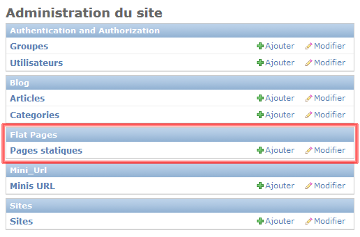
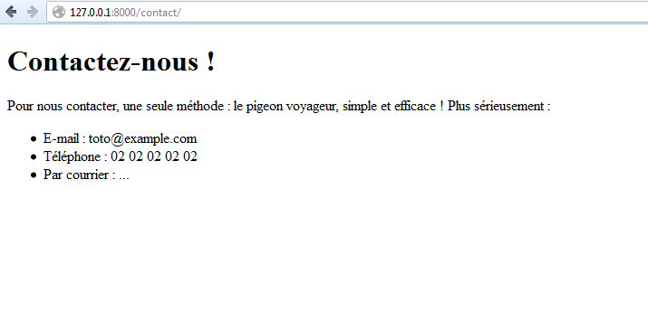

Ouverture vers de nouveaux horizons : django.contrib 
====================================================

Une des forces de Python est sa philosophie « *batteries included* » (littéralement « piles incluses ».) : la bibliothèque standard couvre un nombre d'utilisations très large, et permet d'intégrer énormément de fonctionnalités, sans qu'on doive les coder entièrement une à une. Django suit également cette philosophie, en incluant dans le framework un nombre de modules complémentaires très important.

Nous arrivons à la fin de ce cours, nous vous proposons donc de parcourir rapidement la liste de ces modules, afin de découvrir d'éventuels modules qui pourraient vous intéresser.

Vers l'infini et au-delà
------------------------

L'ensemble des fonctionnalités supplémentaires de Django est situé dans le module `django.contrib`. Chaque sous-module est un module à part permettant d'intégrer une nouvelle fonctionnalité. Ces fonctionnalités sont le plus souvent _indépendantes_, malgré quelques exceptions.

L'unique caractéristique commune de toutes ces fonctionnalités est qu'elles ne sont pas essentielles au bon déroulement global de Django. Nous avons déjà présenté quelques-unes des fonctionnalités présentes dans `django.contrib`. En effet, l'administration ou encore le système utilisateurs font partie de `django.contrib`. 

Nous avons adjoint ici une liste reprenant tous les modules compris dans `django.contrib`. Nous ne pouvons que vous conseiller de la regarder. Vous découvrirez peut-être de nouveaux modules qui pourraient vous être utiles, au lieu de devoir les réécrire vous-mêmes !

+--------------+--------------------------------------------------------------------------------------------------------------------------------------------------------------------------------------------------------------------------------------+----------------------------------------------------------------+
|Nom du module |Description                                                                                                                                                                                                                           |Traité dans ce cours                                            |
+==============+======================================================================================================================================================================================================================================+================================================================+
|`admin`       |Système d'administration                                                                                                                                                                                                              |Partie II, chapitre 4                                           |
+-------------+--------------------------------------------------------------------------------------------------------------------------------------------------------------------------------------------------------------------------------------+----------------------------------------------------------------+
|`auth`        |Système utilisateurs                                                                                                                                                                                                                  |Partie IV, chapitre 1                                           |
+--------------
+--------------------------------------------------------------------------------------------------------------------------------------------------------------------------------------------------------------------------------------+----------------------------------------------------------------+
|`contenttypes`|Permet d'obtenir la représentation de n'importe quel modèle                                                                                                                                                                           |Partie III, chapitre 2                                          |
+--------------+--------------------------------------------------------------------------------------------------------------------------------------------------------------------------------------------------------------------------------------+----------------------------------------------------------------+
|`flatpages`   |Permet de gérer des pages HTML statiques au sein même de la base de données                                                                                                                                                           |Partie IV, chapitre 7                                           |
+--------------+--------------------------------------------------------------------------------------------------------------------------------------------------------------------------------------------------------------------------------------+----------------------------------------------------------------+
|`formtools`   |Ensemble d'outils pour compléter les formulaires (par exemple la prévisualisation avant envoi)                                                                                                                                        |Non traité                                                      |
+--------------+--------------------------------------------------------------------------------------------------------------------------------------------------------------------------------------------------------------------------------------+----------------------------------------------------------------+
|`gis`         |Bibliothèque complète qui apporte le support de SIG (systèmes d'information géographique), pour stocker des données géographiques et les exploiter. Voir [http://www.geodjango.org](http://www.geodjango.org) pour plus d'informations|Non traité                                                      |
+--------------+--------------------------------------------------------------------------------------------------------------------------------------------------------------------------------------------------------------------------------------+----------------------------------------------------------------+
|`humanize`    |Ensemble de filtres pour les templates, afin de rendre certaines données plus « naturelles », notamment pour les nombres et les dates                                                                                                 |Partie IV, chapitre 7                                           |
+--------------+--------------------------------------------------------------------------------------------------------------------------------------------------------------------------------------------------------------------------------------+----------------------------------------------------------------+
|`messages`    |Gestion de notifications qui peuvent être affichées au visiteur                                                                                                                                                                       |Partie IV, chapitre 2                                           |
+--------------+--------------------------------------------------------------------------------------------------------------------------------------------------------------------------------------------------------------------------------------+----------------------------------------------------------------+
|`redirects`   |Gestion des redirections au sein du projet via une base de données. Utile si vous changez le schéma de vos URL                                                                                                                        |Non traité                                                      |
+--------------+--------------------------------------------------------------------------------------------------------------------------------------------------------------------------------------------------------------------------------------+----------------------------------------------------------------+
|`sessions`    |Gestion des sessions                                                                                                                                                                                                                  |Non traité                                                      |
+--------------+--------------------------------------------------------------------------------------------------------------------------------------------------------------------------------------------------------------------------------------+----------------------------------------------------------------+
|`sitemaps`    |Génération de _sitemaps_ XML                                                                                                                                                                                                          |Non traité                                                      |
+--------------+--------------------------------------------------------------------------------------------------------------------------------------------------------------------------------------------------------------------------------------+----------------------------------------------------------------+
|`sites`       |Permet la gestion de différents sites web avec la même base de données et la même installation de Django                                                                                                                              |Partie IV, chapitre 7                                           |
+--------------+--------------------------------------------------------------------------------------------------------------------------------------------------------------------------------------------------------------------------------------+----------------------------------------------------------------+
|`staticfiles` |Gestion de fichiers statiques dans les templates                                                                                                                                                                                      |Partie II, chapitre 2                                           |
+--------------+--------------------------------------------------------------------------------------------------------------------------------------------------------------------------------------------------------------------------------------+----------------------------------------------------------------+
|`syndication` |Génération de flux RSS et Atom                                                                                                                                                                                                        |Non traité                                                      |
+--------------+--------------------------------------------------------------------------------------------------------------------------------------------------------------------------------------------------------------------------------------+----------------------------------------------------------------+
|`webdesign`   |Intègre un outil de génération de _Lorem ipsum_ via un unique tag : {`% lorem [nb] [methode] [random] %}`                                                                                                                             |La description dans ce tableau présente presque tout le module !|
+--------------+--------------------------------------------------------------------------------------------------------------------------------------------------------------------------------------------------------------------------------------+----------------------------------------------------------------+

Nous allons clore cette partie par la présentation dans ce chapitre de deux fonctionnalités que nous avons jugées utiles et rapides à présenter : `flatpages` et `humanize`. Tous les autres modules sont très bien documentés dans [la documentation officielle](https://docs.djangoproject.com) de Django.

Dynamisons nos pages statiques avec flatpages !
-----------------------------------------------

Sur la quasi-totalité des sites web, il existe des pages statiques dont le contenu doit parfois être modifié. Nous pouvons citer comme exemples les pages avec des informations de contact, de conditions générales d'utilisation, des foires aux questions, etc. Il peut être lourd de passer par des `TemplateView` pour ce genre de cas simple, puisque cela implique de devoir retourner dans le code ou le template à chaque modification du contenu.

Django propose le module `flatpages` pour contourner ce problème. Une `flatpage` est un objet caractérisé par une URL, un titre et un contenu. Tout cela sera inclus dans un template générique, ou bien dans un template que vous aurez adapté. Ces informations sont enregistrées dans la base de données et sont éditables à tout moment par l'administration.

### Installation du module

Pour utiliser le module `flatpages`, il faut l'activer grâce à ces quelques étapes :

Dans votre fichier `settings.py` :

 1. Ajoutez les lignes `'django.contrib.sites'` et `'django.contrib.flatpages'` dans la liste `INSTALLED_APPS`, si elles ne sont pas déjà présentes. 
 2. Vérifiez que votre `settings.py` contient bien une variable `SITE_ID`. Nous n'en avons encore jamais parlé dans ce cours, mais Django permet d'héberger plusieurs sites sur une même base de données via cette variable. Habituellement, cette valeur est mise à `SITE_ID = 1`, mais si vous développez plusieurs sites, cette valeur peut changer !
 3. Lancez maintenant la commande `python manage.py migrate`, pour créer les deux tables nécessaires.

Pour la suite, deux méthodes s'offrent à vous : vous pouvez soit spécifier clairement comment accéder à ces pages, soit activer un middleware, qui en cas d'erreur 404 (page non trouvée) vérifie si une `flatpage` correspond à l'URL saisie par l'utilisateur.

#### Le cas des URL explicites

Pour cette méthode, deux possibilités sont envisageables. Vous devrez placer l'un des codes suivants dans le fichier `urls.py` principal du projet.

Vous pouvez soit préciser un chemin précis vers les `flatpages` : dans cet exemple, toutes les URL de nos pages statiques commenceront par `/pages/`. 

```python
urlpatterns = patterns('',
   ('^pages/', include('django.contrib.flatpages.urls')),
)
```

… ou créez un pattern qui attrape toutes les URL qui n'ont pas de vues associées et tentez de trouver une `flatpage` qui corresponde (ce qui est équivalent au middleware). Dans ce cas, le pattern doit être ajouté en toute fin du fichier `urls.py` !


```python
urlpatterns += patterns('django.contrib.flatpages.views',
    (r'^(?P<url>.*)$', 'flatpage'),
)
```

#### Utilisation du middleware FlatpageFallbackMiddleware

La seconde méthode laisse `FlatpageFallbackMiddleware` tout gérer. Une fois activé et dès qu'une erreur 404 est levée, le middleware vérifie dans la base de données si une page correspond à l'URL qui est demandée. Dans le cas où plusieurs sites sont activés, il vérifie également que la page demandée correspond bien au site web actuel. Si une page est trouvée, alors il l'affiche, sinon il laisse l'erreur 404 se poursuivre.

Lors de l'utilisation du middleware, le comportement des autres middlewares peut ne pas être pris en compte, notamment ceux utilisant la méthode `process_view()` : le middleware est exécuté après la résolution de l'URL et après que l'erreur 404 s'est propagée, ce qui empêche ce type de middleware de s'exécuter. De plus, pour des raisons de fonctionnement, nous plaçons usuellement le middleware `FlatpageFallback` en dernier. Veillez donc à vérifier le comportement de vos middlewares avant d'utiliser cette méthode.

Enfin, vérifiez que vos middlewares laissent bien l'erreur 404 arriver jusqu'au middleware de `flatpage`. Si un autre middleware traite l'erreur et renvoie une exception, la réponse HTTP obtient le code 500 et notre nouveau middleware ne tentera même pas de chercher si une page existe.

L'installation du middleware semble plus simple au premier abord, mais nécessite de faire attention à de nombreux petits pièges. Si vous souhaitez l'utiliser, vous pouvez le faire en ajoutant `'django.contrib.flatpages.middleware.FlatpageFallbackMiddleware'` à votre `MIDDLEWARE_CLASSES`.

Cela peut sembler trop "magique" pour certains et préfèrent la méthode explicité via le `urls.py`.

[[information]]
| Quelle que soit la méthode choisie, la suite de ce cours ne change pas.

### Gestion et affichage des pages

Maintenant que le module est installé et les tables créées, une nouvelle catégorie est apparue dans votre panneau d'administration : il s'agit du module `flatpages`, qui contient comme seul lien la gestion des pages statiques, comme le montre la figure suivante.



Il n'est pas nécessaire de disserter plus longtemps sur cette partie : l'administration des pages statiques se fait comme tout autre objet, est assez intuitive et est plutôt bien documentée en cas de souci. 

Pour la suite, nous avons créé une page de contact, avec comme URL `/contact/`, un titre et un peu de contenu. Vous pouvez vous aussi créer vos propres pages, pour prendre en main l'administration de ce module.

Il nous reste un seul point à traiter avant de pouvoir utiliser nos `flatpages` : _les templates_. Pour le moment, nous n'avons assigné aucun template à ces pages. Par défaut, chaque page sera traitée avec le template `flatpages/default.html` de votre projet. Nous allons donc tout d'abord le créer, dans le dossier `templates/` global :

```jinja
<!DOCTYPE html>
<html>
<head>
<title>{{ flatpage.title }}</title>
</head>
<body>
   <h1>{{ flatpage.title }}</h1>
   {{ flatpage.content }}
</body>
</html>
```

Celui-ci peut bien entendu étendre votre template `base.html`, comme vu au chapitre sur les templates. Une fois ce template enregistré, nous pouvons tester le module : vous pouvez à présent accéder à la page (voir figure suivante).



Comme vous pouvez le voir, le champ `contenu` accepte également du HTML, pour mettre en forme votre page.

Enfin, plusieurs options avancées, que nous ne détaillerons pas ici, existent afin :

- De n'autoriser que les utilisateurs connectés à voir la page (via le module `django.contrib.auth`) ;
- D'utiliser un template différent de `flatpages/default.html`.


### Lister les pages statiques disponibles

Pour terminer ce sous-chapitre, nous allons voir comment lister toutes les pages statiques disponibles via `flatpages`. Le module fournit plusieurs tags afin de récupérer ces listes. Vous devez donc tout d'abord charger la bibliothèque, via ``. Après, vous pouvez lister l'ensemble des pages visibles par tous, comme ceci : 

```jinja


<ul>
    
        <li><a href="{{ page.url }}">{{ page.title }}</a></li>
    
</ul>
```

Pour afficher celles également disponibles uniquement pour les personnes connectées, il faut spécifier l'utilisateur en cours, grâce au mot-clé `for` : 

```jinja

```

Si la variable `user` correspond à un utilisateur non connecté, ce tag aura le même effet que le premier, c'est-à-dire ``. Enfin, il est possible de lister les `flatpages` commençant par une certaine URL uniquement, via un argument optionnel, avant les mots-clés `for` et `as` : 

```jinja



```

Rendons nos données plus lisibles avec humanize 
-----------------------------------------------

Le module `django.contrib.humanize` fournit un ensemble de filtres permettant d'ajouter, selon les développeurs du framework, « une touche humaine aux données ». Nous allons voir les différents cas où les filtres du module `humanize` rendent la lecture d'une donnée plus agréable à l'utilisateur. L'avantage de ce module est qu'il prend mieux en charge la localisation : la transformation des données s'adapte à la langue de votre projet !

Avant de commencer, ajoutez la ligne `'django.contrib.humanize'` à votre variable `INSTALLED_APPS` dans le fichier `settings.py`. Pour intégrer les filtres présentés par la suite, il faut charger les `templatetags` du module, via la commande ``.

### apnumber

Pour les nombres de 1 à 9, ce filtre va les traduire automatiquement en toutes lettres. Dans les autres cas (nombres supérieurs ou égaux à 10), ils seront affichés en chiffres. Cette convention suit le style de l'agence Associated Press.

Exemples (avec la langue du projet en français) :

```jinja
{{ 1|apnumber }}   renvoie "un"     <br />
{{ "2"|apnumber }} renvoie "deux"   <br />
{{ 10|apnumber }}  renvoie 10.
```

Le filtre prend à la fois des entiers et des chaînes de caractères en paramètre.

### intcomma

Ajoute des séparateurs de milliers, afin de simplifier la lecture. En réalité, le filtre prend en charge la localisation spécifiée dans le fichier `settings.py`, et le séparateur dépend donc de la langue courante : le séparateur sera la virgule si la langue courante est l'anglais par exemple.

Exemples (encore une fois en français puisque le séparateur est l'espace) :

```jinja
{{ 300|intcomma }}     renvoie 300       <br />
{{ "9000"|intcomma }}  renvoie 9 000     <br />
{{ 90000|intcomma }}   renvoie 90 000    <br />
{{ 9000000|intcomma }} renvoie 9 000 000
```

Le filtre prend à la fois des entiers et des chaînes de caractères en paramètre.


### intword

Ce filtre permet de convertir les grands entiers en leur représentation textuelle, de préférence avec des nombres supérieurs à un million. Ce filtre respecte également la localisation pour le séparateur décimal.

```jinja
{{ 1000000|intword }}    renvoie 1,0 million.     <br />
{{ "4525640"|intword }}  renvoie 4,5 millions.    <br />
{{ 20000000|intword }}   renvoie 20,0 millions.   <br />
{{ 999999999|intword }}  renvoie 1000,0 millions. <br />
{{ 5500000000|intword }} renvoie 5,5 milliards.   <br />


Et des cas plus extrêmes. On suppose que mon_salaire = 9 * (10 ** 101), 
ce qui correspond à un 9 suivi de 101 zéros !

{{ 1000000000000000000|intword }} renvoie 1,0 quintillion. <br />
{{ mon_salaire|intword }} renvoie 90,0 gogols.             <br />

{# Ce filtre ne supporte pas les « petits nombres » #}
{{ 90000|intword }} renvoie 90000.
```

Le filtre prend à la fois des entiers et des chaînes de caractères en paramètre.


### naturalday

Retourne « aujourd'hui », « hier » ou « demain » si la date est appropriée. Dans les autres cas, la date sera affichée selon le format fourni en paramètre.

Par exemple, si la date actuelle est le 4 mars 2130 : 

**Portion de notre vue :**

```python
date_avant_hier = datetime(2130, 3, 2)
date_hier = datetime(2130, 3, 3)
date_auj = datetime(2130, 3, 4)
date_demain = datetime(2130, 3, 5)
```

**Template associé :**

```jinja
{{ date_avant_hier|naturalday:"DATE_FORMAT" }} renvoie "2 mars 2130"<br />
{{ date_avant_hier|naturalday:"d/m/Y" }} renvoie "02/03/2130"<br />
{{ date_hier|naturalday:"d/m/Y" }} renvoie "hier"<br />
{{ date_auj|naturalday:"d/m/Y" }} renvoie "aujourd'hui"<br />
{{ date_demain|naturalday:"d/m/Y" }} renvoie "demain"<br />
```

### naturaltime

Retourne une chaîne de caractères précisant le nombre de secondes, minutes ou heures écoulées depuis la date (ou restantes dans le cas d'une date future) :

Exemple, en admettant que nous sommes le 4 mars 2130, à 14:20:00 :

**Portion de notre vue :**

```python
date1 = datetime(2130, 3, 4, 14, 20, 0)
date2 = datetime(2130, 3, 4, 14, 19, 30)
date3 = datetime(2130, 3, 4, 13, 15, 25)
date4 = datetime(2130, 3, 4, 12, 20, 0)
date5 = datetime(2130, 3, 3, 13, 10, 0)
date6 = datetime(2130, 3, 5, 18, 20, 0)
```

**Template associé :**

```jinja
{{ date1|naturaltime }} renvoie "maintenant"            <br />
{{ date2|naturaltime }} renvoie "il y a 29 secondes"    <br />
{{ date3|naturaltime }} renvoie "il y a une heure"      <br />
{{ date4|naturaltime }} renvoie "il y a une heure"      <br />
{{ date5|naturaltime }} renvoie "il y a 1 jour, 1 heure"<br />
{{ date6|naturaltime }} renvoie "dans 1 jour, 4 heures" <br />
```

### ordinal

Convertit un entier en chaîne de caractères représentant une place dans un classement.

Exemple, encore une fois en français :

```jinja
{{ 1|ordinal }}   renvoie 1<sup>er</sup><br />
{{ "2"|ordinal }} renvoie 2<sup>e</sup><br />
{{ 98|ordinal }}  renvoie 98<sup>e</sup><br />
```

Le filtre prend à la fois des entiers et des chaînes de caractères en paramètre.

Nous avons fini le tour du module `humanize` ! Celui-ci contient au total six filtres vous facilitant le travail pour certaines opérations esthétiques dans vos templates.

En résumé
---------

 - Django est un framework très puissant, il propose de nombreux modules complémentaires et optionnels pour simplifier le développement.
 - Ce cours a traité de quelques-uns de ces modules, mais il est impossible de les présenter tous : la documentation présente de façon complète chacun d'entre eux.
 - Il existe des centaines de modules non officiels permettant de compléter votre installation et d'intégrer de nouvelles fonctionnalités.
 - Nous avons présenté ici `humanize`, qui rend vos données plus naturelles dans vos templates, et `flatpages` qui permet de gérer vos pages statiques via l'administration.