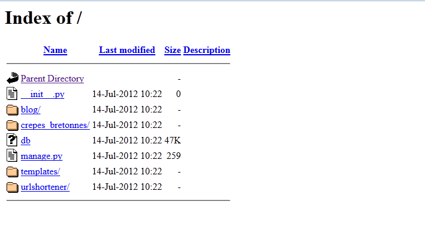
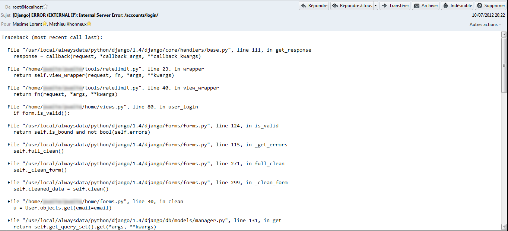
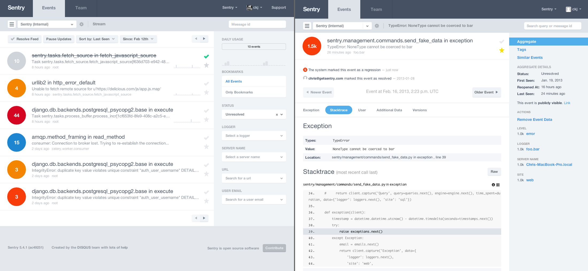

Déployer votre application en production
========================================

Tout au long du cours, nous avons utilisé le serveur de développement de Django. Cependant, ce serveur de développement n'est adapté que pour le développement, et pas du tout pour la mise en production dans une situation réelle.

Nous allons voir dans ce chapitre comment déployer un projet Django en production sur un serveur dédié Linux. Si vous ne disposez pas de serveur dédié, sachez qu'il existe certains hébergeurs qui proposent également l'installation et la gestion d'un projet Django, nous en avons listé quelques-uns à la fin de ce chapitre.

Le déploiement
--------------

Contrairement à ce que certains peuvent penser, le serveur de développement *ne peut pas* être utilisé en production. En effet, celui-ci n'apporte pas les conditions de sécurité et de performances suffisantes pour garantir un service stable. Le rôle d'un framework n'est pas de distribuer les pages web, c'est au serveur web qu'incombe ce travail.

Nous allons voir deux méthodes : l'installation avec Apache2 et mod_wsgi d'une part et nginx/gunicorn ensuite. Pour ces deux méthodes, nous allons travailler sur un serveur Linux avec un accès root.
Sachez que vous pouvez également déployer un projet Django sur certains hébergements mutualisés le supportant. Généralement, une documentation de l'hébergeur sera mise à votre disposition pour vous indiquer comment le déployer sur leur infrastructure. Ce chapitre ne se concentre que sur l'installation sur un serveur dont vous avez l'accès SSH.

Le protocole WSGI est une spécification qui permet à un serveur web et une application web Python de communiquer ensemble et ainsi récupérer les pages web générés par votre projet Django.

### Configuration du projet

Avant de nous lancer dans la configuration du serveur web, Nous allons  modifier les paramètres de notre projet (`settings.py`). Dans un premier temps, à la création de notre projet, nous avions défini quelques variables : base de données, variable `DEBUG`, etc. Il va falloir les adapter à notre serveur de production.

Voici les variables à modifier :

-  Passez la variable `DEBUG` à `False` pour indiquer que le site est désormais en production. Il est très important de le faire, sans quoi les erreurs et des données sensibles pourraient être affichées !
- Remplissez la variable `ALLOWED_HOSTS` qui doit contenir les différentes adresses depuis lesquelles le site peut être accédé. Exemple : `ALLOWED_HOSTS = ['www.crepes-bretonnes.com', '.super-crepes.fr']`. Le point au début du deuxième élément de la liste permet d'indiquer que tous les sous-domaines sont acceptés, autrement dit, les domaines suivants seront accessibles : `super-crepes.fr`, `www.super-crepes.fr`, `mobile.super-crepes.fr`, etc.
- Adaptez la connexion à la base de données en fonction de ce que vous souhaitez utiliser en production. Nous vous conseillons d'utiliser *PostgreSQL* en production, MySQL le cas échéant. N'oubliez pas d'installer les extensions nécessaires si vous souhaitez utiliser autre chose que SQLite.
- Générez une nouvelle `SECRET_KEY`, via [cet outil en ligne](http://www.miniwebtool.com/django-secret-key-generator/) par exemple. Cette clé sert à sécuriser plusieurs éléments de Django, il est important qu'elle soit unique et secrète.


### Installation avec Apache2

Par défaut, Django fournit un fichier `wsgi.py` qui s'occupera de la liaison entre votre projet Django et Apache2. Pour rappel :

    crepes_bretonnes/
        manage.py
        crepes_bretonnes/
            __init__.py
            settings.py
            urls.py
            wsgi.py

Ce fichier n'a pas besoin d'être modifié. Il est normalement correctement généré selon les paramètres de votre projet.

Il faut savoir qu'un projet Django ne se déploie pas comme un projet PHP. En effet, si nous tentons d'héberger le projet sur un serveur Apache avec une configuration basique, voici le résultat :



Non seulement votre code n'est pas exécuté, mais il est lisible par tous. Il faut donc spécifier à Apache d'utiliser le protocole WSGI pour que Django puisse exécuter le code et renvoyer du HTML.

Dans un premier temps il va falloir installer le module WSGI. Sous la plupart des distributions Linux, un paquet existe pour nous simplifier la vie. Par exemple, pour Debian :

    aptitude install libapache2-mod-wsgi

N'oubliez cependant pas, si vous n'avez pas Django ou Apache2 d'installé, de les installer également ! Nous ne couvrirons pas l'installation d'Apache2, ni sa configuration basique. Une installation de Django dans un [environnement virtuel (venv)](https://docs.python.org/3/library/venv.html) est encore une fois conseillé même si nous le détaillerons pas ici.
Ensuite, modifions le fichier `/etc/apache2/httpd.conf` pour indiquer où trouver notre application. Si ce fichier n'existe pas, créez-le. Voici la configuration à insérer :

    WSGIScriptAlias / /chemin/vers/crepes_bretonnes/crepes_bretonnes/wsgi.py
    WSGIPythonPath /chemin/vers/crepes_bretonnes/
    <Directory /chemin/vers/crepes_bretonnes/>
       <Files wsgi.py>
           Order deny,allow
           Allow from all
       </Files>
    </Directory>

 - La première ligne, `WSGIScriptAlias`, indique que toutes les URLs commençant par « / » (qui indique la racine du serveur) devront utiliser l'application définie par le second argument, qui est ici le chemin vers notre fichier `wsgi.py`.
 - La deuxième ligne, `WSGIPythonPath`, permet de rendre accessible votre projet via la commande `import` en Python. Ainsi, le module `wsgi` pourra lancer notre projet Django.
 - Enfin, la directive `<Directory ...>` permet de s'assurer que le serveur Apache peut accéder au fichier `wsgi.py` uniquement.

Sauvegardez ce fichier. Si vous souhaitez changer des informations sur le nom de domaine ou le port, il faudra passer par les VirtualHosts d'Apache (ce que nous ne couvrirons pas ici).

Sauvegardez et relancez Apache (`service apache2 reload`). Votre site doit normalement être accessible !


### Installation avec nginx et gunicorn

Aujourd'hui, nginx est de plus en plus utilisé comme serveur web avec les frameworks web récent notamment grâce à sa légèreté et sa facilité de configuration.

Il va falloir fonctionner en deux temps : il faut d'abord lancer un serveur, semblable à celui de développement, qui va exécuter votre projet Django, qui fera office de serveur HTTP WSGI, puis le lier à votre serveur nginx. Nous allons ici choisir gunicorn, puisque que le trio nginx + gunicorn + Django est fréquemment vu sur le web.

Si vous souhaitez utiliser un environnement virtuel, pensez à l'activer dans un premier temps. Ensuite, pour installer gunicorn, il suffit d'utiliser `pip` :

```console
pip install gunicorn
```

Pour le configurer ensuite, on crée généralement un fichier .sh qui se chargera de lancer la commande `gunicorn` avec des paramètres précis : 

```bash
#!/bin/bash
set -e
LOGFILE=/var/log/gunicorn/mlorant.log
LOGDIR=$(dirname $LOGFILE)
LOGLEVEL=debug   # info ou warning une fois l'installation OK
NUM_WORKERS=3    # Règle : (2 x $num_cores) + 1

# user/group to run as
USER=root
GROUP=root

cd /chemin/vers/crepes_bretonnes/
# source ../bin/activate  # Cette ligne ne sert que si vous utilisez virtualenv
test -d $LOGDIR || mkdir -p $LOGDIR
exec gunicorn_django -w $NUM_WORKERS \
  --user=$USER --group=$GROUP --log-level=$LOGLEVEL \
  --log-file=$LOGFILE 2>>$LOGFILE -b 127.0.0.1:8000
```

Ce fichier lance donc un serveur gunicorn, pour notre projet, sur le port 8000 de la machine. Vous pouvez dès à présent le lancer en tâche de fond (via `screen` ou appuyez sur Ctrl-Z une fois lancé puis "bg" pour mettre la tâche en fond) 

Il faut maintenant configurer nginx pour qu'il aille requêter ce serveur :  

    # Configuration du server
    server {
        listen      80;
        server_name .crepes-bretonnes.com;
        charset     utf-8;

        access_log /var/log/nginx/crepes_bretonnes.access.log;
        error_log /var/log/nginx/crepes_bretonnes.error.log;

        # Fichiers media et statiques, délivrés par nginx directement
        location /media  {
            alias /chemin/vers/crepes_bretonnes/media;
        }

        location /static {
            alias /chemin/vers/crepes_bretonnes/static;
        }

        # Le reste va vers notre proxy uwsgi
        location / {
            include fastcgi_params;
            proxy_set_header X-Forwarded-Host $server_name;
            proxy_set_header X-Real-IP $remote_addr;
            fastcgi_pass 127.0.0.1:8000;
        }
    }

Ce fichier doit être placé dans `/etc/nginx/sites-available`, avec le nom que vous souhaitez (`crepes_bretonnes` ici), et ensuite vous devez créer un lien symbolique vers `sites-enabled` :

```console
# cd /etc/nginx/sites-enabled
# ln -s ../sites-available/crepes_bretonnes
# service nginx restart
```

Une fois le serveur redémarré, votre site devrait être accessible via `crepes-bretonnes.com`.

<div class="warning">Si vous obtenez une erreur du type `Internal Server Error`, pas de panique, c'est sûrement dû à une erreur dans votre configuration. \\
Pour traquer l'erreur, vérifiez vos logs dans le dossier `/var/log/apache2/` (respectivement `nginx`) et regardez l'exception lancée lors du chargement d'une page.</div>

Gardez un œil sur le projet
---------------------------

Une application n'est *jamais parfaite*, et des erreurs peuvent tout le temps faire surface, même après la mise en production malheureusement. Cependant, lorsqu'une erreur survient en production, un problème apparaît : comment être au courant de l'erreur rencontrée et dans quelles circonstances s'est-elle produite ? Une solution serait de vérifier régulièrement les journaux d'erreur de votre serveur web, mais si une erreur critique apparaît, vous seriez le dernier prévenu. Vous n'aurez pas non plus le contexte de l'erreur. Pour résoudre ce fâcheux problème, Django propose une solution simple : il vous enverra un e-mail à chaque erreur rencontrée avec le contexte de celle-ci !

Cet e-mail contient plusieurs types d'informations : le traceback complet de l'erreur Python, les données HTTP de la requête et d'autres variables bien pratiques (informations sur la requête HTTP, état de la couche WSGI, etc.). Ces dernières ne sont pas affichées dans l'image (elles viennent après, dans l'e-mail).



### Activer l'envoi d'e-mails

Dans un premier temps, assurez-vous qu'un serveur d'e-mails est installé sur votre machine, permettant d'envoyer des e-mails via le protocole SMTP.
Pour pouvoir recevoir ces alertes, assurez-vous que votre variable `DEBUG` est à `False`. Les e-mails ne sont envoyés que dans ce cas-là. En effet, en développement, les exceptions sont affichées directement dans le navigateur lorsque l'erreur est lancée.

Ensuite, nous allons ajouter une variable `ADMINS` dans le `settings.py`. Cette variable est une liste de tuple contenant des informations sur les administrateurs. Ceux sont eux qui recevront les e-mails d'erreurs.

    ADMINS = (
        ('Maxime Lorant', 'maxime@crepes-bretonnes.com'),
        ('Mathieu Xhonneux', 'mathieu@crepes-bretonnes.com'),
    )

Ici, les e-mails d'erreurs sont envoyés aux deux personnes, en même temps.

<div class="info">Par défaut, Django envoie les e-mails depuis l'adresse `root@localhost`. Cependant, certaines boîtes e-mail rejettent cette adresse, ou tout simplement vous souhaiteriez avoir quelque chose de plus propre. Dans ce cas, vous pouvez personnaliser l'adresse en ajoutant une variable dans votre `settings.py` : `SERVER_EMAIL = 'no-reply@crepes-bretonnes.com'`, par exemple.</div>

### Quelques options utiles...

#### Être avertis des pages 404

Par défaut, les pages non trouvées ne sont pas signalées par e-mail. Si vous voulez toutefois les recevoir, il vous suffit d'ajouter un élément à la liste `MIDDLEWARE_CLASSES` :

     'django.middleware.common.BrokenLinkEmailsMiddleware'

ajoutez les lignes suivantes dans votre `settings.py` :

    SEND_BROKEN_LINK_EMAILS = True

Django enverra un e-mail à toutes les personnes dans `MANAGERS` lorsque le code d'erreur 404 sera déclenché par quelqu'un. Par simplicité, vous pouvez rendre les deux listes égales :

    ADMIN = (...)
    MANAGERS = ADMINS

Il est également possible de filtrer ces envois, via la configuration de IGNORABLE_404_URLS.

    import re
    IGNORABLE_404_URLS = (
        re.compile(r'\.(php|cgi)$'),
        re.compile(r'^/phpmyadmin/'),
        re.compile(r'^/apple-touch-icon.*\.png$'),
        re.compile(r'^/favicon\.ico$'),
    )

Ici, les fichiers `*.php`, le dossier `phpmyadmin/`, etc. ne seront pas concernés.

#### Filtrer les données sensibles

Enfin, il peut arriver qu'une erreur de votre code survienne lors de la saisie de données sensibles : saisie d'un mot de passe, d'un numéro de carte bleue, etc. Pour des raisons de sécurité, il est nécessaire de _cacher ces informations dans les e-mails d'erreurs_ ! Pour ce faire, nous devons déclarer au-dessus de chaque vue contenant des informations critiques quelles sont les variables à cacher, grâce à `sensitive_variables` et `sensitive_post_parameters` :

    from django.views.decorators.debug import sensitive_variables
    from django.views.decorators.debug import sensitive_post_parameters

    @sensitive_variables('user', 'password', 'carte')
    def paiement(user):
        user     = get_object_or_404(User, id=user)
        password = user.password
        carte = user.carte_credit

        raise Exception

    @sensitive_post_parameters('password')
    def connexion(request):
        # Ici request.POST['password'] ne sera pas transmis dans le mail
        raise Exception

**Ne laissez surtout pas ces informations visibles**, même si vous êtes le seul à avoir ces e-mails et que vous vous sentez confiant. L'accès au mot de passe en clair est très mal vu pour le bien des utilisateurs et personne n'est jamais à l'abri d'une fuite (vol de compte e-mail, écoute de paquets…).

### Introduction à Sentry, pour garder un oeil encore plus attentif

Une fois tout ceci appliqué, vous recevrez un mail par erreur 500 et vous vous estimez prêt à conquérir le web avec votre tout nouveau site. Cependant, méfiez-vous, cette pratique peut très vite vous spammer de mails, notamment lors d'une mise en production sur un site à fort affluence.

Pour remédier à cela, des outils existent, notamment [le projet _Sentry_](http://sentry.readthedocs.org/en/latest/#). Nous n'allons pas entrer dans les détails ici, sachez juste qu'il existe et qu'il permet de centraliser les erreurs qui se sont produites sur votre site web. Si l'erreur n'a jamais été vu auparavant ou depuis un certain temps, Sentry vous préviendra par mail. Vous recevrez donc 1 seul mail dans la soirée si une fonctionnalité ne fonctionne pas comme prévu.
De plus, Sentry offre des outils de visualisations pratiques pour voir les modules les plus problématiques.



Pour les intéressés, Sentry est assez lourd à installer (c'est un projet Django à lui seul et nécessite sa propre instance et sa propre base de données...) mais il supporte de nombreux autres frameworks web, dont certains en PHP, en Node.js ou encore en Java.

Hébergeurs supportant Django
----------------------------

Nous avons vu comment installer un projet Django sur un serveur dédié. Cependant, tout le monde n'a pas la chance d'avoir un serveur à soi. Il existe toutefois d'autres possibilités. De plus en plus d'hébergeurs proposent désormais le support de langages et outils autres que le PHP : Java/J2EE, Ruby On Rails, et bien sûr Django !

Voici la liste des hébergeurs notables :

+--------------------------------------------------+-------------------------------------------------------------------------------------------------------------------------------------------------------------------------------------+-----------------+
|Nom                                               |Caractéristiques                                                                                                                                                                     |Offre            |
+==================================================+=====================================================================================================================================================================================+=================+
|[Alwaysdata](https://www.alwaysdata.com/)         |Large panel, dont une offre gratuite. Le support est très réactif, leur site est même codé avec Django ! Plus de [détails ici](https://www.alwaysdata.com/plans/shared/).            |Gratuit et Payant|
+--------------------------------------------------+-------------------------------------------------------------------------------------------------------------------------------------------------------------------------------------+-----------------+
|[Heroku](http://www.heroku.com/)                  |Un hébergeur devenu très à la mode. Très flexible et puissant, il permet de réaliser énormément d'opérations différentes et gère parfaitement Django.                                |Gratuit et Payant|
+--------------------------------------------------+-------------------------------------------------------------------------------------------------------------------------------------------------------------------------------------+-----------------+
|[WebFaction](http://www.webfaction.com/)          |Site international (serveurs à Amsterdam pour l'Europe), propose le support de Django sans frais supplémentaires. Les quotas sont très flexibles.                                    |Payant           |
+--------------------------------------------------+-------------------------------------------------------------------------------------------------------------------------------------------------------------------------------------+-----------------+
|[DjangoEurope](http://djangoeurope.com/)          |Comme son nom l'indique, DjangoEurope est spécialisé dans l'hébergement de projets Django. Il fournit donc une interface adaptée à la mise en production de votre projet.            |Payant           |
+--------------------------------------------------+-------------------------------------------------------------------------------------------------------------------------------------------------------------------------------------+-----------------+
|[A2 Hosting](http://www.a2hosting.com/django-hosting)|Support de plusieurs versions de Django, avec accès SSH pour le `manage.py`, autant de bases de données que vous le souhaitez… Une vraie mine d'or d'après les utilisateurs !|Payant           |
+--------------------------------------------------+-------------------------------------------------------------------------------------------------------------------------------------------------------------------------------------+-----------------+


Une liste plus exhaustive est disponible sur [djangofriendly.com](http://djangofriendly.com/hosts/), qui se charge de lister les hébergeurs en mettant en avant leurs 2 ou 3 points clés. Comme vous pouvez le voir, la majorité de ces hébergeurs sont payants cependant.

En résumé
---------

- Il ne faut pas utiliser le serveur `python manage.py runserver` en production ;
- Une des méthodes d'installation possible passe par Apache2 avec le mod_wsgi, en exécutant le script wsgi.py contenu dans le répertoire du projet ;
- Il existe également le combo nginx + gunicorn, que l'on a également décrit ;
- Si l'on désactive le mode `DEBUG`, Django enverra un e-mail à toutes les personnes listées dans le tuple `ADMINS` en cas d'erreur 500 sur le site. Il est possible d'être averti en cas d'erreurs 404, et de filtrer les données sensibles envoyées (telles que les mots de passe) ;
- Sentry est un projet Django permettant de surveiller votre propre projet de manière plus fine. 
